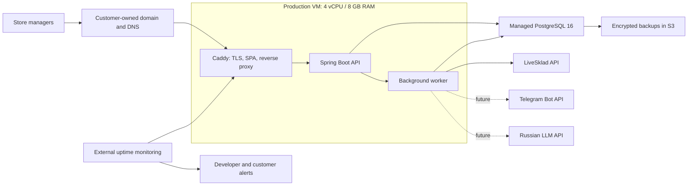

# Production deployment and operations

Status: target architecture and implementation standard, revalidated against the repository on
2026-07-27. Scope, budget and recovery assumptions were confirmed on 2026-07-25. Items still
marked CONFIRM remain decision gates; all other requirements are the recommended production baseline.

This document records the intended production deployment, release, security, backup and support
model for Store Analytics. It describes the target state, not the current implementation. Existing
deployment files must not be treated as production-ready until the readiness checklist in this
document is complete.

Normative words are used deliberately:

- **MUST / MUST NOT**: a release blocker unless the data owner explicitly accepts the documented
  risk and the exception has an owner and expiry date;
- **SHOULD / SHOULD NOT**: the default design; deviation needs a short architectural decision
  record;
- **MAY**: optional and driven by measured need.

This is an engineering and operations standard, not a substitute for legal advice. The customer
must confirm personal-data roles, retention and external-provider terms with an appropriate
specialist before real employee/customer data is processed.

Related documents:

- [architecture.md](architecture.md) — application and package boundaries;
- [security-hardening.md](security-hardening.md) — implemented backend security controls;
- [observability.md](observability.md) — backend health, metrics and correlation IDs;
- [data-retention.md](data-retention.md) — technical-data retention;
- [database-design.md](database-design.md) — database model and invariants;
- [synchronization-api.md](synchronization-api.md) — durable LiveSklad synchronization jobs;
- [PROJECT_HANDOFF.md](PROJECT_HANDOFF.md) — current project state and delivery context.

## Current pilot record (2026-08-10)

This section records the deployed state. The remainder of the document remains the normative
target and runbook.

- Public origin: `https://store-analytics.net`.
- Application host: Ubuntu 24.04 LTS in the Timeweb Saint Petersburg region, with a public edge
  address and a private VPC interface.
- Release: `v0.1.0-pilot.11-4b607da`; backend API/worker use
  `store-analytics-backend:v0.1.0-pilot.11` and the web edge uses
  `store-analytics-web:v0.1.0-pilot.11`. Separate `backend-api`, `backend-worker` and `web`
  containers are healthy. Flyway schema version 34, HTTPS, frontend, liveness and readiness smoke
  checks pass.
- Database: managed PostgreSQL 16 over the private network and TLS `verify-full`; runtime,
  migration and backup roles are separate and the `app` schema ACLs are reasserted by each deploy.
- Object storage: private Timeweb S3 bucket, versioning and Governance Object Lock enabled,
  100 GB account-side safety limit, dedicated backup writer credentials. The encrypted nightly
  logical dump is enabled and its first upload was verified; provider physical database backup is
  enabled daily with one retained copy. Additional encrypted logical dumps were uploaded and
  verified immediately before the `pilot.10` migration on 2026-08-10 and the application-only
  `pilot.11` release on 2026-08-13.
- Host access: SSH public keys only; root login and password authentication are disabled. UFW allows
  SSH, HTTP/HTTPS and Timeweb monitoring only. The provider Zabbix listener remains restricted to
  provider monitoring addresses.
- Data scope: LiveSklad backfill starts at 2026-07-01 and incremental synchronization is durable.
  The pilot has two stores. Production identifiers and credentials are never recorded in this file.
- Monitoring: the local public-readiness monitor passed its one-shot acceptance and
  `store-analytics-health.timer` is enabled; Timeweb monitoring remains an independent external
  signal.
- LLM: YandexGPT 5.1, prompt v4/content schema v2, strict structured output, bounded retries and
  persisted cost accounting. Snapshot, generation and publication planners/workers are enabled.
  The snapshot revision window is seven days during the pilot so late source data or late employee
  eligibility changes can produce an immutable revision.
- Telegram: bot infrastructure exists, but customer delivery remains deferred until linking and
  webhook acceptance are completed.
- LLM production acceptance ended at RUB 111.3248 for twenty-two provider calls, including the
  earlier failed-contract diagnostics and controlled acceptance regenerations. This is one-time
  commissioning activity, not the expected weekly steady-state cost. The final accepted primary
  store generation required one provider call and no validation retry.
- Both pilot stores expose a `READY`, `CURRENT` weekly interpretation for 2026-07-27 through
  2026-08-02. Store and team projections are present for both. The primary store is published from
  snapshot revision 2; the second store has its first successful publication.
- The response validator removes only invalid optional team relationships and unsupported optional
  risk items, then revalidates the complete response. A missing employee `WORKLOAD` summary is
  restored deterministically only from that employee's backend-owned `WORKLOAD_STATUS` fact and an
  available same-employee evidence reference. Missing evidence remains fail-closed; headlines,
  insights, actions and other substantive content are never synthesized by this fallback.
- The weekly interpretation UI uses a smaller responsive hero, deduplicated insight/action/data
  limitation cards, visible employee sufficiency badges and explicit explanations for unavailable
  team or employee analysis.
- Detailed employee interpretation remains data-gated. The primary store currently has five
  `LIMITED` and one `INSUFFICIENT` employee; the second store has three `INSUFFICIENT` employees.
  Managers must enter and confirm the real shifts for the affected week to improve coverage. Sales
  are never treated as inferred shifts, and no employee facts are fabricated to unlock AI output.
- Product classification remediation completed on 2026-08-08. The 101 sold products that were
  previously `UNMAPPED` received effective-dated assignments under rule version
  `pilot-unmapped-review-2026-08-08-v1`, effective from 2026-01-01 in the reporting time zone.
  Thirty-five assignments preserve the earlier customer-approved supplement exactly; the remaining
  assignments use the same explicit device, condition, accessory and service rules. A controlled
  commissioning transaction then re-normalized 129 already persisted sale/return rows without
  downloading the source period again. Post-change verification for 2026-07-01 through 2026-08-08
  found zero `UNMAPPED` rows and zero open `UNMAPPED_PRODUCT` issues in both stores. Future source
  synchronization remains the authoritative reconciliation path; the application still does not
  guess categories during normal synchronization.
- Release `pilot.10` makes current-period completeness checks use the last completed reporting day,
  separates period-scoped consistency issues from unrelated historical issues and refreshes cached
  workspace data when a manager returns to the browser tab. Confirmed MacBook, iPad, Dyson and
  PlayStation 5 device families now receive deterministic payroll defaults after their approved
  analytics category has been resolved; explicit effective-dated product overrides still win and
  accessory rows are not promoted to device payroll categories. This is calculation logic rather
  than a source-data rewrite.
- Release `pilot.11` scopes the `RATING_SALES_WITHOUT_SHIFT` quality issue to employees who
  participate in ranking. Sales by excluded employees remain in financial reporting but no longer
  create a false ranking-quality warning. The release has no database migration; schema version 34
  remains current.
- Employee interpretation membership is captured immutably when a weekly snapshot is created.
  Changing `participates_in_ranking` does not mutate an existing snapshot; a newer successful
  source sync inside the revision window creates a new snapshot revision and a new LLM generation.

The weekly LLM release acceptance is complete. Overall pilot acceptance still requires keeping
backup/restore evidence current and repeating the normal security, synchronization and recovery
checks for every subsequent release.

## 1. Goals and constraints

Expected scale for the next year:

- up to three stores;
- up to ten employees per store;
- a small number of authenticated managers and administrators;
- PostgreSQL remains the system of record;
- LiveSklad remains the external operational data source;
- Telegram notifications and LLM-based interpretations will be added later;
- the cabinet is available over the public internet;
- target infrastructure budget is ideally RUB 5,000–6,000/month and no more than RUB 10,000/month;
- target recovery point objective (RPO) is one hour;
- target recovery time objective (RTO) is four hours;
- a short planned maintenance window at night is acceptable.

The architecture must optimize for recoverability, security and operational simplicity rather than
for hypothetical high load. Kubernetes, microservices, a dedicated message broker, Redis and a
self-hosted GPU model are not part of the initial production design.

## 2. Target production topology



### 2.1 Application VM

The recommended initial VM is:

- Russian data center;
- Ubuntu LTS;
- 4 vCPU;
- 8 GB RAM;
- 80 GB NVMe;
- public IPv4 address;
- private VPC connection to PostgreSQL;
- cloud firewall plus host firewall.

The VM runs Docker Engine and Docker Compose. Only TCP ports 80 and 443 are public. SSH is allowed
only with keys and should be restricted by source IP or a private administrative VPN whenever
practical.

### 2.2 Runtime containers

Target containers:

- `web`: Caddy serving the compiled React SPA, terminating TLS and proxying `/api/*`;
- `backend-api`: Spring Boot API, with synchronization worker and scheduler disabled;
- `backend-worker`: the same immutable backend image in a worker role, with no public port;
- optional local metrics/log components only when their operational value justifies the memory cost.

The API and worker roles may temporarily run in one backend process during the earliest pilot, but
the target state separates them. This prevents long synchronization, Telegram or LLM work from
competing with interactive HTTP traffic and guarantees that scheduled jobs run in exactly one
place.

### 2.3 Reverse proxy and TLS

Caddy is the preferred reverse proxy because it provides automatic certificate issuance and
renewal with a small configuration surface. The backend is not published directly to the internet.
The frontend and API use one origin so session cookies and CSRF protection do not require a broad
CORS configuration.

Caddy owns and sets `X-Forwarded-For`, `X-Forwarded-Proto` and `X-Forwarded-Host`; values supplied by
an untrusted public client are never preserved as authoritative. The standard first-edge Caddy
behavior ignores incoming `X-Forwarded-*` values when constructing the upstream headers. If a CDN
is later introduced, configure global `trusted_proxies` with strict right-to-left parsing before
preserving any upstream chain.

The reverse proxy must additionally provide:

- request correlation IDs;
- HSTS;
- a reviewed Content Security Policy;
- `X-Content-Type-Options: nosniff`;
- `Referrer-Policy`;
- `Permissions-Policy`;
- frame protection through CSP `frame-ancestors`.

Spring automatic forwarded-header processing remains disabled. The application-level resolver
accepts `X-Forwarded-For` only when the direct socket peer belongs to `TRUSTED_PROXY_CIDRS`. The
production network uses a fixed, dedicated Caddy→backend CIDR; unrelated containers and possible
client ranges are not included. The backend port is reachable exclusively from that private network
and is never published. Application CIDR validation is defence in depth, not the primary firewall.

### 2.4 PostgreSQL

Managed PostgreSQL 16 is preferred over PostgreSQL on the application VM. It separates database
failure from application-host failure and removes routine database patching and physical-backup
administration from the application server.

Two cost profiles are acceptable:

1. **Budget profile:** one managed PostgreSQL node, protected by hourly logical dumps and provider
   physical backups. This accepts database downtime while a failed node or cluster is restored.
2. **High-availability profile:** a provider-supported three-node PostgreSQL cluster with automatic
   failover. Replication improves availability but does not replace backups.

The final choice is a customer risk/budget decision before production. With the agreed four-hour
RTO, the budget profile is acceptable only after a timed restore drill proves the objective.

PostgreSQL requirements:

- no public database access;
- private VPC endpoint;
- TLS with certificate verification;
- separate application and backup users;
- least-privilege grants;
- connection-pool limits sized for the selected database plan;
- storage and connection alerts;
- automatic disk growth only with an explicit cost alert and upper limit;
- Flyway remains the only schema migration mechanism.

## 3. Provider and budget decision

The current recommended provider is Timeweb Cloud in a Russian region because its VM, managed
PostgreSQL, VPC, firewall, S3 and external monitoring fit the target budget. This is a pragmatic
choice, not a permanent architectural dependency. Deployment artifacts and backups must remain
portable to another Russian provider.

Indicative prices observed in July 2026:

| Component | Indicative monthly cost |
| --- | ---: |
| Application VM, 4 vCPU / 8 GB / 80 GB | about RUB 1,800 |
| PostgreSQL, 2 vCPU / 4 GB / 40 GB, one node | about RUB 1,600 |
| S3, monitoring, backups and domain allocation | variable |
| Three-node PostgreSQL profile | roughly RUB 4,700 for database nodes |

The expected total is approximately RUB 4,000–5,500/month for the budget profile and RUB
7,000–8,500/month for a three-node database profile. Prices are estimates, not contractual values;
they must be recalculated in the provider console before purchase.

Official references:

- <https://timeweb.cloud/services/cloud-servers>
- <https://timeweb.cloud/services/dbaas/>
- <https://timeweb.cloud/docs/dbaas/postgresql>
- <https://timeweb.cloud/services/s3-storage>
- <https://timeweb.cloud/docs/monitoring>

## 4. Ownership, billing and access

Production infrastructure belongs to the customer and is paid by the customer directly. The
developer receives named administrative access and charges separately for development and support.

The customer should own:

- the cloud-provider account and billing profile;
- the domain and DNS zone;
- production S3 buckets;
- the LLM commercial account and API quota;
- Telegram/MAX bot ownership and recovery access;
- the GitHub organization or, at minimum, an owner-level recovery path;
- the off-provider backup destination;
- emergency credentials and recovery documentation.

Do not create production infrastructure on the developer's personal card or register the domain to
the developer. Do not share a single cloud password or Linux account.

Recommended access model:

- customer: account owner, billing administrator and emergency-access holder;
- developer: named project administrator with MFA;
- `deploy`: restricted Linux user for deployments;
- `operator`: restricted diagnostics/log access where separation is useful;
- `breakglass`: customer-held emergency account, tested and normally unused;
- service accounts: narrowly scoped non-human credentials for CI, S3 backup and external APIs.

Secrets and emergency instructions are transferred through a customer-owned password manager, not
through Telegram or email. On handover, revoke the developer's access and rotate all credentials
that the developer could read.

The customer/developer agreement should define:

- ownership of code, infrastructure and data;
- infrastructure billing responsibility;
- support hours and incident severity;
- response targets, RPO and RTO;
- maintenance windows;
- production-release approval;
- personal-data processing instructions;
- provider and subprocessor list;
- incident notification;
- access revocation and project handover;
- data export and deletion at contract end.

## 5. Personal-data position

The system may contain names, schedules, payroll data, employee performance metrics and, in future,
customer conversations. Production databases, primary backups and operational logs should therefore
remain in Russia unless a reviewed legal basis permits otherwise.

The customer is expected to be the personal-data operator because the customer determines the
purpose and content of processing. The developer is expected to process data under the customer's
instructions. This allocation must be confirmed contractually and, where necessary, by a specialist
in Russian personal-data law. Provider claims of 152-FZ compliance do not by themselves make the
application compliant.

Operational rules:

- collect and retain only required data;
- redact credentials and sensitive business values from logs;
- use masked or synthetic data in staging;
- send no payroll amounts, employee rankings or conversation bodies in messenger notifications;
- send LLM providers the minimum structured facts required for the task;
- pseudonymize employee identifiers before external LLM processing where possible;
- document retention, deletion and incident-response procedures;
- review the customer's Roskomnadzor notification obligations before production processing.

## 6. Staging and customer acceptance

Testing a new release directly in production is not the normal acceptance process. Staging is a
separate, temporary environment created for customer acceptance.

For this project's budget, staging is ephemeral:

- a separate 2 vCPU / 4 GB VM;
- a separate PostgreSQL instance or local staging-only PostgreSQL container;
- separate secrets, bot tokens and LLM keys;
- `stage.<customer-domain>`;
- synthetic or irreversibly masked data;
- no production notification recipients;
- created for acceptance and removed or stopped afterwards.

The exact Docker images accepted in staging are promoted to production. Production images are not
rebuilt after acceptance.

Acceptance flow:

1. CI produces a release-candidate image identified by commit SHA.
2. The candidate is deployed to staging.
3. The customer tests it for an agreed period.
4. Feedback is fixed and a new candidate is built.
5. The accepted candidate receives a release tag.
6. Production deployment is manually approved.
7. Staging is stopped or removed after the acceptance window.

## 7. CI/CD and release strategy

### 7.1 Pull-request CI

Every pull request must run:

- backend compilation, unit tests, integration tests and Checkstyle;
- frontend lint, tests and production build;
- Flyway migration from an empty PostgreSQL 16 database;
- migration test from the last production schema where practical;
- Docker image builds;
- dependency and container-image vulnerability scans;
- secret scanning;
- SBOM generation;
- later, Playwright end-to-end smoke tests.

A release is impossible while any required check is failing.

### 7.2 Immutable artifacts

GitHub Actions builds backend and frontend images once and publishes them to a container registry,
initially GitHub Container Registry. Images receive:

- a commit SHA tag;
- a semantic release tag such as `v1.2.0` after acceptance;
- OCI source/revision labels;
- a recorded content digest.

Production Compose references a version or digest, never `latest`. Production pulls images and does
not build source code on the server.

### 7.3 Deployment sequence

Production deployment is initially a controlled rolling restart with a short maintenance window:

1. verify that CI, backup freshness and free disk space are healthy;
2. record the current image digests and database schema version;
3. create and verify a pre-deployment database backup/checkpoint;
4. provision required secret files and run release/Compose preflight;
5. pull the accepted images and verify their packaged schema version against the release manifest;
6. run Flyway once and record the resulting schema version;
7. start or replace `backend-api` and wait for readiness;
8. start `backend-worker` only after API readiness;
9. update the web container if required;
10. run authenticated business smoke tests;
11. record the deployment result and notify the developer;
12. remove old images only after the rollback window.

Multiple application containers must not race to perform migrations. The target deployment provides
an explicit one-shot migration step or guarantees that only one designated API process runs Flyway
before other roles start.

### 7.4 Rollback

Application rollback uses the previous image digest. Database migrations are forward-only. Schema
changes must use expand/contract compatibility so the previous application image can run during the
rollback window.

Each release manifest declares its migration-source and runtime schema ranges. `rollback.sh` reads
the database schema recorded immediately after Flyway and refuses to start an image whose runtime
range does not contain that version. Missing compatibility metadata also fails closed. When
rollback is refused, use a reviewed forward-fix image and `forward-fix.sh`; do not edit the recorded
schema version or force-start an older container.

In particular, the production V39.1 image has no verified V42 runtime compatibility. After the
V39.1-to-V42 migration, recovery from an application startup defect is therefore a V42-compatible
forward fix. Restore is reserved for data corruption or a migration that cannot be repaired
forward.

If a migration destroys or corrupts data, image rollback is insufficient. Recovery requires a new
database/cluster restored from a verified backup. Destructive migrations require a separate change
plan, explicit backup validation and customer-approved maintenance window.

### 7.5 GitHub controls

- protect the default branch;
- require successful CI before merge;
- restrict release-tag creation;
- use least-privilege `GITHUB_TOKEN` permissions;
- pin third-party Actions to reviewed versions or commit SHAs;
- separate staging and production secrets;
- trigger production through an explicit manual workflow or controlled operator command;
- keep deployment history and release notes.

GitHub plan limitations for private repository environments and required reviewers must be checked
before relying on GitHub's approval UI. Manual `workflow_dispatch` plus protected release tags is an
acceptable initial control.

## 8. Startup, shutdown and automated updates

The host enables Docker at boot. A systemd unit owns the production Compose project and runs
`docker compose up -d` after the network and Docker daemon are ready.

Containers use:

- `restart: unless-stopped`;
- explicit health checks;
- startup dependency conditions only for readiness, not as a substitute for retry logic;
- graceful Spring Boot shutdown;
- bounded CPU and memory;
- Docker log rotation.

Automatic application updates such as Watchtower are prohibited. Application updates are deployed
only through the controlled release process. Critical OS security updates may be automated, with
reboot requirements monitored and performed in a maintenance window. Base images and dependencies
are updated through reviewed pull requests.

## 9. Security baseline

### 9.1 Host and network

- only 80/443 are public;
- SSH uses keys only, with root and password login disabled;
- administrative access is IP-restricted or VPN-protected;
- cloud firewall and host firewall use deny-by-default rules;
- PostgreSQL uses private networking and TLS;
- system clock synchronization is enabled;
- unattended critical security patches are monitored;
- provider-account and GitHub MFA are mandatory;
- deletion protection is enabled where supported.

### 9.2 Containers

- non-root runtime user;
- `no-new-privileges`;
- drop Linux capabilities unless explicitly required;
- read-only root filesystem where supported;
- writable `tmpfs` or named volumes only for declared paths;
- resource limits;
- immutable image versions/digests;
- no Docker socket mounted in application containers;
- no secrets baked into layers or images.

### 9.3 Secrets

Compose secret files are only a delivery mechanism; they are not encrypted storage by themselves.
Long-lived secrets should be held in a cloud secret manager or in encrypted, access-controlled files
provisioned onto the host. Secrets never enter Git, Docker build context, CI logs or application
logs.

Required rotation runbooks:

- PostgreSQL application password;
- LiveSklad credentials;
- session/bootstrap administrator secrets;
- S3 access keys;
- GitHub registry/deployment credentials;
- future Telegram bot token;
- future LLM API key.

The bootstrap administrator password is a one-time secret. Remove it from the runtime environment
after the initial administrator exists and rotate it if it was exposed to an operator.
The executable one-time flow and recovery cases are defined in
`bootstrap-and-break-glass.md`.

### 9.4 Application

- secure, HTTP-only, same-site session cookie;
- exact same-origin CORS configuration;
- CSRF protection;
- server-side authorization on every store-scoped resource;
- MFA for administrative and payroll-sensitive accounts before broad production rollout;
- public health endpoint exposes no component or secret details;
- metrics and API documentation remain administrator-only or private;
- rate limits use the validated client IP behind the trusted reverse proxy;
- logs use correlation IDs and redact sensitive values;
- audit records are exported or backed up so a compromised VM cannot silently remove all evidence.

## 10. Observability and support

External monitoring must be outside the application VM so it can alert when the VM itself is down.
At minimum monitor:

- public HTTPS availability;
- TLS certificate expiry;
- backend liveness and readiness;
- HTTP error rate and p95 latency;
- JVM heap and garbage collection;
- database connection-pool saturation;
- PostgreSQL storage, connections and slow queries;
- synchronization freshness, failures, retries and stuck leases;
- backup success, age and restore verification;
- host disk, CPU and memory;
- future Telegram delivery failures and outbox age;
- future LLM latency, validation failures, token consumption and cost.

Alert routing:

- developer: technical details and actionable diagnostics;
- customer: business-facing availability, stale-data and recovery messages;
- provider billing alerts: customer owner and developer;
- backup/deletion/security alerts: developer plus customer owner.

The application's own Telegram bot must not be the only alert path: if the application or bot is
down, it cannot report its failure. Provider/external email and messenger monitoring remains
independent.

Recommended operational targets:

- acknowledgement and resolution expectations are documented by incident severity;
- planned maintenance is announced in advance;
- customer-visible data shows its last successful synchronization timestamp;
- no 24/7 response is implied unless explicitly contracted.

## 11. Automatic synchronization

The durable PostgreSQL-backed synchronization job design remains the basis for production.

Rules:

- exactly one scheduler enqueues scheduled work;
- web/API replicas do not run the scheduler or synchronization worker;
- jobs are idempotent and survive process restarts;
- retries use bounded exponential backoff;
- overlapping date windows reconcile late external changes;
- stalled leases are detected and alerted;
- manual execution remains available to an authorized administrator;
- report generation starts only after the required synchronization succeeds;
- the UI exposes data freshness and degraded external-source status.

For the pilot deployment, the worker evaluates the same completed-day window at 03:15, 04:15 and
05:15 in `Europe/Kaliningrad`. The repeated checks are intentional recovery points, not three data
loads: a successful or non-recoverably failed window is not recreated, an active synchronization
defers the check, and only a terminal recoverable source/transport/database failure may create a
new attempt for the same window. This prevents a worker restart at one exact cron instant from
leaving the previous business day absent until the following night.

The initial schedule must be agreed with the customer as a data-freshness SLA. A nightly
reconciliation is retained even if more frequent incremental synchronization is introduced.

Future reporting orchestration should be event-driven:

```text
synchronization completed
-> metrics/report snapshot calculated
-> optional LLM interpretation completed or fallback selected
-> report published
-> notification recorded in outbox
-> Telegram/MAX delivery attempted
```

Independent cron jobs must not guess that the previous stage has completed.

## 12. Telegram notifications

Telegram delivery is a non-critical asynchronous adapter. It must never participate in the business
transaction that calculates a report.

Implemented components:

- `telegram_subscription` — verified link between an application user and Telegram chat;
- `notification_preference` — categories, stores, quiet hours and digest settings;
- `notification_event` — canonical business event;
- `notification_outbox` — durable channel-specific delivery request;
- `notification_delivery` — attempts, provider message ID and errors;
- worker with retry, rate-limit handling and dead-letter status;
- exact webhook route with Telegram secret-token validation;
- one-time, hashed, expiring deep-link token for account linking.

Messages contain only a short status and a link to the authenticated cabinet. Payroll amounts,
employee rankings, personal details and customer conversations remain in the protected dashboard.

## 13. LLM interpretation

The LLM is an asynchronous interpretation service, not a calculator or decision authority. The
weekly YandexGPT 5.1 path is implemented and has passed local real-provider acceptance; production
flags remain disabled until server-side staging and operational gates are complete.

```text
backend metrics
-> immutable report snapshot
-> LLM analysis job
-> validated structured interpretation
-> PostgreSQL
   |-> full dashboard view
   `-> short notification rendering
```

Rules:

- the backend calculates metrics, thresholds, recipients and severity;
- the LLM receives a minimum structured fact set, not direct database access;
- one canonical structured interpretation is reused by dashboard and Telegram;
- output is validated against a versioned JSON schema;
- prompt, provider, model, input hash, token count, latency and result version are stored;
- model failure uses a deterministic template and never blocks the report;
- external calls use timeout, bounded retry and circuit breaking;
- a provider-neutral interface allows GigaChat/YandexGPT replacement;
- self-hosted GPU inference is out of scope for the initial budget;
- production uses a customer-owned commercial API account.

## 14. Backup policy

Replication is not backup. Deletes, corrupt writes and compromised credentials can affect every
replica.

Target backup layers:

1. provider-managed physical PostgreSQL backups;
2. encrypted hourly `pg_dump` in custom format to a private S3 bucket;
3. S3 versioning and Object Lock;
4. a weekly encrypted copy in another Russian provider or customer-controlled storage;
5. Git history, container registry artifacts and infrastructure code for application recovery;
6. customer-held encrypted export of emergency secrets and DNS/infrastructure inventory.

Recommended retention:

| Backup class | Retention |
| --- | --- |
| Hourly | 48 hours |
| Daily | 14 days |
| Weekly | 8 weeks |
| Monthly | 12 months |

Retention must be confirmed against customer, contractual and personal-data requirements.

Every backup job records:

- source database and schema version;
- start/end time;
- artifact size;
- checksum;
- encryption status;
- storage destination;
- retention class;
- success/failure;
- restore-verification result.

Backups are useful only after successful restoration. Run:

- automated integrity checks after creation;
- a monthly restore into an isolated database;
- a quarterly full disaster-recovery exercise;
- a restore drill before first production launch.

## 15. Disaster recovery

RPO one hour and RTO four hours are engineering targets, not promises until measured by a drill.

### 15.1 Container or process failure

- health check fails;
- container restarts automatically;
- worker reclaims durable work after lease expiry;
- alert only when retries or duration cross a threshold.

### 15.2 Application VM loss

1. provision a new VM from infrastructure code/runbook;
2. restore firewall, DNS and systemd/Compose configuration;
3. provision runtime secrets;
4. pull the last known-good image digests;
5. connect to managed PostgreSQL;
6. start API, worker and web;
7. run smoke tests;
8. update DNS only if the public address changed.

### 15.3 Database corruption or deletion

1. isolate the damaged cluster and preserve evidence;
2. select the latest valid backup before the incident;
3. create a new PostgreSQL cluster/database;
4. restore roles, schema and data;
5. validate Flyway version, row counts, users, stores, reports and audit continuity;
6. point staging/smoke tests at the restored database;
7. switch production only after validation;
8. resume synchronization and reconcile the external source.

LiveSklad can replay some external facts, but users, plans, work shifts, manual adjustments, payroll
snapshots, report snapshots and audit history exist only in PostgreSQL. Database backups are
therefore business-critical.

### 15.4 External dependency outage

- LiveSklad outage: retain last synchronized data, show stale-data status and retry later;
- LLM outage: publish deterministic interpretation/fallback;
- Telegram/MAX outage: retain notification in outbox and retry;
- provider-wide outage: recover from off-provider backup on the documented alternative provider.

### 15.5 Credential compromise

- revoke suspected credentials immediately;
- isolate affected resources;
- rotate related and derived credentials;
- review audit and provider logs;
- rebuild compromised hosts from known-good artifacts rather than trusting in-place cleanup;
- notify the customer and authorities according to the incident and contractual/legal duties.

## 16. Scaling path

Scaling is measurement-driven:

1. tune queries, indexes, connection pools and retention;
2. vertically resize the application VM;
3. vertically resize PostgreSQL or move to the three-node profile;
4. keep API and worker roles separate;
5. add API replicas behind the reverse proxy only after sustained HTTP load requires them;
6. add more workers only when job partitioning and external-source limits permit it;
7. introduce Redis, a broker or additional services only for a measured requirement.

Current HTTP sessions, self-service revocation and concurrent-session control are process-local.
Sticky routing can keep one browser on one replica, but cannot provide cluster-wide revocation or a
global concurrency limit. Horizontal API scaling therefore requires a shared registry; for this
project's scale, Spring Session JDBC is the preferred first option, while Redis is not required
solely for session storage.

Large raw payload, audit and history tables require retention monitoring. Partitioning is introduced
only when table size and query plans demonstrate a need.

## 17. Required repository artifacts

Target files, names subject to final repository conventions:

```text
.dockerignore

frontend/
  Dockerfile

deploy/
  compose.production.yml
  compose.staging.yml
  Caddyfile
  env.production.example
  env.staging.example
  systemd/store-analytics.service

scripts/
  deploy.sh
  rollback.sh
  smoke-test.sh
  backup-postgres.sh
  verify-backup.sh
  restore-postgres.sh

.github/workflows/
  ci.yml
  build-images.yml
  deploy-staging.yml
  deploy-production.yml
  security-scan.yml

infra/
  opentofu-or-terraform/
  ansible/

docs/runbooks/
  DEPLOYMENT.md
  ROLLBACK.md
  BACKUP_RESTORE.md
  DISASTER_RECOVERY.md
  INCIDENT_RESPONSE.md
  SECRET_ROTATION.md
  MONITORING.md
  ACCESS_HANDOVER.md

SECURITY.md
.editorconfig
.gitattributes
.github/dependabot.yml
```

`env.*.example` files contain names and safe examples only. They never contain real credentials.

The root `.dockerignore` is a release prerequisite because Docker build context must not include
`.env`, `.git`, local databases, logs, frontend `node_modules`, build output or developer secrets.

## 18. Implementation phases

### Phase 0 — release baseline

- all backend and frontend checks pass;
- documentation reflects the current code and Flyway version;
- no known production-blocking security defects;
- production configuration is validated without printing secret values.

### Phase 1 — reproducible images and local production topology

- root `.dockerignore`;
- production frontend/Caddy image;
- hardened backend runtime image;
- Compose uses immutable images rather than server-side builds;
- health checks, resource limits and log rotation;
- explicit API, worker and migration roles;
- local smoke tests.

### Phase 2 — CI and temporary staging

- GitHub pull-request CI;
- image publication to GHCR;
- ephemeral staging deployment;
- masked/synthetic staging data;
- customer acceptance workflow;
- release tags and deployment records.

### Phase 3 — production infrastructure

- customer-owned cloud and domain;
- VM, VPC, firewall and managed PostgreSQL;
- TLS and same-origin routing;
- customer/developer access separation;
- external monitoring and billing alerts;
- production secret provisioning.

### Phase 4 — backup and recovery proof

- provider physical backups;
- hourly encrypted S3 dumps;
- Object Lock/versioning and retention;
- off-provider weekly copy;
- automated verification;
- timed full restore drill proving or revising RPO/RTO.

### Phase 5 — first controlled production release

- accepted staging image promoted without rebuild;
- pre-deployment backup;
- single migration execution;
- API/worker/web rollout;
- authenticated smoke tests;
- monitoring verification;
- access and runbook handover to the customer.

### Phase 6 — operational maturity

- incident and maintenance routine;
- dependency/base-image update cadence;
- monthly restore tests and quarterly DR drills;
- capacity/cost review;
- MFA and security review;
- implement Telegram and LLM as non-critical asynchronous adapters.

## 19. Production readiness checklist

Production may be opened to real users only when:

- [ ] backend and frontend required checks pass;
- [ ] immutable images are built in CI and stored in a registry;
- [ ] production does not build source code on the server;
- [ ] `.dockerignore` excludes secrets and local artifacts;
- [ ] domain and cloud account are customer-owned;
- [ ] TLS and security headers are verified;
- [ ] only 80/443 and restricted SSH are public;
- [ ] database uses private networking and TLS;
- [ ] secrets are absent from Git, images and logs;
- [ ] SEC-01 is signed by the customer/operator, unexpired, and all compensating controls pass;
- [ ] staging acceptance is complete;
- [ ] production backup is current and independently restorable;
- [ ] restore drill has measured RPO/RTO;
- [ ] external uptime, stale-sync and backup alerts reach the expected recipients;
- [ ] rollback and incident runbooks are available;
- [ ] customer emergency access is tested;
- [ ] monitoring shows application, database and synchronization health;
- [ ] personal-data roles, providers, retention and incident handling are documented;
- [ ] customer approves the release and maintenance/support model.

## 20. Deferred decisions

Resolve these decisions before their corresponding implementation phase:

- final Timeweb region and exact VM/database plans;
- single-node or three-node PostgreSQL production profile;
- customer domain name;
- GitHub ownership/organization and paid-plan requirements;
- alternative provider or destination for off-provider backup;
- operational support hours and severity response targets;
- post-SEC-01 MFA method and rollout date;
- production data-freshness SLA and synchronization frequency;
- selected commercial LLM provider after evaluation;
- exact Telegram notification catalogue and preferences;
- final retention periods approved by the customer.

## 21. Repository verification and decision record

This section is the normative implementation specification produced from the repository review on
2026-07-25 and revalidated against the application release candidate on 2026-08-06. If a generic
recommendation in sections 1-20 conflicts with this section, this section takes precedence.
PRODUCTION_READINESS_SECURITY_AUDIT_TEMP.md is useful input, but it is not a source of truth where
it disagrees with current code or the maintained documents in docs/.

### 21.1 Verified current state

| Area | Verified state | Production consequence |
| --- | --- | --- |
| Backend | Java 21, Spring Boot 4.1.0, Spring Security 7.1.0, native Jackson 3 | Keep Java 21; pin patch updates and rehearse the exact release image before promotion |
| Build | Wrapper and backend image both use Gradle 9.0.0; wrapper distribution SHA-256, dependency locking and strict artifact verification are configured | Build in CI once, retain verification/SBOM evidence and promote the accepted immutable digest; do not build source on the production VM |
| Database | PostgreSQL 16 and Flyway SQL migrations V1-V32; empty-to-V32, V29-to-V30 report integrity and V32 CARE classification paths are tested | Run the exact one-shot migration image before API/worker; rehearse V30 on a restored production-sized copy and do not combine it with a PostgreSQL major upgrade |
| Runtime | Explicit `API`, `WORKER`, `COMBINED` and one-shot `MIGRATION` roles; API/worker force Flyway off | Wire the verified roles into production topology; keep worker HTTP unreachable and do not run multiple `COMBINED` replicas |
| Sessions | Server-side HTTP sessions and concurrent-session registry are local to one JVM | Run one API replica initially; use Spring Session JDBC before horizontal API scaling |
| Frontend | React/Vite SPA, cookie credentials, CSRF support, production build succeeds | Serve the static build and API from one HTTPS origin |
| Production Compose | PostgreSQL plus backend built from source; no frontend edge or published service | It is a developer scaffold, not a production deployment artifact |
| Database credentials | Backend supports a one-shot migration connection and API startup under a no-DDL runtime role | Provision and rotate separate migration owner, runtime and backup credentials in deployment |
| Health | Readiness compares packaged schema version with `flyway_schema_history` through read-only JDBC | Grant runtime `SELECT` on schema history and alert on version mismatch |
| Monitoring | Backend Prometheus registry, Bearer-gated scrape, release identity and health probes are implemented and tested on a separate management port; no monitoring stack is deployed | Bind the management port only to the private monitoring network, rotate its token and add independent public uptime/TLS monitoring plus alert routing |
| External payloads | LiveSklad response bytes/JSON complexity/cardinality are bounded; retained raw uses an entity-specific allowlist and versioned privacy policy | Inspect legacy policy-version inventory before enabling retention deletion |
| Frontend dependency scan | npm audit --omit=dev reports two high findings in react-router/react-router-dom; the advisory concerns RSC mode and this is currently a Vite SPA | Verify non-reachability, then resolve with a safe version or issue a dated, evidence-based waiver |
| Packaging | Root `.dockerignore`, backend Dockerfile and deployment runbooks exist; production frontend image and release workflows are still absent, and current Compose builds backend source on the server | Complete the immutable web/API/worker/migrate/backup artifact set and digest-promotion workflow before production |
| Local secret hygiene | The ignored root .env was not read, but its observed file mode is 0644 | Never copy it to production; production secret files are narrowly owned and mode 0600 |

Repository validation performed during this review and the 2026-08-06 application acceptance:

- frontend generated-contract check, lint, 90/90 unit tests, production build and desktop/tablet/mobile browser acceptance passed;
- complete backend check passed under Java 21 with PostgreSQL 16/Testcontainers: 674 tests in
  239 suites, 0 failures/errors/skipped;
- Checkstyle, generated OpenAPI compatibility, Gradle supply-chain integrity and operator-script
  security passed;
- a real test database migrated V29→V30, repaired both historical report hashes and retained the
  immutable trigger;
- authenticated API and browser checks opened both report revisions without HTTP 500 or runtime
  errors; desktop acceptance traversed all principal user sections;
- no real secret values or `.env` contents were read during the review.

A passing test suite is necessary but not sufficient: it does not prove the production topology,
backup restore, reverse-proxy trust boundary, resource limits or operational access.

### 21.2 Accepted architecture decisions

| ID | Decision | Reason and boundary |
| --- | --- | --- |
| ADR-D01 | Keep a modular monolith | Current scale does not justify microservices or their operational cost |
| ADR-D02 | Use Docker Compose on one application VM | Simple, reproducible and sufficient for the expected load |
| ADR-D03 | Use one public origin for SPA and /api | Simplifies cookies, CSRF, CORS and release compatibility |
| ADR-D04 | Use managed PostgreSQL 16 on a private network | Database durability and maintenance are more important than saving one small VM |
| ADR-D05 | Use PostgreSQL durable jobs/outbox | No broker or Redis is needed at this scale |
| ADR-D06 | Build once and promote by image digest | Staging and production must execute the same artifact |
| ADR-D07 | Run one API replica initially | Local session/concurrency state makes multiple independent replicas unsafe |
| ADR-D08 | Separate API and worker operational roles | External calls and scheduled work must not starve interactive requests |
| ADR-D09 | Customer owns cloud, domain and external API accounts | Preserves billing, access recovery and clean handover |
| ADR-D10 | Treat Telegram and LLM as optional asynchronous adapters | Their failure must not block reports, login or core analytics |

Caddy is the preferred edge for a new deployment. Nginx is acceptable only when the operator already
has a maintained Nginx standard and automated certificate renewal. Do not run both.

### 21.3 Confirmed scope and remaining decisions

Confirmed for planning on 2026-07-25:

- up to three stores and approximately 30 employees in the first year;
- public-internet access is required;
- RUB 5,000-6,000/month is preferred and RUB 10,000/month is the ceiling;
- RPO 1 hour, RTO 4 hours and a short night maintenance window are acceptable.

These remain customer/go-live decision gates and are not silently converted into contractual
promises:

- CONFIRM: the customer will own and pay for cloud, domain, bot and LLM accounts;
- CONFIRM: the initial availability target is 99.5% per calendar month, excluding announced
  maintenance, until real measurements justify another SLO;
- CONFIRM: the required data-freshness SLA and synchronization schedule.

Security exception SEC-01 was selected for the initial public launch: no application MFA, VPN or
IP allowlisting. This is a known elevated account-takeover risk, especially for administrator and
payroll-sensitive accounts; it is not the recommended steady state. Production use under SEC-01
MUST have named individual accounts, no shared/default/bootstrap credentials, strong unique
passwords, login throttling, short reviewed sessions, complete authentication/audit alerts and an
incident credential-revocation procedure. Cloud-provider and GitHub MFA remain mandatory.

SEC-01 expires 90 days after the first production launch or immediately after a credential attack,
material user expansion or privileged-access incident, whichever occurs first. At expiry, the
project owner/customer must either implement MFA or sign a new dated risk acceptance after reviewing
authentication telemetry. If the project owner is not the personal-data customer/operator, that
customer must co-sign the exception before real employee data is exposed publicly.

## 22. Executable production topology

### 22.1 Service and network matrix

| Service | Public ingress | Private dependencies | Database role | Persistent data |
| --- | --- | --- | --- | --- |
| web | TCP 80/443 | backend-api | none | Caddy certificate/state volumes |
| backend-api | none; only web can reach its HTTP port | PostgreSQL | app_runtime | none |
| backend-worker | none | PostgreSQL, LiveSklad, future Telegram/Yandex AI | app_runtime | none |
| migrate | none; one-shot job | PostgreSQL | migration_owner | none |
| backup | none; scheduled job | PostgreSQL, S3 | backup_reader | bounded temporary dump directory |
| monitoring | no public port by default | application/host/provider endpoints | none | bounded metrics data if self-hosted |

Compose networks:

- edge: only web has a published port;
- app: web, API and private monitoring;
- data: API, worker, migrate and backup reach the private PostgreSQL endpoint;
- external API egress is permitted only for services that require it.

Docker Compose networks do not replace the cloud firewall. PostgreSQL has no public IP, application
ports are not published, and administration uses SSH/VPN rather than an exposed dashboard.

### 22.2 Role matrix for the backend image

The same backend image MAY run as API and worker, but configuration must make ownership explicit:

| Capability | backend-api | backend-worker |
| --- | ---: | ---: |
| HTTP business API | enabled | disabled or unreachable |
| app.sync.worker-enabled | false | true |
| app.sync.schedule-enabled | false | exactly one worker instance true |
| app.reports.annual-scheduling-enabled | false | exactly one worker instance true |
| app.maintenance.retention.scheduling-enabled | false | exactly one worker instance true |
| Login-throttle cleanup | false | true |
| Data freshness, sync state, payroll and quality metric refresh | false | true |
| LiveSklad availability probe | false | true |
| Flyway migration at application startup | false | false |

The backend implements the validated `app.runtime.role` property with `API`, `WORKER`, `COMBINED`
and `MIGRATION`. All scheduled collectors, cleanup tasks, probes, sync work, annual reports and
retention are guarded for `WORKER`/`COMBINED`; an architecture test rejects an unowned future
`@Scheduled` method. Condition tests prove default, API, worker, migration and invalid-role
behavior. An integration smoke test boots the complete API context with PostgreSQL, no Flyway bean,
no DDL privilege and no worker-owned beans.
Deployment acceptance must additionally prove that:

- two containers cannot both enqueue singleton schedules accidentally;
- PostgreSQL leases/locks still protect jobs that may safely have more than one worker later.

A combined role is allowed for the earliest restricted pilot only as one JVM. It is not permission
to start two combined replicas. `MIGRATION` is a separate one-shot execution path in the same jar;
it is never a long-running API or worker replica.

### 22.3 Migration job and readiness

The production deployment sequence MUST use an explicit one-shot migration task:

1. stop before rollout if another migration task is active;
2. connect with migration_owner;
3. apply the configured PostgreSQL lock/statement timeout and bounded Flyway lock retries;
4. validate migration checksums and apply pending migrations;
5. record the schema version in the release log;
6. exit successfully;
7. start API and worker with runtime Flyway disabled;
8. readiness verifies that the database schema is at the version expected by the image.

The backend implementation now enforces this split. Start the packaged jar with
`--app.runtime.role=MIGRATION`; the application uses a minimal non-web context, enables the packaged
Flyway version, skips JPA and schedulers, validates checksums, migrates, verifies that the resulting
version equals the highest migration packaged in the image, and exits. `API` and `WORKER` force
Flyway off even if a lower-precedence property tries to enable it.

Runtime `schemaVersionReadiness` reads only the latest versioned row in `flyway_schema_history` and
compares it with the image-derived expected version. Empty-database and V17-to-V18 migration tests,
plus an API startup test under a PostgreSQL role without schema `CREATE`, protect this boundary.
The V18 upgrade test also executes the previous raw INSERT contract after migration: additive schema
compatibility remains intact and an N-1 writer fails closed as legacy privacy policy version 0. The
migration tool version MUST match the application image; do not use an unrelated host client.

### 22.4 Graceful lifecycle

- Caddy stops accepting new requests before API termination.
- Spring Boot graceful shutdown is enabled with an explicit bounded timeout.
- The API termination grace period is longer than its longest accepted HTTP request.
- The worker stops claiming work, completes or safely releases the current lease, then exits.
- External requests have connect, response and total deadlines shorter than shutdown grace.
- Health checks have a startup allowance and do not restart an application merely because an
  optional provider is unavailable.
- A failed PostgreSQL/readiness dependency prevents traffic but does not expose diagnostic details
  publicly.

## 23. Frontend, API and edge contract

### 23.1 Same-origin routing

The production browser contract is a relative API root, normally /api. Production builds MUST
reject absolute URLs, protocol-relative URLs such as //host, user-info, backslashes and any API
base that can leave the current origin. VITE_API_BASE_URL is a build-time value and is never a
runtime secret.

Caddy routing order is normative:

1. exact public /healthz returns a minimal readiness result with no component details;
2. /api/* proxies to backend-api;
3. public requests to /actuator/*, Swagger/OpenAPI administration routes and internal metrics are
   denied;
4. hashed static assets are served directly;
5. only remaining navigation paths use the SPA index.html fallback.

The SPA fallback MUST NOT turn API 404/401/403/500 responses into HTML with status 200.

### 23.2 Cookie, CSRF and proxy trust

- session cookies are Secure, HttpOnly, explicitly named and scoped to the narrowest useful path;
- SameSite=Lax remains the default for same-origin navigation;
- state-changing requests require the CSRF cookie/header pair already implemented by the client;
- session list/revoke commands remain authenticated and CSRF-protected; their public identifiers are
  opaque HMAC references and never raw cookie IDs, IP addresses or User-Agent values;
- CORS allows the one exact production origin and no wildcard with credentials;
- authentication, API responses, payroll pages and index.html use Cache-Control: no-store;
- content-hashed JS/CSS assets use long-lived immutable caching;
- automatic framework trust of forwarding headers is disabled;
- `TRUSTED_PROXY_CIDRS` contains only the dedicated Compose edge range;
- direct access to the backend port is impossible from the internet.

Backend tests already cover trusted and untrusted peers, strict right-to-left chain walking, spoofed
prefixes, malformed/multiple headers, IPv4/IPv6 normalization and shared NAT state. Deployment tests
MUST additionally prove that the real Caddy emits the intended chain and that direct backend access
is unavailable. If a CDN or load balancer is later placed before Caddy, configure Caddy trusted
proxies in strict mode and add its exact ranges to the tested chain. Keep the IP threshold materially
higher than the email threshold and tune it from NAT/user telemetry; a successful login must not
clear the shared IP failure scope.

### 23.3 Browser security headers

Deploy headers in a measured sequence:

1. enable reporting for Content Security Policy and remove violations caused by the application;
2. enforce a nonce/hash-based CSP without unsafe-eval;
3. set frame-ancestors 'none', object-src 'none' and a restrictive base-uri;
4. set nosniff, a strict referrer policy and minimal permissions policy;
5. enable HSTS only after HTTPS works on the production domain and every required subdomain.

Production source maps are disabled or stored as private release artifacts. They are never served
publicly by default.

### 23.4 API compatibility standard

Backend and frontend are a coordinated release, but deploys still require compatibility:

- database changes use expand/contract;
- backend changes are backward compatible with the currently deployed frontend during the rollout;
- deploy backend first, then web, unless a maintenance-window atomic release is explicitly chosen;
- retain at least the previous application image and release manifest for rollback;
- publish the OpenAPI document as a CI artifact and run a breaking-change diff;
- expose a non-sensitive build/API contract version in authenticated system status;
- generate or centrally maintain transport types and schemas rather than duplicating enums manually;
- frontend parsing SHOULD tolerate unknown additive enum values with a safe fallback;
- removed fields/endpoints require a deprecation and migration period.

### 23.5 Payload and timeout budgets

Limits are endpoint-specific and confirmed by tests, not copied blindly:

| Traffic | Initial ceiling to validate | Notes |
| --- | ---: | --- |
| Normal JSON API request | 256 KiB | Reject larger bodies before deserialization |
| Explicit import/upload route | 8 MiB | Only if a real workflow needs it; stream and validate |
| Telegram webhook | 512 KiB | Validate media type and structure before persistence |
| LiveSklad response | measured per endpoint | Bound bytes, pages, records, JSON depth and string lengths |
| LLM request/response | token and byte caps | Reject/trim before provider call and after response |

Caddy, Spring and client limits MUST agree. Return a stable problem response for rejected payloads.
Do not log rejected bodies. Browser requests keep a bounded timeout; long administration operations
such as report backfill become durable asynchronous jobs instead of one long database transaction
and HTTP request.

## 24. Database security and migration standard

### 24.1 Roles and grants

Use separate PostgreSQL logins:

| Role | Required grants | Explicitly forbidden |
| --- | --- | --- |
| migration_owner | Own application schema/objects; create/alter/drop during controlled migration | Superuser, CREATEROLE, provider administration |
| app_runtime | Connect, schema usage, required DML and sequence usage | DDL, role creation, bypass RLS, provider administration |
| backup_reader | Connect and read all application objects required for a consistent dump | DML, DDL, role creation |
| optional app_api / app_worker | Membership in the runtime privilege group | Direct ownership of schema objects |

Default/public schema privileges are revoked, default privileges are explicitly set, and new provider
users are reviewed rather than trusted to have least privilege automatically. Credential rotation
is tested without rebuilding images.

Connections use the private endpoint and TLS certificate verification (sslmode=verify-full or the
driver-equivalent) with the provider CA and correct hostname. sslmode=require alone does not verify
server identity.

### 24.2 Pool and query budgets

Start conservatively and tune from measurements:

- API maximum pool: 10 connections;
- worker maximum pool: 5 connections;
- migration/backup: bounded one-off connections;
- reserve at least half the provider connection limit for administration, migrations, monitoring,
  failover behaviour and future growth;
- set connection acquisition, statement, lock and idle-in-transaction timeouts;
- the one-shot migrator defaults to `MIGRATION_LOCK_TIMEOUT=5s`,
  `MIGRATION_STATEMENT_TIMEOUT=10m` and `MIGRATION_LOCK_RETRY_COUNT=10`; raise these only from
  measured staging evidence, never to make an unexplained lock wait disappear;
- tag connections with an application name per role;
- alert before pool usage or database connections reach sustained saturation.

These are initial envelopes, not promises. Load tests and provider plan limits determine the final
numbers.

### 24.3 Migration rules

Every migration is immutable after production use. CI tests:

- migrate an empty PostgreSQL 16 database;
- migrate a copy of the previous production schema;
- application startup and key queries on the migrated database;
- rollback compatibility of the previous image when expand/contract claims it;
- lock duration and runtime on production-like data for risky changes.

Data removal uses: add new shape, dual-read/write if needed, backfill in bounded batches, switch
readers, observe, then remove in a later release. A pre-deployment backup does not make destructive
DDL automatically safe.

### 24.4 Spring Boot support line

The backend source and dependency migration from the final OSS Spring Boot 3.5 release to Spring
Boot 4.1.0 is complete. Java 21 and Gradle 9 satisfy the selected line's requirements. The migration
uses the modular Web MVC, RestClient and Flyway starters, native Jackson 3, springdoc 3 and
Testcontainers 2; the dependency lock and the backend/security/OpenAPI suites are revalidated.

This closes the source-level support-line blocker, but not deployment acceptance. Production still
requires building the exact release container, a production-like staging rehearsal, N-1 API and
database compatibility checks, authenticated smoke tests and an observed canary/roll-forward.
Future Spring Boot patch updates remain controlled dependency changes with lock regeneration and
the same gates.

Official basis: [Spring Boot 4 migration guide](https://github.com/spring-projects/spring-boot/wiki/Spring-Boot-4.0-Migration-Guide),
[Spring Boot system requirements](https://docs.spring.io/spring-boot/system-requirements.html) and
[Spring support policy](https://spring.io/support-policy).

## 25. Runtime, secrets, monitoring and recovery specification

### 25.1 Initial resource envelope

For the recommended 4 vCPU / 8 GB application VM, start with the following envelopes and change
them only from measurements:

| Service | Memory envelope | CPU envelope | Notes |
| --- | ---: | ---: | --- |
| web | 128-256 MiB | 0.25-0.50 CPU | Includes Caddy and static assets |
| backend-api | 1.5-2 GiB | up to 2 CPU | Set JVM heap below the container limit and leave native/headroom |
| backend-worker | 2-2.5 GiB | up to 2 CPU | Synchronization and future external adapters need more burst room |
| backup | 512 MiB-1 GiB while active | up to 1 CPU | Schedule away from heavy sync/report windows |
| local metrics components | 512-768 MiB total | up to 1 CPU | Optional; omit if provider/external monitoring is sufficient |
| host reserve | at least 1.5 GiB | shared | Kernel, Docker, filesystem cache, SSH and recovery operations |

Do not allocate every byte to containers. Configure Java container awareness, an explicit maximum
heap, out-of-memory termination, and alerts before swap or OOM becomes the control mechanism.
A load test must include login, dashboard reads, report generation, sync overlap and a backup.

Every long-lived container uses a non-root user, no-new-privileges, dropped capabilities, a read-only
root filesystem where practical, bounded tmpfs, a PID limit, health check and rotated logs.
Application containers never mount the Docker socket. The deployment user should not receive an
unrestricted interactive Docker workflow: membership in the docker group is effectively root
access. Prefer a narrow deployment script invoked through restricted sudo and record its use.

### 25.2 Secret inventory and lifecycle

The production secret register contains metadata, owners and rotation dates, never secret values:

| Secret | Owner | Consumer | Delivery | Rotation trigger |
| --- | --- | --- | --- | --- |
| PostgreSQL runtime credential | customer/cloud | API, worker | mounted secret file or managed secret | compromise, staff change, scheduled rotation |
| PostgreSQL migration credential | customer/cloud | one-shot migrate | available only for migration | after exposure or privileged maintenance |
| PostgreSQL backup credential | customer/cloud | backup job | backup-only secret | compromise or scheduled rotation |
| LiveSklad credential | customer | worker | secret file | provider rotation, compromise |
| bootstrap administrator secret | customer | initial bootstrap only | one-time channel | remove immediately after bootstrap |
| S3 backup access key | customer/cloud | backup job | scoped secret file | compromise or scheduled rotation |
| backup encryption key | customer | backup job/recovery operator | outside primary cloud plus sealed recovery copy | controlled re-key plan |
| registry pull credential | customer/project | deploy host | read-only credential helper | compromise or access change |
| deployment credential | customer/project | CI or named operator | protected environment/SSH agent | staff change or compromise |
| Telegram bot token | customer | worker | secret file | BotFather rotation or compromise |
| Telegram webhook secret | project | edge/worker | secret file | compromise |
| Yandex AI API key | customer/Yandex Cloud | worker | scoped secret file | expiry, compromise or quota abuse |

Compose secrets mount files and scope them to services, but they are not an encrypted secret store.
Host secret files are root-owned, mode 0600, excluded from backups unless the recovery design
explicitly encrypts them, and never printed by docker compose config, diagnostics or CI logs.
Applications should support a FILE-style configuration source so values are not forced into
environment variables.

Each rotation runbook states: create new credential, deploy both-valid overlap if supported, verify,
revoke old credential, inspect failures, update the register and test recovery. The customer keeps a
sealed break-glass copy in a customer-owned password manager.

### 25.3 Logs, metrics and traces

Backend and edge logs SHOULD be structured JSON with timestamp, level, service, release digest,
request/correlation ID, route template, status and duration. Never log:

- passwords, session or CSRF tokens, cookies and authorization headers;
- LiveSklad, Telegram, S3 or Yandex credentials;
- raw external payloads;
- payroll values, employee rankings or unnecessary names;
- full LLM prompts/responses when they contain business or personal data.

Local Docker logs rotate by size and count. Security/audit and deployment events are copied off the
application VM with a documented retention period so loss or compromise of the VM is not loss of
all evidence.

The backend includes the Prometheus Micrometer registry and a dedicated Bearer-gated
`/actuator/prometheus` endpoint. Production MUST set `management.server.port` to a separate port,
bind it only to the private monitoring network and provide a rotated `PROMETHEUS_SCRAPE_TOKEN` of
at least 32 characters. Caddy MUST NOT publish `/actuator/*`. Prometheus/Alertmanager may run on the
VM with about 15 days of bounded retention; Grafana is optional and reachable only through VPN/SSH.
Independent Timeweb or another external monitor checks public HTTPS and TLS even when the VM is
unavailable. Do not use a normal user session cookie for monitoring.

Each release supplies a validated `RELEASE_ID` and immutable `IMAGE_DIGEST`; `/actuator/info` and
`storeanalytics.release.info` corroborate the running version, role and expected schema. They do not
replace the signed release manifest or registry digest verification.

### 25.4 Initial alerts and SLOs

Thresholds are starting points and MUST be tuned after a baseline:

| Signal | Warning | Critical/action |
| --- | --- | --- |
| Public readiness | two consecutive failures | sustained failure for 2-5 minutes |
| TLS expiry | less than 21 days | less than 7 days |
| Backup age | more than 60 minutes | more than 75 minutes or last job failed |
| Restore verification | last monthly test approaching due | test failed or overdue |
| Host disk free | below 20% | below 10% |
| JVM/container memory | sustained above 75% | above 85%, OOM or restart |
| DB/API pool usage | sustained above 70% | sustained above 85% or acquisition timeout |
| HTTP 5xx | above learned baseline | user impact over a five-minute window |
| p95 API latency | above agreed route budget | sustained breach with user impact |
| Sync freshness | approaching customer SLA | SLA breached |
| Worker lease/outbox | age approaching processing budget | stuck lease or oldest item over budget |
| LLM | token/cost anomaly or validation rise | budget cap reached; disable adapter safely |
| Telegram | retry/429 rise | dead-letter growth or notification SLA breach |

Availability is measured at the public edge. Data freshness is a separate SLI. The initial 99.5%
availability objective in section 21 is not contractual until monitoring definitions, exclusions and
response ownership are approved.

### 25.5 Backup execution and proof

The hourly logical backup job:

1. acquires a singleton backup lock;
2. checks free disk and database connectivity;
3. creates a PostgreSQL custom-format dump with backup_reader;
4. validates the dump catalogue;
5. encrypts locally before upload;
6. computes a checksum over the encrypted artifact;
7. uploads under a temporary object key;
8. verifies remote size/checksum, promotes to the final immutable key and writes a manifest;
9. removes bounded local temporary files;
10. emits success/failure and backup-age metrics without secret values.

Enable S3 versioning and Object Lock with a retention mode approved by the customer. The encryption
key is not stored only beside the encrypted backup. Provider physical backups and logical dumps are
both required: Timeweb logical backup functionality is documented as beta, so the project-owned
pg_dump layer remains necessary. Keep the weekly off-provider copy.

A restore test creates an isolated database, restores schema and data, validates Flyway history,
row-count invariants, at least one authenticated synthetic workflow and application readiness, then
destroys the isolated test environment under an approved cleanup procedure. Record elapsed time and
the recovered timestamp. Before launch, a full drill must demonstrate the one-hour RPO/four-hour
RTO or those targets must be revised.

## 26. Asynchronous external integrations

### 26.1 Telegram webhook and outbox

Telegram notifications use a transactional outbox. Creating a business event and its outbox record
is one database transaction; sending is never part of that transaction.

Webhook handling MUST:

- use HTTPS and an unguessable exact route;
- validate the X-Telegram-Bot-Api-Secret-Token value in constant time;
- apply a strict byte/content-type/JSON limit before processing;
- persist a minimal accepted update and return 2xx quickly;
- enforce a unique constraint on Telegram update_id;
- request only required allowed_updates;
- process asynchronously and make handlers idempotent;
- follow provider 429 retry_after and bounded retry with jitter;
- dead-letter permanent failures with an operator-visible reason.

Account linking uses a one-time random token stored only as a hash, scoped to a user/action, with a
short expiry and single-use transaction. Never bind an account merely from a chat username. Message
templates contain a short non-sensitive status and a link to the authenticated cabinet; no payroll,
rankings or detailed personal data.

Telegram is external infrastructure. The personal-data operator must approve the data categories
sent to it, document the provider and minimize all payloads.

### 26.2 Yandex AI interpretation jobs

The LLM path is durable and locally idempotent because the Yandex API does not provide application
idempotency guarantees:

| Stored field | Purpose |
| --- | --- |
| report_snapshot_id and input_hash | unique request identity and deduplication |
| prompt_version and output_schema_version | reproducibility |
| provider, model and endpoint class | audit and migration |
| status, attempt, next_attempt_at and lease | durable work/retry |
| input/output token counts and latency | capacity and cost |
| validated structured result | one canonical result for UI and notification |
| error category, not raw secret payload | operations without sensitive leakage |

Start with one concurrent LLM request. Apply connect/total timeouts, capped exponential retry with
jitter, maximum input/output tokens and a daily/monthly budget kill switch. Provider quotas are
external configuration and must be checked before each rollout; the project limit remains one
concurrent request until measured demand requires more. Do not treat provider quota as a target.

The service account is customer-owned. Its API key has an expiry and the narrow
yc.ai.languageModels.execute scope. The worker is the only consumer. No model receives database,
network tool or code-execution access. Input facts are allowlisted, names and product/customer text
are removed unless essential, identifiers are pseudonymous, and external text is treated as
untrusted data rather than instructions.

Request structured JSON output against a versioned JSON Schema, validate it server-side, apply
business-safe length/value limits, and render the same stored interpretation in dashboard and
Telegram. On timeout, quota, invalid output or provider outage, publish a deterministic template.
Core report calculation and publication never wait for the model.

Do not store hidden reasoning traces. Store only the minimal input snapshot needed for reproducible
support, the validated result and usage metadata under an approved retention rule.

### 26.3 Cost model

Do not hard-code provider prices in application logic. For every release, capture the provider price
source and model version, then calculate scenarios:

text input cost = jobs per month x average input tokens x current input-token rate

text output cost = jobs per month x average output tokens x current output-token rate

total integration cost = text cost + retries + optional storage/egress/monitoring

Forecast low, expected and worst-case volumes for manual reports, scheduled reports and retries.
Alert at 50%, 80% and 100% of the approved monthly budget. At 100%, disable new optional analysis
jobs safely while deterministic reports continue.

## 27. CI/CD gates and release evidence

### 27.1 Required pipeline

Pull-request and release automation SHOULD execute these ordered gates:

1. repository hygiene, formatting, lint and secret scan;
2. Java 21 build through the checked-in supported Gradle 8.x wrapper;
3. backend unit/integration tests with PostgreSQL 16;
4. frontend npm ci, lint, unit tests and production build;
5. npm dependency audit and JVM dependency analysis;
6. empty-database and previous-schema migration tests;
7. OpenAPI generation and breaking-change diff;
8. production image builds from an allowlisted minimal context;
9. image/filesystem vulnerability scan and SBOM generation;
10. end-to-end same-origin smoke/security tests;
11. image signing or registry-supported provenance/attestation;
12. publish one immutable image set only after all required gates pass.

Pin the Gradle distribution checksum, dependency lock/verification metadata, base-image digests and
third-party GitHub Actions to reviewed immutable references. Scanners do not make release decisions
by severity alone: a waiver names the finding, reachability evidence, compensating control, owner,
expiry and upgrade issue. The current React Router findings therefore require resolution or this
formal waiver, not silent acceptance.

### 27.2 Release manifest

Every release stores:

- semantic version and Git commit;
- backend/web image digests and SBOM/provenance references;
- expected Flyway schema version;
- OpenAPI/contract version;
- configuration schema version, not secret values;
- test/scan results and approved waivers;
- staging acceptance and production approver;
- deployment start/end, operator and outcome;
- previous known-good release;
- pre-deployment backup identifier and restore-verification status.

Production deploy is manual, serialised by a deployment lock and receives the accepted digest. It
does not rebuild. A failed migration prevents application replacement. A failed readiness/smoke
check triggers application rollback when schema compatibility permits and records an incident.

### 27.3 Smoke tests

Use dedicated least-privilege synthetic accounts and test data. A production smoke test verifies:

- anonymous HTTPS shell/login and security headers;
- CSRF acquisition, login, authenticated profile and logout;
- manager read access to its assigned store/dashboard;
- denial of another store and administrator-only routes;
- one representative KPI/report read;
- readiness, worker and sync freshness from the private operator path;
- no API route is served by SPA fallback;
- no paid LLM call, Telegram message or destructive payroll/report mutation unless the release
  procedure explicitly creates and cleans isolated test data.

## 28. Implementation backlog and production acceptance

### 28.1 P0 - blockers before real production data

| Work item | Acceptance evidence |
| --- | --- |
| Align Java/Gradle build path | CI and Docker use the same supported Gradle 8.x wrapper and checksum |
| Add root .dockerignore | Build context inspection contains no .env, .git, outputs, logs or local artifacts |
| Build frontend/Caddy image | Same-origin TLS deployment passes route/fallback/header tests |
| Replace production Compose | Immutable digests, web/API/worker/migrate/backup roles, private networks, health/resource/log limits |
| Wire verified application roles into deployment | API has no scheduled work; one worker owns schedules; `COMBINED` is absent from split production |
| Separate DB roles and migration job | Runtime DDL denial test and successful one-shot migration |
| Wire schema readiness into deployment | Runtime has schema-history SELECT, starts without owner credential and rejects schema mismatch |
| Wire trusted proxy boundary | Fixed Caddy subnet, private backend port and real-proxy E2E spoofing/NAT tests pass |
| Establish secret register/rotation | No values in Git/image/log; bootstrap secret removed; one rotation rehearsed |
| Implement encrypted backup | Hourly job, immutable storage, checksum/manifest and successful isolated restore |
| Add independent monitoring | HTTPS/TLS/readiness/backup/sync alerts reach both required recipients |
| Establish CI/release manifest | Build once, digest promotion, scans, SBOM, OpenAPI diff and manual production approval |
| Resolve dependency findings | Safe upgrade or unexpired documented waiver |
| Protect sensitive public access | Signed, unexpired SEC-01; named accounts and password/throttle/session/audit controls verified |

### 28.2 P1 - required production hardening

| Work item | Acceptance evidence |
| --- | --- |
| Bound LiveSklad/input payloads | Byte/page/record/depth/string tests and stable 413/validation responses |
| Convert long admin backfill to job | Durable status/retry/cancel semantics; no long HTTP transaction |
| Add structured/redacted logs | Automated redaction tests and off-host retention |
| Deploy and harden private Prometheus scraping | Separate private port/network, token rotation, bounded retention and alert coverage |
| Contract automation | Published OpenAPI, diff and shared/generated transport schemas |
| End-to-end authorization tests | Manager/store/admin/payroll matrix through the real proxy |
| Load/resource test | No OOM/pool exhaustion; agreed latency and job freshness at expected plus headroom |
| Operational runbooks | Another authorized operator completes deploy, rollback and restore from docs |

### 28.3 P2 - after stable core operations

Telegram outbox/delivery and Yandex AI interpretation jobs are implemented. Neither integration is
a prerequisite for production of core analytics. Enable each independently through its feature
flags, budget/rate limits and staged rollout with a kill switch.

### 28.4 Definition of production ready

Production is ready only when all P0 items and section 19 are complete and evidence is linked from a
release-readiness record. P1 exceptions require an owner, risk, compensating control and deadline.
A verbal statement that a control exists is not evidence.

The final go-live rehearsal MUST include:

1. provision from the approved runbook;
2. restore or initialize PostgreSQL and run one migration job;
3. deploy exact accepted image digests;
4. verify public ports, TLS, headers and private database access;
5. execute authenticated/authorization smoke tests;
6. prove backup creation and isolated restoration;
7. simulate API/worker restart and one external-provider outage;
8. verify customer/developer alerts and break-glass access;
9. measure recovery time and document every manual step;
10. customer approval of costs, data processing, support and residual risks.

## 29. Authoritative implementation references

Provider and platform capabilities must be rechecked at purchase/implementation time:

- [Timeweb Cloud servers and current plans](https://timeweb.cloud/services/cloud-servers)
- [Timeweb managed databases and current plans](https://timeweb.cloud/services/dbaas/)
- [Timeweb DBaaS creation, replication and maintenance](https://timeweb.cloud/docs/dbaas/dbaas-create)
- [Timeweb PostgreSQL service and TLS position](https://timeweb.cloud/services/postgresql)
- [Timeweb VPC](https://timeweb.cloud/docs/vpc)
- [Timeweb cloud firewall](https://timeweb.cloud/docs/firewall)
- [Timeweb database users and privileges](https://timeweb.cloud/docs/dbaas/dbaas-manage/users)
- [Timeweb physical database backups](https://timeweb.cloud/docs/dbaas/dbaas-manage/backup)
- [Timeweb logical backups, currently marked beta](https://timeweb.cloud/docs/dbaas/dbaas-manage/logical-backups)
- [Timeweb S3 Object Lock](https://timeweb.cloud/docs/s3-storage/supported-features/object-lock)
- [Timeweb external monitoring](https://timeweb.cloud/docs/monitoring)
- [Caddy automatic HTTPS](https://caddyserver.com/docs/automatic-https)
- [Caddy reverse proxy and trusted forwarded headers](https://caddyserver.com/docs/caddyfile/directives/reverse_proxy)
- [Docker Compose secrets](https://docs.docker.com/compose/how-tos/use-secrets/)
- [Spring Boot system requirements](https://docs.spring.io/spring-boot/system-requirements.html)
- [Spring Boot graceful shutdown](https://docs.spring.io/spring-boot/reference/web/graceful-shutdown.html)
- [Spring Session JDBC](https://docs.spring.io/spring-session/reference/configuration/jdbc.html)
- [GitHub artifact attestations](https://docs.github.com/en/actions/how-tos/secure-your-work/use-artifact-attestations/use-artifact-attestations)
- [GitHub advisory GHSA-qwww-vcr4-c8h2](https://github.com/advisories/GHSA-qwww-vcr4-c8h2)
- [Telegram Bot API webhook and secret token](https://core.telegram.org/bots/api)
- [Yandex Cloud quotas and limits](https://yandex.cloud/en/docs/overview/concepts/quotas-limits)
- [Yandex API key scopes and expiry](https://yandex.cloud/ru/docs/iam/concepts/authorization/api-key)
- [Yandex asynchronous API and idempotency note](https://yandex.cloud/ru/docs/api-design-guide/concepts/about-async)
- [Yandex structured JSON schema support](https://yandex.cloud/en/docs/serverless-integrations/concepts/workflows/yawl/integration/foundationmodelscall)
- [Federal Law No. 152-FZ official publication](https://ips.pravo.gov.ru/api/ips/legislation/document?baseid=None&hash=98490812b3409e2a8d78a11ca9010f434ea3d9250a11dbbdb78690cd5551bdd6)

Official documentation supports technical design decisions; provider marketing and this engineering
document do not replace a customer-specific legal review.
