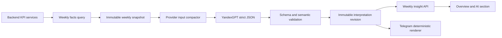

> Historical evidence preserved during the documentation reform. Current replacements: `docs/current/ai/README.md`.

# Полный аудит контура ИИ-интерпретации

Дата аудита: 2026-08-14
Область: weekly snapshot -> YandexGPT -> validation -> publication -> dashboard -> Telegram
Режим: только исследование. Рабочий код и production в рамках аудита не изменялись.

## 1. Итог

Технический контур ИИ реализован существенно надёжнее, чем выглядит конечный результат:

- расчёты выполняет backend, а не модель;
- модель получает агрегированные псевдонимизированные факты без имён сотрудников и исходных документов;
- snapshot, задания, попытки, ответы и публикации версионируются и сохраняются неизменно;
- есть строгий JSON-контракт, локальный preflight, ограниченные повторы, deadline, lease recovery,
  атомарная публикация, аудит операторских действий и метрики;
- старый опубликованный результат остаётся доступным, пока готовится новая ревизия.

Основная проблема находится не в вызове YandexGPT, а на стыках аналитического контракта:

1. полный snapshot содержит значительно больше полезных фактов, чем получает модель;
2. модель обязана писать текст без чисел, но backend и frontend не подставляют значения
   подтверждающих фактов в пользовательский результат;
3. модель не получает ограничения качества данных, хотя prompt требует на них опираться;
4. командные сравнения и выбор лидеров почти не подготовлены детерминированно — модель должна
   вывести их из урезанного набора фактов;
5. валидатор доказывает существование факта, но не всегда доказывает, что конкретный текст
   действительно следует именно из этого факта;
6. offline evaluation проверяет старый контракт v1 и структуру, но не деловую полезность текущего
   prompt v4 / schema v2.

Поэтому текущая интерпретация может быть формально корректной, безопасной и успешно опубликованной,
но при этом общей, повторяющейся и мало помогающей руководителю принять решение.

## 2. Что исследовано

Проверены полностью или по соответствующему сквозному пути:

- `backend/.../interpretation/snapshot` — планирование, извлечение метрик, качество, snapshot;
- `backend/.../interpretation/generation` — compact input, задания, preflight, provider worker,
  budget guard, retry и recovery;
- `backend/.../integration/llm/yandex` — HTTP-контракт YandexGPT, ошибки, token/cost accounting;
- `backend/.../interpretation/validation` — JSON schema, semantic validation, normalisation;
- `backend/.../interpretation/publication` — immutable publication и notification event;
- `backend/.../interpretation/query` и `web` — consumer API и dashboard projection;
- `backend/.../notification` — Telegram fanout и deterministic renderer;
- `frontend/src/insights`, `frontend/src/api/weeklyInsightContract.ts`, admin LLM operations,
  маршруты и встраивание на главную;
- миграции `V22`, `V24`, `V25`, `V31` и связанные notification migrations;
- prompt v4, content schema v2, input schema, документация, deployment-конфигурация,
  Prometheus alerts и offline evaluation tooling;
- backend и frontend тесты, связанные с ИИ-контуром.

Текущая конфигурационная пара по коду и production handoff:

- prompt: `weekly-interpretation-v4`;
- content schema: `2`;
- provider: `YANDEX`;
- model URI фиксируется в задании и не допускает плавающий суффикс `/latest`;
- temperature: `0.2`;
- максимум provider calls: `2`;
- максимум output tokens: `8000`.

## 3. Фактическая архитектура



Принципиально важно: ИИ не обращается к базе и не считает KPI. Он только интерпретирует уже
рассчитанные значения. Изменения формул выручки, возвратов, категорий, attach-rate и рейтинга
попадают в новые snapshots через существующие backend services.

Историческая публикация сама не переписывается. Автоматические ревизии snapshot ограничены окном
`72h`; старые недели потребуют контролируемой ручной регенерации, если их надо пересчитать после
изменения формул.

## 4. Какие периоды сравниваются

Endpoint `GET /api/stores/{storeId}/insights/weekly/current` всегда выбирает последнюю полностью
завершённую календарную неделю магазина:

- начало недели — понедельник в timezone магазина;
- анализируемый период — предыдущий понедельник–воскресенье;
- период сравнения — непосредственно предшествующий понедельник–воскресенье.

Пример при обращении в пятницу 14 августа:

- анализ: 3–9 августа;
- сравнение: 27 июля–2 августа.

Выбранный пользователем месяц или произвольный период на главной на этот endpoint не влияет.
Селектор периода на маршруте `/insights` отключён, хотя тот же компонент на главной расположен
рядом с показателями выбранного месяца. Это создаёт визуально неочевидное смешение периодов.

### 4.1 Магазин

Магазин сравнивается сам с собой: текущая завершённая неделя против предыдущей завершённой недели.

### 4.2 Сотрудник

Сотрудник сравнивается прежде всего сам с собой за те же две недели. В каждом факте хранится:

- текущее значение;
- предыдущее значение;
- абсолютное изменение;
- относительное изменение, только если предыдущее значение больше нуля.

Состав сотрудников snapshot — объединение релевантных сотрудников текущего и предыдущего периода.
Исключаются нераспределённые продажи и сотрудники с `participates_in_ranking=false`. Релевантность
определяется продажами либо допустимостью рейтинга при наличии смен. Ссылки `E01`, `E02` и т. д.
назначаются стабильно внутри snapshot; provider не получает UUID или имя.

Жёсткий предел — 10 сотрудников в одном snapshot.

### 4.3 Сотрудник против команды

Полноценного детерминированного сравнения сотрудника с медианой команды сейчас нет. Snapshot
содержит только `TEAM.RATING.ELIGIBLE_COUNT`, а не медианы, распределения или готовые пары
«наставник–сотрудник».

Лидеров, most improved и peer-learning relationships фактически выбирает модель по индивидуальным
фактам. Backend проверяет допустимость ссылок и форму relationship, но не строит сам надёжный
командный benchmark. Поэтому ответ на вопрос «кого с кем сравниваем» сейчас такой:

- недельная динамика сотрудника — сотрудник с самим собой;
- командные лидеры и обмен опытом — вывод модели среди допущенных сотрудников, а не результат
  отдельного детерминированного алгоритма сравнения.

## 5. Какие факты реально формируются

### 5.1 Магазин, полный snapshot

Формируются:

- чистая выручка, количество, себестоимость, валовая прибыль, маржа;
- средний чек;
- дополнительная выручка на телефон;
- группы и категории: выручка, количество, доля выручки;
- attach-rate: числитель, знаменатель и rate по каждой настроенной метрике;
- план: факт, цель, выполнение, прогноз, остаток, требуемый темп, доли, gap, статус.

Для категорий сейчас нет себестоимости, валовой прибыли и средней прибыли на единицу. Следовательно,
требование заказчика о «среднем заработке с единицы техники» пока не может быть качественно
интерпретировано ИИ только на основании category facts.

### 5.2 Сотрудник, полный snapshot

Формируются:

- число смен, часы и workload status;
- число завершённых продаж и sufficiency выборки;
- выручка, количество, валовая прибыль и маржа при полном cost coverage;
- доля выручки магазина, выручка за смену и час;
- дополнительная выручка и её доля;
- rating scores, coverage и rank;
- категории: выручка, количество, доля;
- attach-rate: числитель, знаменатель и rate;
- список доступных аналитических разделов.

### 5.3 Качество и достаточность

Основные пороги текущей policy:

- нет смен или часов — workload `INSUFFICIENT`;
- одна смена или менее 12 часов — `LIMITED`;
- иначе workload `SUFFICIENT`;
- менее 3 завершённых продаж — выборка `INSUFFICIENT`;
- 3–5 — `LIMITED`, от 6 — `SUFFICIENT`;
- attach denominator менее 3 — `INSUFFICIENT`, 3–4 — `LIMITED`, от 5 — `SUFFICIENT`;
- командные отношения разрешаются при минимум трёх сотрудниках с `SUFFICIENT`.

Store snapshot получает `BLOCKED`, если завершённая неделя не покрыта успешной синхронизацией.
`PARTIAL` используется при неполной себестоимости, классификации, открытых quality issues и
ограничениях attach-rate.

## 6. Что из snapshot реально видит модель

`LlmProviderInputCompactor` намеренно уменьшает payload, но сейчас уменьшение слишком сильное.

| Область | В полном snapshot | В provider input |
|---|---:|---:|
| Категории магазина | все | максимум 2 |
| Attach магазина | все метрики | максимум 1 |
| Категории сотрудника | все | максимум 1 |
| Attach сотрудника | все метрики | максимум 1 |
| Группы продаж | есть | удалены полностью |
| Ограничения качества | есть | удалены полностью |
| Candidate signals | пусто | пусто |
| Team benchmarks | почти отсутствуют | почти отсутствуют |

Категории выбираются по максимальной абсолютной величине выручки текущей или предыдущей недели,
а не по изменению, отклонению от плана или управленческой значимости. Attach выбирается по самому
большому знаменателю. Поэтому резкое изменение небольшой, но важной категории может вообще не
попасть в запрос.

Для магазина сохраняются только ключевые финансовые показатели, две категории, одна attach-метрика
и сокращённые plan facts. Для сотрудника — completed sales, выручка, маржа, выручка в час,
additional share, rating score/coverage, одна категория и одна attach-метрика.

Для сотрудника с `INSUFFICIENT` остаётся только `WORKLOAD_STATUS`. Для `LIMITED` и `SUFFICIENT`
число смен, часы и даже `WORKLOAD_STATUS` не передаются, хотя prompt требует отдельный WORKLOAD
вывод для каждого сотрудника. Если модель не создаёт такой блок, backend может добавить общий
детерминированный текст уже во время validation, используя полный snapshot. Это спасает контракт,
но создаёт шаблонный, неинформативный абзац.

Provider получает технические `categoryCode`, но не получает человекочитаемые названия категорий.
Одновременно prompt запрещает показывать коды и просит использовать русские бизнес-названия.
Это вынуждает модель угадывать перевод/смысл кода.

## 7. Prompt и контракт ответа

Prompt v4 правильно ограничивает модель:

- только русский язык и JSON;
- без расчётов, самостоятельных forecast/rank/attach-rate;
- без кадровых решений, характеристик личности и обвинений;
- каждый вывод должен иметь `evidenceRefs`;
- недостаточные данные должны ограничивать персональный разбор;
- causal explanation разрешён только как hypothesis;
- возвраты нельзя трактовать как доказательство плохой работы сотрудника.

При этом есть внутренние противоречия:

1. запрещены все цифры, проценты, деньги, даты, ранги и часы в narrative;
2. prompt утверждает, что backend подставит проверенные значения по `evidenceRefs`;
3. текущая read projection и frontend этого не делают;
4. prompt требует точные backend limitations, но compactor передаёт пустой список;
5. prompt просит лидеров и most improved, но запрещает модели рассчитывать ranking, а готовых
   deterministic candidate signals нет;
6. prompt требует workload для каждого сотрудника, но workload facts для достаточных сотрудников
   отсекаются;
7. prompt просит небольшое число материальных выводов, но schema одновременно требует много
   обязательных блоков — минимум `2 + 2 * employee count`.

Это основной источник общих формулировок.

## 8. Validation: что надёжно и где есть разрывы

### 8.1 Сильные стороны

Validator проверяет:

- JSON schema v2;
- точный состав сотрудников и backend-owned analysis status;
- обязательные headline/workload/store/team blocks;
- допустимые employee/category/candidate/competency refs;
- существование и доступность evidence;
- запрет cross-employee evidence для employee content;
- ограничения для `INSUFFICIENT` и `LIMITED`;
- отсутствие чисел и технических идентификаторов в narrative;
- форму actions и relationships;
- запрет неподтверждённых revenue/profit risks;
- замену provider limitations на точный backend-owned набор.

### 8.2 Разрыв provenance между compact input и validation

Provider вызывается с компактным набором фактов. Validation затем восстанавливает полный snapshot
через `PersistedWeeklyInterpretationInputFactory` и принимает evidenceRef из полного snapshot.

В specialized response schema ограничиваются employee/category/candidate/competency refs, но не
`evidenceRefs`. Следовательно, ответ может сослаться на синтаксически предсказуемый факт, которого
не было в provider input; если такой факт есть в полном snapshot, validation его примет.

Это не раскрывает персональные данные, но нарушает строгую гарантию «модель действительно видела
указанное доказательство». Для аудируемой интерпретации validation должна проверять exact provider
projection либо публикация должна хранить отдельный перечень реально переданных evidence refs.

### 8.3 Семантическая связь проверяется неполно

- Для STORE/TEAM текста допустимо сослаться на employee evidence без проверки scope.
- Employee item обязан иметь хотя бы один собственный факт, но может дополнительно ссылаться на
  нерелевантные store/team facts.
- `categoryCode` проверяется на допустимость, но не на соответствие cited evidence этой категории.
- `competencyCode` проверяется на допустимость, но не на подтверждение cited facts.
- Проверяется наличие факта, но не смысловая связь текста/действия с метрикой.
- Несколько неверных optional relationships и unsupported risks silently удаляются, после чего
  ответ может быть опубликован без validation retry.

То есть validator хорошо защищает контракт и границы данных, но не является полноценным
проверяющим качества управленческого вывода.

## 9. YandexGPT и жизненный цикл задания

Эта часть реализована аккуратно:

- один фиксированный HTTPS endpoint, redirects не допускаются;
- `Api-Key`, project/folder header и `x-data-logging-enabled: false`;
- strict structured output;
- bounded request и response size;
- local token/context/cost preflight до сети;
- timeout ограничен меньшим из call timeout и job deadline;
- typed классификация HTTP/provider failures и `Retry-After`;
- попытка сохраняется до сетевого вызова;
- raw response сохраняется отдельно от canonical validated response;
- crash между provider call и validation восстанавливается без лишнего повторного вызова;
- не более двух provider calls, validation retry не более одного;
- open attempt защищён уникальным partial index;
- publication использует только `SUCCEEDED` attempt и проверяет canonical hash.

Application ограничивает стоимость одного вызова, но не реализует месячный budget cap. Месячный
лимит должен обеспечиваться внешним Yandex Cloud budget/alert либо будущим application-level guard.

Есть небольшое документационное расхождение: adapter реально отправляет `strict: true`, тогда как
часть старой документации описывает `strict=false`.

## 10. Публикация и ревизии

Публикация выполняется атомарно:

- блокируется store row;
- создаётся новая immutable interpretation revision;
- проставляется ссылка на предыдущую ревизию;
- создаётся `WEEKLY_REPORT_READY` или `WEEKLY_REPORT_REVISED` notification event;
- job переводится в `SUCCESS` в той же транзакции.

Если готовится новая snapshot/interpretation revision, API продолжает отдавать старую публикацию со
статусом `UPDATING` или `UPDATE_DELAYED`. Это правильное поведение для production.

## 11. Dashboard и пользовательский результат

Один и тот же `WeeklyInsightPanel` сейчас отображается:

- на главной `/overview`;
- в отдельном разделе `/insights`.

На главной он расположен над ключевыми KPI и занимает большую часть первого экрана. Отдельный
раздел уже существует и доступен в основной навигации. Поэтому пожелание убрать ИИ-разбор с
главной не требует переработки backend — достаточно удалить повторное встраивание после отдельной
задачи реализации.

Read projection передаёт в frontend:

- текстовые summary/insight/action;
- `evidenceRefs`;
- имена сотрудников, восстановленные из immutable snapshot membership;
- limitations.

Но она не передаёт отображаемое значение, единицу, предыдущее значение и delta для cited evidence.
Frontend хранит `evidenceRefs` в Zod contract, но не использует их при отрисовке. Пользователь не
может проверить, почему сделан вывод и насколько велико изменение.

Дополнительные особенности:

- UI выбирает первый подходящий insight как strength/attention/risk, а не получает явный
  backend priority;
- exact duplicate narratives удаляются только на клиенте;
- отдельного component-теста `WeeklyInsightPanel` нет;
- frontend contract tests проверяют форму API, но не полезность и evidence rendering;
- на `/insights` период selector отключён, поскольку endpoint поддерживает только current week.

## 12. Telegram

Weekly Telegram renderer детерминированно использует ту же canonical publication, заменяет employee
refs именами из snapshot и ограничивает длину сообщения. Provider повторно не вызывается.

Renderer показывает headline, result/dynamics/plan, focus, actions, команду, краткие строки по
сотрудникам и limitations. Числовые значения cited evidence он также не восстанавливает, поэтому
наследует общность dashboard-текста.

По production handoff customer delivery Telegram пока отложена до завершения linking/webhook
acceptance, хотя инфраструктура fanout/delivery реализована.

## 13. Security, privacy и операции

Подтверждено:

- provider input содержит store ref `S01`, employee refs `E01...`, агрегаты и technical category
  codes; имена, UUID сотрудников, документы, телефоны и credentials не передаются;
- имена восстанавливаются только после публикации внутри защищённого backend;
- `/api/admin/**` защищён глобальным ADMIN rule;
- manual regenerate/cancel требует idempotency key, причины длиной 10–500 символов и пишется в
  audit log;
- секрет Yandex не включается в `toString` и не должен попадать в логи;
- provider metrics используют безопасные low-cardinality labels;
- Prometheus alerts покрывают failed/validation_failed, expired lease, deadline и backlog;
- admin UI показывает очередь, статусы, попытки, token/cost totals и разрешает cancel/regenerate.

## 14. Тесты и фактический прогон

Backend содержит широкий набор unit/integration tests для:

- snapshot planning, quality, persistence и crash recovery;
- compactor/request factory и provider preflight;
- Yandex HTTP contract и error mapping через локальный mock server;
- generation/validation/publication lifecycle;
- schema v1/v2 и semantic validation;
- read projection, revisions и Telegram fanout;
- configuration readiness, metrics и operator operations.

14 августа выполнен локальный прогон релевантных backend tests на Java 21 с Testcontainers:

```text
BUILD SUCCESSFUL
failures: 0
external YandexGPT calls: 0
```

Первый технический запуск контейнера остановился на общем `operatorScriptSecurityTest`, потому что
в минимальном Java image не было Python. AI test suite был повторно запущен с исключением только
этого shell-helper и завершился успешно. Это ограничение тестового контейнера, а не сбой продукта.

Frontend целевой прогон:

```text
6 test files passed
16 tests passed
```

Главный пробел тестирования — нет набора реальных v4 outputs с ожидаемыми бизнес-выводами. Текущий
`scripts/llm-eval/manifest.example.json` использует schema v1 и два канонических статических
примера. `evaluate.py` проверяет schema, допустимые refs, forbidden regex и точные JSON pointers,
но не проверяет:

- выбран ли действительно самый важный фактор;
- соответствует ли текст delta/plan/quality;
- не потеряна ли значимая категория compactor-ом;
- полезно ли действие руководителю;
- не повторяет ли модель одну мысль разными словами;
- корректна ли пара наставник–сотрудник;
- совпадает ли cited evidence с тем, что реально видел provider.

## 15. Зафиксированные проблемы по приоритету

### P1 — исправить до улучшения prompt

1. **Нет числовой evidence-проекции для пользователя.** Prompt запрещает числа, UI их не
   восстанавливает.
2. **Validation использует полный snapshot, а не exact provider input.** Возможна формально
   допустимая ссылка на факт, которого модель не видела.
3. **Limitations удаляются из provider input.** Модель не знает, какие разделы ограничены, хотя
   quality status и prompt требуют это учитывать.
4. **Workload facts удаляются для LIMITED/SUFFICIENT.** Обязательный workload-текст становится
   общим или фактически неподтверждённым.
5. **Нет deterministic team benchmark/candidates.** Лидеры, most improved и peer learning слишком
   сильно делегированы модели.
6. **Нет display names категорий в provider input.** Русские названия модель вынуждена угадывать.

### P2 — качество анализа и UX

7. Compactor выбирает категории по абсолютной выручке, а не по значимости изменения/плана.
8. Отсекаются groups и большая часть attach/category evidence.
9. Validator слабо связывает scope/category/competency и смысл текста с конкретным evidence.
10. Silent removal optional items может маскировать слабый ответ вместо controlled retry.
11. API current не связан с выбранным периодом; на главной визуально смешаны месяц и прошлая неделя.
12. ИИ-панель дублируется на главной и в отдельном разделе.
13. Offline evaluation остался на schema v1 и не оценивает деловую полезность.
14. Нет component/e2e тестов реального экрана ИИ-разбора с evidence values.
15. Есть per-call cost guard, но нет application monthly budget cap.

### P3 — сопровождение

16. Документация расходится с кодом по strict output, compactor limits, rollout status и составу
    fact catalog.
17. `llm-fact-catalog-v1.md` описывает будущие team medians/leaders/category profitability как будто
    они уже являются частью контракта, хотя код их не формирует.
18. Schema name в Yandex request остаётся `weekly_interpretation_v1` даже для content schema v2;
    функционально это не мешает, но затрудняет диагностику.

## 16. Рекомендуемая последовательность будущей реализации

Не следует начинать с переписывания prompt. Сначала надо восстановить детерминированную основу и
проверяемость результата.

### Этап 1. Упростить размещение

- убрать `WeeklyInsightPanel` с `/overview`;
- оставить полноценный разбор в `/insights`;
- явно подписать фиксированный недельный период и отсутствие связи с selector месяца.

Это независимое UX-изменение и не требует нового provider call.

### Этап 2. Исправить evidence contract

- сохранить exact provider evidence set рядом с попыткой или однозначно реконструировать его;
- специализировать response schema перечислением допустимых `evidenceRefs`;
- валидировать ответ только против реально переданного provider input;
- не удалять limitations из compact input;
- добавить category display label как backend-owned справочное поле;
- вернуть workload status/shift count/hours в минимально достаточной форме.

### Этап 3. Построить deterministic analytical candidates

Backend должен заранее вычислять и передавать модели:

- material deltas и вклад направлений в изменение результата;
- plan gaps;
- top growth/decline categories по понятной policy;
- attach gaps с достаточным denominator;
- employee self-dynamics;
- team medians/distributions;
- unique leaders с минимальным разрывом;
- most improved;
- допустимые mentor/learner pairs;
- confidence/sufficiency каждого кандидата.

Модель должна выбирать формулировку и связывать несколько подтверждённых сигналов, а не сама
искать лидера в наборе сырых агрегатов.

### Этап 4. Передавать evidence bundle в consumer API

Для каждого cited evidence backend должен вернуть безопасную display-проекцию:

- label;
- current value;
- previous value;
- absolute/relative delta;
- unit/format;
- sufficiency/quality marker;
- category/employee scope.

UI сможет показывать рядом с выводом короткую строку вроде «текущая неделя / прошлая неделя /
изменение», не позволяя модели печатать или округлять числа.

### Этап 5. Упростить prompt и presentation model

- убрать требования, которые backend уже выполняет детерминированно;
- уменьшить обязательное число narrative blocks;
- отказаться от filler workload block, если нет содержательного контекста;
- закрепить приоритеты store/employee/team;
- разделить observation, hypothesis и action визуально;
- показывать confidence и ограничения рядом с конкретным выводом;
- не выбирать «первый insight» как главный без backend priority.

### Этап 6. Создать v4 evaluation dataset

Подготовить минимум 20–50 обезличенных weekly cases:

- ожидаемые обязательные выводы;
- допустимые выводы;
- запрещённые выводы;
- ожидаемые evidence refs;
- expected absence при insufficient/partial data;
- проверка exact provider evidence provenance;
- оценка повторов, конкретности и полезности action;
- regression cases по возвратам, нулевой базе, missing cost, attach denominator и сменам.

### Этап 7. Controlled rollout

- shadow generation без публикации;
- ручная оценка на обоих pilot stores;
- canary одного периода;
- сравнение старой и новой interpretation revision;
- только затем включение публикации и, отдельно, Telegram.

## 17. Вопросы заказчику, которые понадобятся позже

Они не блокируют первые технические исправления, но нужны до окончательной настройки механики:

1. Сохраняем сравнение «полная неделя к предыдущей полной неделе» или нужен rolling period?
2. Для сотрудника что важнее: динамика относительно себя, отклонение от плана, медиана команды или
   лучший сотрудник с сопоставимой нагрузкой?
3. Можно ли показывать руководителю точные значения рядом с ИИ-выводом, если числа подставляет
   backend, а не модель?
4. Какие 3–5 типов действий действительно полезны руководителю и какие рекомендации считаются
   слишком общими?
5. Нужен ли разбор всех сотрудников сразу или сначала магазин, затем раскрытие конкретного
   сотрудника по запросу?
6. Должны ли недостаточные смены полностью запрещать персональную интерпретацию либо разрешать
   только факты продаж без оценки эффективности?

## 18. Решение по итогам аудита

Контур не нужно переписывать с нуля. Persistence, lifecycle, provider adapter, security,
publication и operations можно сохранить. Исправления следует сосредоточить на четырёх слоях:

1. provider projection;
2. deterministic analytical candidates;
3. evidence-aware validation и consumer API;
4. presentation/evaluation.

Первое практическое изменение можно сделать отдельно: убрать ИИ-разбор с главного экрана. После
этого главный технический этап — exact evidence contract; только затем имеет смысл менять prompt и
визуальную интерпретацию.

## 19. Статус реализации: exact evidence contract (2026-08-15)

Этап 2 реализован локально, без развёртывания на production.

Сделано:

- добавлена миграция V37, сохраняющая exact compact provider input и его SHA-256 для каждой новой
  попытки вызова;
- validation теперь использует input конкретной попытки, а не полный immutable snapshot;
- сохранён fallback для legacy attempts, созданных до V37;
- response schema v2 ограничивает `evidenceRefs` только фактами, реально отправленными модели;
- compact input сохраняет backend-owned limitations, связанные evidence и candidate evidence;
- возвращены `SHIFT_COUNT`, `WORKED_HOURS` и `WORKLOAD_STATUS`;
- в snapshot/provider input добавлен backend-owned словарь отображаемых названий категорий;
- пустой словарь не сериализуется, поэтому хеши исторических snapshot остаются совместимыми;
- добавлены fail-closed проверки связности facts, evidence index и snapshot identity.

Проверки:

- целевые unit, contract и Testcontainers-тесты evidence-контура прошли;
- миграция с пустой и предыдущими схемами прошла;
- Checkstyle main/test прошёл;
- полный backend-набор: 776 тестов, 774 прошли в общей сессии; два локальных HTTP-теста
  Telegram завершились connect timeout и затем оба прошли при изолированном повторе.

Следующий технический этап по плану — deterministic analytical candidates. Изменение prompt и
consumer/UI evidence bundle остаются отдельными последующими этапами.

## 20. Статус реализации: deterministic analytical candidates (2026-08-15)

Этап 3 реализован локально, без развёртывания на production и без изменения prompt.

Сделано:

- добавлена `WeeklySnapshotPolicyV3` с явными порогами materiality, plan gap, attach denominator,
  team sample и уникальности лидера;
- snapshot теперь содержит material store movements, plan gaps, top category growth/decline,
  store и employee attach gaps, employee self-dynamics;
- backend формирует team Q1/median/Q3 минимум по трём достаточным сотрудникам;
- unique leaders, most improved и mentor/learner pairs выбираются до обращения к модели;
- category team benchmark ограничен тремя крупнейшими категориями, learner — тремя сотрудниками;
- каждый candidate содержит scope metadata, sufficiency и полный набор evidence refs;
- manifest.candidateRefs строится из тех же сигналов; candidates и evidence проверяются на
  связность до сохранения snapshot;
- compactor сохраняет все факты, на которые ссылается candidate;
- semantic validator v2 проверяет точное соответствие candidateRef по kind/theme/scope/evidence и
  удаляет team relationships, которые не были разрешены backend candidate;
- версии нового snapshot: `weekly-metrics-v3`, `weekly-snapshot-v6`,
  `weekly-quality-v3`.

Проверки:

- unit-тесты покрывают material store/category/plan/attach сигналы, отсечение маленькой категории,
  слабого denominator и employee attach self-dynamics;
- team tests покрывают median/quartile facts, unique leader, most improved, mentor/learner и запрет
  team claims при двух сотрудниках;
- contract path projector → snapshot → compactor → provider request schema → v2 validator прошёл;
- Checkstyle main/test прошёл;
- planner и snapshot builder используют один набор версий; это закреплено pipeline-тестом;
- полный backend-набор: 782 теста, 782 прошли, failures/errors/skipped = 0;
- `operatorScriptSecurityTest` исключён только потому, что Java 21 test image не содержит Python.

Следующий отдельный этап — evidence bundle в consumer API и его безопасный UI-рендеринг.

## 21. Статус реализации: consumer evidence bundle (2026-08-15)

Этап 4 реализован локально, без развёртывания на production и без изменения prompt.

Сделано:

- consumer API возвращает только факты, на которые действительно ссылается опубликованная
  интерпретация;
- внутренние ссылки snapshot заменяются стабильными в пределах ответа непрозрачными кодами
  `EV001`, `EV002` и далее; размер bundle ограничен 200 фактами;
- внутренние employee refs вида `E01` заменяются публичными UUID, а display name берётся из
  immutable membership конкретного snapshot;
- backend формирует безопасные подписи, текущие и предыдущие значения, абсолютное и относительное
  изменение, единицы, sufficiency и готовый текст сравнения;
- форматирование денег, процентов, статусов и мест в рейтинге выполняется только backend; frontend
  не пересчитывает и не интерпретирует исходные числа;
- выдача работает fail-closed, если опубликованный текст ссылается на отсутствующий факт,
  недоступный факт отмечен доступным либо сотрудник отсутствует в membership snapshot;
- UI показывает подтверждающие факты рядом с выводами магазина, команды, сотрудников, действий и
  ограничений данных;
- ИИ-разбор остаётся только на странице `/insights` и не возвращён на главный экран;
- OpenAPI и сгенерированные frontend-типы обновлены без breaking changes;
- документация consumer contract и frontend handoff синхронизирована с реализацией.

Дополнительная сквозная проверка:

- persisted interpretation v2 читается через HTTP API только при полном соответствии
  `evidenceRefs` индексу и фактам своего snapshot;
- ответ содержит семь безопасных evidence entries, отформатированное значение и UUID сотрудника;
- в публичном JSON отсутствуют `STORE.NET_REVENUE`, `EMP:E01` и строковый псевдоним `E01`;
- тот же persisted interpretation после чтения по-прежнему создаёт одну Telegram delivery, то есть
  consumer projection не изменила сохранённый canonical content и notification fanout.

Проверки:

- полный backend-набор: 784 теста, failures/ignored = 0;
- Checkstyle test прошёл;
- frontend: 30 test files, 113 тестов, typecheck, lint и production build прошли;
- OpenAPI generation, frontend contract generation/check и compatibility check прошли;
- operator script security tests прошли отдельно в WSL;
- Gradle supply-chain integrity: 449 компонентов и 840 артефактов проверены успешно;
- `git diff --check` прошёл.

Следующий отдельный этап по плану — упрощение prompt и presentation model. До него полезно сначала
зафиксировать желаемый пользовательский формат выводов, приоритеты store/team/employee и набор
действительно полезных руководителю рекомендаций.

## 22. Статус реализации: упрощение prompt и presentation model (2026-08-15)

Этап 5 реализован локально, без развёртывания на production, внешнего YandexGPT-вызова и создания
Telegram-событий.

Сделано:

- добавлен `weekly-interpretation-v5` как отдельная immutable prompt version для content schema v2;
- пара v2/v5 доступна только для последующей evaluation; application defaults и production не
  переключались с v2/v4;
- v4 сохранён без изменения текста и прежних provider bounds, поэтому уже созданные job продолжают
  исполняться по зафиксированной версии;
- в v5 обязательный минимум сокращён до store headline, team overview и одного headline на каждого
  сотрудника; дополнительные summary blocks формируются только при отдельном полезном выводе;
- WORKLOAD стал необязательным во всём semantic validator v2; backend больше не добавляет общую
  заглушку о достаточности данных;
- prompt закрепляет порядок store → employee self-dynamics → backend-supported team comparison →
  actions, запрет повторов и общих рекомендаций;
- observation, synthesis, hypothesis, risk и opportunity получили явные разные смыслы; возможная
  причина не должна выдаваться за подтверждённый факт;
- presentation projector больше не выбирает первый ответ модели главным: candidate-backed insights
  сортируются по backend sufficiency, тематическому приоритету и стабильному candidateRef;
- UI показывает тип каждого вывода, отдельно поясняет гипотезу и различает подтверждающие данные,
  основание гипотезы, основание рекомендации и данные с ограничениями;
- действия в интерфейсе явно названы рекомендациями; добавлены отсутствовавшие локализованные
  action types, horizons и статус LIMITED.

Границы изменения:

- content schema остаётся v2, миграция опубликованных документов не выполняется;
- точные числа по-прежнему подставляет только backend evidence bundle;
- ranking не пытается оценить свободный текст модели: приоритет применяется только к проверенным
  backend candidates, а при их отсутствии сохраняется исходный порядок;
- v5 не станет default до offline evaluation и controlled rollout.

Добавленные и обновлённые проверки:

- registry/configuration test подтверждает допустимость только согласованной пары v2/v5;
- provider request test проверяет новый prompt и уменьшенные min/max bounds;
- validator tests подтверждают отсутствие WORKLOAD-заглушки и допустимость отсутствующей секции;
- projector test доказывает, что backend-приоритет сильнее порядка insights в ответе модели;
- frontend tests проверяют визуальное различение гипотезы и состояния evidence.

Итоговая локальная проверка:

- полный backend-набор: 787 тестов, failures/errors/skipped = 0;
- Checkstyle main/test прошёл;
- frontend: 30 test files, 114 тестов, contracts check, lint, typecheck и production build прошли;
- operator script security tests прошли отдельно в WSL;
- Gradle supply-chain integrity: 449 компонентов и 840 артефактов проверены успешно;
- `git diff --check` прошёл.

Следующий отдельный этап — evaluation dataset и shadow-сравнение v4/v5 на обезличенных weekly
cases. До него default prompt остаётся v4.

## 23. Статус реализации: versioned evaluation dataset (2026-08-16)

Локальная часть этапа 6 реализована без production-развёртывания, внешних LLM-вызовов, публикации
интерпретаций и Telegram-событий.

Сделано:

- `dataset-v2.json` содержит 26 обезличенных сценариев и две конфигурации одного content schema:
  текущий prompt v4 и кандидат v5;
- покрыты stable/growth/decline, план, допродажи, attach-rate с достаточной и малой базой, категории,
  возвраты, нулевая текущая и прошлая база, data quality, sufficiency сотрудников, self-dynamics,
  team tie/leader/most improved, конфликтующие сигналы и конец месяца;
- сценарий возвратов проверяет реальную границу контракта: snapshot содержит уже чистые показатели,
  но не отдельную сумму возвратов, поэтому модель не вправе заявлять рост возвратов;
- для каждого случая зафиксированы обязательные, допустимые и запрещённые выводы, а также exact
  candidate/relationship/limitation expectations;
- compact scenario детерминированно разворачивается в полный provider-neutral input v1 с
  уникальным snapshotRef и SHA-256 factsHash;
- каждый построенный input проверяется официальной JSON Schema и дополнительной связностью
  facts/evidence/candidates/limitations;
- dataset использует production evidenceRef/metricCode, реальные plan/category/attach thresholds,
  трёхзначные candidateRef и фактическую форму team benchmark/candidate;
- ответы v4/v5 проверяются по content schema v2, доступности evidence, exact candidates и team
  relationships, сотрудникам, limitations, narrative safety, повторам и ограничениям объёма;
- runner перед schema gate повторяет детерминированную backend-нормализацию nullable-полей, широких
  action targets и backend-owned limitations;
- dataset хранит human rubric из пяти измерений и список critical errors; смысловые ожидания
  оцениваются человеком, а не ненадёжным поиском совпадающих слов;
- legacy manifest v1 продолжает поддерживаться отдельно.

Добавленные проверки:

- 14 unit-тестов runner покрывают валидный ответ, детерминированность input, экспорт, полную матрицу,
  legacy compatibility и намеренные нарушения;
- негативные тесты проверяют unknown evidence, числа и технические идентификаторы в narrative,
  персональный insight при INSUFFICIENT, неподтверждённую team relationship, несовпадение insight с
  candidate, непродуктовый формат fact/candidate refs и замену ответа модели точным backend-owned
  limitation;
- локальная проверка dataset построила и провалидировала все 26 input без model responses.

Итоговая регрессия проекта:

- backend: 787 тестов, failures/errors/skipped = 0; Checkstyle main/test прошёл;
- frontend: contracts check, lint, 30 test files / 114 тестов и production build прошли;
- OpenAPI compatibility прошла на свежем сгенерированном artifact;
- operator script security и Gradle supply-chain integrity прошли; проверены 449 компонентов и
  840 артефактов;
- git diff --check прошёл.

Граница готовности:

- evaluation infrastructure и канонические сценарии готовы;
- ответы провайдера ещё не генерировались, поэтому сравнение качества v4/v5 и решение о переключении
  default prompt не выполнены;
- следующий отдельный шаг — согласовать бюджет, получить 52 shadow-ответа без публикации, запустить
  полный автоматический gate и провести ручную оценку по rubric.

До этого default prompt и production-конфигурация остаются на v4.

## 24. Статус реализации: безопасная подготовка shadow-сравнения (2026-08-16)

Подготовительная часть этапа 7 реализована локально. Внешних YandexGPT-вызовов, production-записей,
публикаций и Telegram-событий не было.

Сделано:

- добавлен test-only `LlmEvalShadowRunner`, который не входит в production JAR;
- запросы строятся через настоящий `LlmProviderInputCompactor` и `LlmProviderRequestFactory`, а
  отправка при явном разрешении использует production `YandexLlmProviderClient`;
- для каждой пары v4/v5 проверяется точное равенство уже сжатого provider input; в плане сохраняется
  его SHA-256, полный prompt/input/schema в лог не выводится;
- dry-run по умолчанию не требует credentials и не вызывает сеть;
- execute требует versioned model URI, secret file, отдельную confirmation-фразу, максимальное число
  платных вызовов и общий верхний предел расчётной стоимости;
- сохранение resumable: готовые ответы не перезаписываются, ошибки не повторяются автоматически,
  response, receipt и safe failure metadata разделены;
- применяются production-ограничения request bytes, context window и максимальной стоимости одного
  запроса; агрегированный лимит проверяется до первого сетевого вызова;
- shell wrapper сам выбирает локальный Java 21 и сохраняет `set +x`/`umask 077`.

Dry-run выявил и устранил два расхождения evaluation infrastructure:

1. export из `evaluate.py` является полным scenario input, после чего production закономерно применяет
   compaction; документация исправлена, а реальный shadow теперь строится только production factory;
2. сценарий `month-end-recovery` начинался во вторник, хотя production принимает только недели
   понедельник–воскресенье. Период исправлен, это правило добавлено в semantic gate и отдельный тест.

Проверки:

- dataset: 26 сценариев, 14 Python-тестов;
- полный backend-suite: 792 теста, failures/errors/skipped = 0;
- после финального усиления budget guard: 6 targeted Java-тестов;
- Checkstyle test и operator script security прошли;
- полный dry-run подготовил 52 запроса, подтвердил одинаковый provider input внутри каждой пары и
  оценил консервативный максимум всей матрицы в `612.343200 RUB` при текущих коэффициентах;
- сеть и API key в dry-run не использовались.

Оставшаяся граница этапа:

- ответы v4/v5 ещё не получены;
- до отдельного согласования бюджета команда `shadow.sh run` не запускается;
- default prompt и production-конфигурация остаются на v4.

## 25. Статус реализации: слепая ручная оценка и decision gate (2026-08-16)

Следующий локальный слой controlled rollout реализован без внешних LLM-вызовов, production-записей,
публикаций и Telegram-событий.

Сделано:

- `review.py status` проверяет готовность матрицы без записи артефактов и без сети;
- `review.py prepare` допускается только после успешного automatic gate всех 52 ответов;
- для каждого сценария ответы контрбалансированно назначаются вариантами A/B: v4 не остаётся всегда
  первым и не раскрывается проверяющему;
- review packet содержит полный обезличенный provider input, смысловые required/acceptable/forbidden
  expectations, rubric и оба ответа, но не содержит названий prompt-конфигураций;
- отдельный `scores.json` требует оценок 1–5 по всем пяти dimensions, статуса каждого обязательного
  и запрещённого вывода и отдельного статуса каждого типа critical error;
- packet, закрытая assignment-карта, score sheet и исходные response-файлы связаны SHA-256;
  финализация обнаруживает изменение ответа, перестановку A/B и подмену формы;
- артефакты создаются с приватным `umask 077` и не перезаписывают существующие файлы;
- `review.py finalize` повторно запускает automatic gate, проверяет полноту ручной оценки, только
  после этого раскрывает v4/v5 и формирует JSON/Markdown decision report;
- v5 может получить только статус `CANDIDATE_ELIGIBLE_FOR_CANARY`: он требует полного ручного gate
  и отсутствия регрессии к v4 по ручным оценкам, automatic pass rate, candidate coverage и повторам;
- число actions и workload blocks сохраняется как сравнительная информация, но не используется как
  механический критерий: меньше блоков само по себе не доказывает лучшее качество;
- даже положительное решение разрешает только отдельный canary одного периода и не меняет default
  prompt, публикацию или Telegram.

Добавлены schema формы оценок и 5 тестов, проверяющих:

- детерминированность, отсутствие v4/v5 в packet и равномерное распределение A/B;
- обязательную полноту dimensions/findings/critical errors и SHA-256 bindings;
- обнаружение изменения response после подготовки;
- запрет перезаписи готового артефакта;
- положительный canary gate и его блокировку при critical error кандидата.

Итоговая локальная проверка:

- 19 Python-тестов evaluation/review прошли;
- все 26 scenario inputs прошли dataset gate;
- `review.py status` корректно показал 0 полученных и 52 отсутствующих ответа без violations;
- review artifacts находятся под игнорируемым Git каталогом `build/`.

Оставшаяся граница не изменилась:

- платные ответы v4/v5 ещё не получены;
- до отдельного согласования бюджета shadow execute не запускается;
- без 52 ответов невозможно подготовить настоящий blinded packet, выполнить ручную оценку и принять
  решение о canary;
- default prompt и production-конфигурация остаются на v4.

## 26. Статус реализации: выводы первого shadow-пилота и кандидат v6 (2026-08-16)

Первая ограниченная платная shadow-пара v4/v5 была получена для одного сценария. Оба запроса
успешно прошли Yandex API; суммарная стоимость составила `4.816 RUB`. Ответы не публиковались,
production-конфигурация и Telegram не менялись.

Automatic gate выявил:

- у v4 — 8 исходных нарушений: четыре выдуманные связи между сотрудниками с пустыми выводами и
  четыре неподтверждённых блока `WORKLOAD`;
- у v5 — одно нарушение narrative safety: модель перенесла цифру в человекочитаемый текст;
- после добавления отдельной проверки прямых workload-доказательств прежний ответ v4 ожидаемо
  получает 9 нарушений, поскольку отсутствие workload evidence теперь фиксируется явно.

V5 сохранён без изменений как immutable-артефакт первого пилота. Для исправлений добавлен новый
кандидат `weekly-interpretation-v6`.

Локально реализовано:

- provider schema запрещает `teamRelationships`, когда backend не передал ни одного кандидата;
  при наличии кандидатов ограничивает количество элементов и допустимые темы фактическим набором;
- production validator теперь требует точного backend-кандидата для каждой связи даже при пустом
  списке кандидатов и удаляет неподтверждённые необязательные связи из канонического ответа;
- `WORKLOAD` допускается только при прямом workload evidence: соответствующей секции, статусе или
  workload-факте. Выручка, результат сотрудника и общий статус достаточности таким доказательством
  не являются;
- prompt v6 запрещает переносить числа, проценты, деньги и дельты в narrative, требует посимвольную
  финальную проверку и запрещает создавать workload/relationship-текст для заполнения структуры;
- offline evaluator получил тот же workload gate;
- shadow runner рассчитывает `evaluationHash` по prompt, compact input, response schema, temperature
  и token limit. Старый response/receipt нельзя принять за результат новой матрицы после изменения
  контракта;
- evaluation matrix переведена с v4/v5 на v4/v6. Исторические v4/v5-артефакты сохранены отдельно.

Проверки после исправления:

- полный backend-suite: 794 теста, failures/errors/skipped = 0;
- Checkstyle main/test прошёл;
- 20 Python-тестов evaluation/review прошли;
- чистый offline plan построил 52 запроса v4/v6 без сети и оценил консервативный максимум полной
  матрицы в `622.019200 RUB`;
- `git diff --check` прошёл.

Следующий безопасный шаг — только после отдельного согласования бюджета выполнить одну свежую
контрольную пару v4/v6 в новых каталогах ответов и артефактов. Полный платный прогон, canary,
изменение default prompt, публикация и production-развёртывание этим этапом не разрешены.

## 27. Результат свежей контрольной пары v4/v6 (2026-08-16)

После отдельного подтверждения бюджета выполнена ровно одна новая shadow-пара для сценария
`accessory-gap` в отдельном каталоге артефактов. Публикации, Telegram-событий, production-записей
и изменения default prompt не было.

Бюджет и выполнение:

- offline preflight выбрал ровно два запроса: v4 и v6 для одного и того же compact input;
- консервативный общий предел пары составил `24.343200 RUB`, жёсткий лимит запуска — `30 RUB`;
- оба вызова завершились успешно, failures = 0;
- фактическая стоимость v4 — `2.492800 RUB`, v6 — `2.492000 RUB`;
- фактическая стоимость пары — `4.984800 RUB`;
- сохранены два response и два receipt, старые v4/v5-артефакты не изменялись.

Automatic gate отклонил оба ответа:

- v4: 2 нарушения — повтор одного narrative и неподтверждённый блок `WORKLOAD`;
- v6: 5 нарушений — candidate `C001` требовал `kind=RISK`, но модель вернула
  `kind=OBSERVATION`; дополнительный employee insight вынес технический `employeeRef=E01`
  в title и summary, что одновременно нарушило запрет цифр и запрет технических идентификаторов.

При этом v6 действительно устранил прежние классы ошибок: `teamRelationships` остался пустым,
неподтверждённого `WORKLOAD` нет, duplicate narratives нет. Но появились новые критические
контрактные нарушения, поэтому v6 не готов к canary и полный платный прогон запрещён.

Следующий этап снова локальный: усилить специализированную response schema и/или каноническую
валидацию так, чтобы связка candidateRef/kind/theme/scope/evidence была неделимой, а технические
employeeRef не могли попадать в narrative. После регрессионных тестов потребуется новый versioned
prompt-кандидат; существующие v5 и v6 остаются неизменяемой историей фактических пилотов.

## 28. Статус реализации: strict candidate-контракт и prompt v7 (2026-08-16)

После отклонения контрольной пары v4/v6 выполнен следующий локальный этап. Внешних LLM-вызовов,
production-записей, публикаций и Telegram-событий не было. Уже использованные v5 и v6 не изменялись.

Реализовано:

- добавлен новый immutable candidate `weekly-interpretation-v7`;
- для v7 каждый provider-owned insight обязан содержать non-null candidateRef из фактического
  списка non-relationship backend candidates;
- relationship-кандидаты исключены из допустимых insight candidateRef; при отсутствии обычных
  candidates provider schema устанавливает `insights.maxItems = 0`;
- верхняя граница insights ограничена числом доступных кандидатов, а допустимые kind и theme —
  фактическими множествами backend candidates;
- свободный дополнительный employee insight без candidateRef, который в v6 вывел `E01` в
  narrative, структурно невозможен;
- для известного candidateRef production validator канонизирует kind, theme, scope, employeeRef,
  categoryCode и evidenceRefs из immutable CandidateSignal до structural/semantic validation;
- повтор одного candidateRef в нескольких insights отклоняется отдельным
  `DUPLICATE_CANDIDATE_REF`;
- prompt v7 требует хранить refs только в структурных полях, запрещает free-form insights и
  предписывает отдельную финальную проверку narrative на перенос любого input reference;
- evaluation и blinded-review matrix переведены с v4/v6 на v4/v7. Исторические платные артефакты
  v4/v5 и v4/v6 сохраняются отдельно и не переиспользуются.

Проверки:

- targeted Java tests для provider factory, validator, registry/readiness и shadow runner прошли;
- полный backend-suite: 796 тестов, failures/errors/skipped = 0;
- Checkstyle main/test прошёл;
- 21 Python-тест evaluation/review прошёл;
- чистый offline plan построил 52 запроса v4/v7, подтвердил request/context/budget guards и оценил
  консервативный максимум полной матрицы в `629.625600 RUB`;
- `git diff --check` прошёл;
- сеть и локальный API key на этом этапе не использовались.

V7 остаётся неактивным evaluation-кандидатом. Application default остаётся v4. Следующий возможный
шаг требует отдельного подтверждения бюджета: ровно одна свежая контрольная пара v4/v7 в новых
каталогах. Полный платный прогон, canary и production-развёртывание до успешного automatic gate
контрольной пары запрещены.


## 29. Результат свежей контрольной пары v4/v7 (2026-08-16)

После отдельного подтверждения бюджета выполнена ровно одна новая shadow-пара для сценария
`accessory-gap` в каталоге `build/llm-eval/v4-v7-control-20260816`. Публикации, Telegram-событий,
production-записей, изменения default prompt и развёртывания не было.

Бюджет и выполнение:

- offline preflight выбрал v4 и v7 для одного и того же сценария;
- консервативный максимум пары составил `24.589600 RUB`, жёсткий лимит запуска — `30 RUB`;
- оба вызова завершились с HTTP 200, failures = 0;
- фактическая стоимость v4 — `2.392800 RUB`, v7 — `2.572000 RUB`;
- фактическая стоимость пары — `4.964800 RUB`;
- сохранены два response и два receipt с `evaluationHash`; предыдущие pilot-артефакты не
  перезаписывались.

Результат partial automatic gate:

- v4: 1 проверенный ответ, 0 passed, 1 нарушение — блок summary про отсутствие рабочей нагрузки
  ссылается только на выручку сотрудника и не имеет прямого workload evidence;
- v7: 1 проверенный ответ, 1 passed, 0 нарушений;
- v7 сохранил единственный backend candidate `C001`, не создал свободных insights или связей между
  сотрудниками и не создал неподтверждённый workload-блок;
- это результат только одного контрольного сценария. Остальные 25 ответов каждой конфигурации
  отсутствуют, поэтому полный automatic gate матрицы закономерно не пройден и blinded review не
  готовится.

Ручной просмотр контрольного ответа показывает, что структурные ошибки v6 в этом сценарии
устранены, однако две рекомендации v7 остаются близкими по смыслу и довольно общими. Отсутствие
автоматических нарушений не доказывает достаточную аналитическую полезность текста.

Вывод этапа: v7 прошёл минимальный контрольный сценарий и остаётся кандидатом на дальнейшую
оценку, но не получил разрешение на canary или production. Application default остаётся v4.
Следующий шаг должен быть локальным: определить, как отдельно оценивать конкретность и
неповторяемость действий, добавить соответствующие regression cases и только затем решать,
нужен ли следующий ограниченный платный прогон. Любые новые платные вызовы требуют отдельного
согласования бюджета.

## 30. Статус реализации: action-quality gate и prompt v8 (2026-08-16)

После ручного просмотра успешного structural-ответа v7 выполнен следующий локальный этап. Новых
внешних LLM-вызовов, production-записей, публикаций, Telegram-событий и развёртывания не было.
Использованный в платном пилоте v7 оставлен неизменяемым; улучшения оформлены новым candidate
`weekly-interpretation-v8`.

Реализовано:

- в evaluation dataset добавлена versioned action-quality policy с явным списком допустимых
  наблюдаемых управленческих операций и двумя порогами текстовой близости;
- каждое действие должно называть конкретную проверку, разбор, сравнение, обсуждение практики,
  отработку сценария, изменение процесса или другой наблюдаемый шаг; общие фразы без такой операции
  отклоняются как `nonSpecificActions`;
- близость действий сравнивается только при одинаковых target scope, target employees, horizon и
  evidenceRefs. Одинаковый action type считается структурным дублем; высокий порог применяется ко
  всем парам, а сниженный — только если хотя бы одно действие уже признано неконкретным;
- evaluator сохраняет исходные JSON-индексы и не падает на schema-invalid item, поэтому нарушение
  указывает настоящий путь `$.actions[index]`;
- automatic report получил метрики `nonSpecificActions` и `nearDuplicateActions`;
- blinded decision gate запрещает кандидату регрессировать относительно v4 по обеим новым метрикам;
- human rubric отдельно требует операцию, объект, проверяемый результат и отсутствие смыслового
  повтора;
- prompt v8 требует эти три части для каждого действия и предписывает объединять рекомендации с
  одинаковыми target, horizon и evidence, если различается только формулировка или action type;
- v8 сохраняет strict candidate-only provider schema и backend-owned normalization v7;
- evaluation, shadow runner и blinded review переведены с v4/v7 на v4/v8. Исторические артефакты
  v4/v5, v4/v6 и v4/v7 сохраняются отдельно.

Регрессионная проверка сохранённого ответа v7 для `accessory-gap` теперь находит ровно три
action-quality нарушения: оба действия не содержат наблюдаемой операции, а сама пара является
близким дублем. Положительный контрпример с проверкой наличия и отдельным разбором выкладки не
штрафуется.

Локальные проверки:

- 25 Python-тестов evaluation/review прошли;
- targeted Java tests для prompt registry, readiness, provider schema и shadow runner прошли;
- полный backend-suite: 798 тестов, failures/errors/skipped = 0;
- Checkstyle main/test прошёл;
- чистый offline plan построил 52 запроса v4/v8 в новом каталоге без сети и ключа;
- консервативный максимум полной матрицы — `643.312000 RUB`, первой контрольной пары —
  `25.115200 RUB`;
- plan содержит только `weekly-interpretation-v4` и `weekly-interpretation-v8`.

V8 остаётся неактивным evaluation-кандидатом, application default остаётся v4. Следующий возможный
шаг требует отдельного подтверждения бюджета: одна свежая контрольная пара v4/v8 с жёстким лимитом
не ниже рассчитанного preflight и в новом каталоге артефактов. Полный платный прогон, canary,
production-развёртывание, публикация и Telegram до отдельного решения не разрешены.

## 31. Результат свежей контрольной пары v4/v8 (2026-08-16)

После отдельного подтверждения бюджета выполнена ровно одна новая shadow-пара для сценария
`accessory-gap` в каталоге `build/llm-eval/v4-v8-control-20260816`. Публикации, Telegram-событий,
production-записей, изменения default prompt и развёртывания не было.

Бюджет и выполнение:

- offline preflight выбрал v4 и v8 для одного и того же compact input;
- консервативный максимум пары составил `25.115200 RUB`, жёсткий лимит запуска — `30 RUB`;
- оба вызова завершились с HTTP 200, failures = 0;
- фактическая стоимость v4 — `2.500000 RUB`, v8 — `2.747200 RUB`;
- фактическая стоимость пары — `5.247200 RUB`;
- сохранены два response и два receipt с `evaluationHash`; исторические артефакты не
  перезаписывались.

Partial automatic gate отклонил оба ответа:

- v4: 3 нарушения — одно неконкретное действие, точный повтор narrative и неподтверждённый
  `WORKLOAD`-блок;
- v8: 1 нарушение — второе действие не содержит наблюдаемой операции и сводится к общему
  «проанализировать причины и разработать меры»;
- v8 не создал `WORKLOAD`, team relationships или точных narrative-дублей; первое действие
  конкретно предлагает проверить ассортимент и выкладку и зафиксировать найденные проблемы;
- сохранено два ответа и два receipt, failure artifacts отсутствуют.

Ручной просмотр подтвердил корректность action-quality нарушения и выявил дополнительный пробел
automatic gate: insight v8 выводит риск снижения общей прибыльности только из снижения выручки и
доли категории. Во входе нет evidence по валовой прибыли или марже, поэтому расширение вывода с
выручки на прибыльность не подтверждено. Текущий narrative gate пока не сопоставляет упомянутую
бизнес-метрику с dimension её evidence.

Вывод этапа: v8 улучшил структуру и дал одно полезное конкретное действие, но контрольный сценарий
не прошёл и кандидат не готов к canary. Полный платный прогон v4/v8 запрещён. V8 становится
immutable-историей отклонённой пары, application default остаётся v4.

Следующий этап снова локальный: ограничить лишние действия для одиночного candidate signal,
добавить deterministic narrative dimension guard для прибыли/маржи/выручки и оформить исправления
новым versioned prompt-кандидатом. Любые следующие платные вызовы требуют отдельного согласования.

## 32. Локальный candidate v9: dimension и action-cardinality gate (2026-08-16)

После отклонения контрольного ответа v8 выполнен только локальный этап. Новых внешних LLM-вызовов,
production-записей, публикаций, Telegram-событий, развёртывания и изменения default prompt не было.
Application default остаётся weekly-interpretation-v4; weekly-interpretation-v9 является неактивным
evaluation-кандидатом.

Реализовано:

- новый immutable prompt v9 запрещает перенос вывода между измерениями: слова о выручке требуют
  revenue evidence, слова о прибыли, марже и рентабельности — profitability evidence;
- backend-validator применяет эту проверку ко всем summaryBlocks, insights, actions и
  teamRelationships, используя одновременно evidenceRefs и metricCode исходных фактов;
- semantic mismatch больше не скрывается удалением отдельного insight: ответ отклоняется с
  UNSUPPORTED_NARRATIVE_DIMENSION;
- provider schema v9 динамически ограничивает actions числом non-relationship candidates;
- prompt допускает не более одного действия на candidate и требует объединять связанные шаги в
  одну проверяемую рекомендацию;
- независимый Python evaluator повторяет обе проверки и не полагается только на production-validator.

Повторная оценка сохранённой платной пары v4/v8 новым gate, без нового обращения к модели, дала
ожидаемый результат. Для исторического ответа v8, помеченного только как v9 для применения новых
правил, обнаружены три нарушения: неподтверждённая PROFITABILITY dimension в insight, два действия
при одном non-relationship candidate и неконкретное второе действие. Таким образом, оба дефекта,
выявленные ручным просмотром, теперь воспроизводятся автоматически.

Локальные проверки:

- 29 Python-тестов evaluate/review прошли;
- targeted Java tests для validator, provider request/schema, prompt registry и readiness прошли;
- Checkstyle main/test прошёл;
- offline plan сформировал 52 запроса только для v4/v9 без сети и ключа;
- консервативный максимум полной матрицы — 654.190400 RUB, первой пары accessory-gap —
  25.533600 RUB: v4 12.368000 RUB и v9 13.165600 RUB;
- два полных backend-прогона выполнили по 802 теста, но каждый завершился одним разным
  инфраструктурно-зависимым сбоем: сначала WeeklySnapshotPipelineIntegrationTest, затем проверка
  конкурентного лимита сессий в SecurityHardeningIntegrationTest; оба проблемных сценария после
  этого прошли изолированно. Поэтому changed-scope gate зелёный, но полный suite честно не отмечен
  как полностью зелёный.

V9 не разрешён для canary или production. Следующий возможный этап — только после отдельного
подтверждения бюджета выполнить одну свежую контрольную пару v4/v9 в новом каталоге артефактов с
жёстким лимитом не ниже 25.533600 RUB. Полная платная матрица до успешной пары запрещена.

## 33. Результат контрольной пары v4/v9 (2026-08-16)

После отдельного подтверждения выполнена ровно одна платная shadow-пара для accessory-gap в
каталоге build/llm-eval/v4-v9-control-20260816. Полная матрица, publication, Telegram,
production-записи, развёртывание и изменение default prompt не выполнялись.

Выполнение и бюджет:

- preflight выбрал только первые два запроса v4/v9 на одном provider input;
- консервативный максимум пары — 25.533600 RUB, hard limit — 30 RUB;
- оба вызова завершились успешно, provider failures отсутствуют;
- фактическая стоимость v4 — 2.487200 RUB, v9 — 2.843200 RUB;
- фактическая стоимость пары — 5.330400 RUB.

Первоначальный automatic gate нашёл у v9 два нарушения: insight снова вывел риск общей
прибыльности только из evidence выручки и доли категории, а STORE HEADLINE дословно повторил
insight title. Лимит actions сработал: при одном candidate осталось одно действие. Однако ручной
просмотр выявил новый обход action-quality gate: модель добавила разрешённое слово «зафиксировать»
к прежнему шаблону «проанализировать причины, разработать меры, восстановить показатели». Такое
действие не называет конкретную проверку или результат и не помогает менеджеру.

После добавления forbidden boilerplate policy тот же сохранённый ответ, без повторного обращения к
модели, детерминированно получает все три нарушения: unsupported PROFITABILITY dimension,
non-specific action и duplicate narrative. V9 отклонён, полная платная матрица v4/v9 запрещена.

## 34. Локальный candidate v10 и усиленный action-quality gate (2026-08-16)

Новый immutable prompt weekly-interpretation-v10 создан без внешних вызовов и не активирован.
Application default остаётся weekly-interpretation-v4.

Изменения:

- слова о прибыли, марже, рентабельности, доходности и заработке буквально запрещены в item без
  GROSS_PROFIT, MARGIN или PROFIT metricCode, включая формулировки гипотетического риска;
- STORE HEADLINE и insight title должны выражать разные уровни вывода и не могут повторяться;
- шаблоны «проанализировать причины», «разработать меры», «восстановить показатели» запрещены даже
  рядом с разрешённым глаголом;
- «зафиксировать проблемы/причины/ситуацию» больше не считается конкретным действием; требуется
  назвать проверку и конкретный артефакт результата;
- evaluator получил versioned forbiddenBoilerplatePatterns, JSON schema и регрессионный тест;
- v10 наследует candidate-only insights, backend-owned normalization, dimension guard и динамический
  лимит actions из v9.

Локальные проверки:

- 30 Python-тестов evaluate/review прошли;
- targeted Java tests для provider factory, validator, schema registry, readiness и shadow runner
  прошли;
- Checkstyle main/test прошёл;
- сохранённый v9-ответ под новым gate воспроизводит все три дефекта;
- offline plan содержит 52 запроса только v4/v10, сеть и ключ не использовались;
- консервативный максимум полной матрицы — 663.603200 RUB; первой пары accessory-gap —
  25.895200 RUB: v4 12.368000 RUB и v10 13.527200 RUB.

V10 остаётся неактивным evaluation-кандидатом. Следующий платный вызов возможен только после
нового отдельного подтверждения: одна контрольная пара v4/v10 с hard limit 30 RUB в новом каталоге.
До её успеха запрещены полная матрица, blinded review, canary и production.

## 35. Результат контрольной пары v4/v10 (2026-08-16)

После отдельного подтверждения выполнена ровно одна платная shadow-пара для accessory-gap в
каталоге `build/llm-eval/v4-v10-control-20260816`. Полная матрица, publication, Telegram,
production-записи, развёртывание и изменение default prompt не выполнялись.

Выполнение и бюджет:

- preflight выбрал только первые два запроса v4/v10 на одном provider input;
- консервативный максимум пары — 25.895200 RUB, hard limit — 30 RUB;
- оба вызова завершились успешно, provider failures отсутствуют;
- фактическая стоимость v4 — 2.381600 RUB, v10 — 3.005600 RUB;
- фактическая стоимость пары — 5.387200 RUB.

Первоначальный automatic gate отклонил v4 за WORKLOAD summary без workload evidence и не нашёл
нарушений у v10. Действие v10 стало конкретным: проверить ассортимент и выкладку кабелей и зарядных
устройств, определить пробелы в наличии и зафиксировать их. Ручной просмотр, однако, обнаружил два
содержательных дефекта: STORE headline и insight title почти повторяют один и тот же вывод, а
insight summary содержит управленческую директиву «необходимо выявить причины и принять меры».
Аналитический insight в таком виде частично дублирует действие и хуже разделяет факт и рекомендацию.

После добавления narrative-quality policy тот же сохранённый ответ, без повторного обращения к
модели, детерминированно получает оба нарушения: similarity headline/title равна 0.9231 и insight
содержит management directive. V10 отклонён, полная платная матрица v4/v10 не запускалась.

## 36. Локальный candidate v11 и narrative-quality gate (2026-08-16)

Новый immutable prompt `weekly-interpretation-v11` создан без дополнительных внешних вызовов и не
активирован. Application default остаётся `weekly-interpretation-v4`.

Изменения:

- STORE headline должен описывать более широкую управленческую область, а insight title — точный
  подтверждённый сигнал; близкий повтор при пересекающихся evidenceRefs отклоняется;
- insights оставлены только для анализа: управленческие директивы, проверки и предлагаемые шаги
  допускаются исключительно в actions;
- versioned dataset получил порог headline/insight similarity и набор directive-patterns;
- evaluator проверяет директивы во всех STORE и EMPLOYEE insights и публикует отдельные метрики
  `nearDuplicateNarratives` и `directiveInsights`;
- blinded-review decision gate требует, чтобы обе новые метрики v11 не ухудшались относительно v4;
- v11 наследует candidate-only insights, backend-owned normalization, dimension guard,
  action-quality policy и динамический лимит actions из v10.

Локальные проверки:

- 32 Python-теста evaluate/review прошли;
- targeted Java tests для provider factory, schema registry, readiness и shadow runner прошли:
  43 теста, 0 failures, 0 errors;
- Checkstyle main/test и `git diff --check` прошли;
- сохранённый платный ответ v10 под новым gate воспроизводит два замечания ручного просмотра;
- offline plan содержит 52 запроса только v4/v11, сеть и ключ не использовались;
- консервативный максимум полной матрицы — 669.260800 RUB; первой пары accessory-gap —
  26.112800 RUB: v4 12.368000 RUB и v11 13.744800 RUB.

V11 остаётся неактивным evaluation-кандидатом. Платных вызовов v11 ещё не было. Следующий возможный
этап — только после нового отдельного подтверждения выполнить одну контрольную пару v4/v11 с
hard limit 30 RUB в новом каталоге. До её успешного automatic и ручного контроля запрещены полная
матрица, blinded review, canary, production и изменение default prompt.

## 37. Результат контрольной пары v4/v11 (2026-08-16)

После отдельного подтверждения выполнена ровно одна платная shadow-пара для accessory-gap в
каталоге `build/llm-eval/v4-v11-control-20260816`. Runner выбрал два запроса на одном provider
input, не выполнял автоматических повторов и не запускал остальные сценарии. Publication, Telegram,
production-записи, развёртывание и изменение default prompt не выполнялись.

Выполнение и бюджет:

- консервативный максимум пары — 26.112800 RUB, hard limit — 30 RUB;
- оба вызова завершились успешно, provider failures отсутствуют;
- фактическая стоимость v4 — 2.405600 RUB, v11 — 3.117600 RUB;
- фактическая стоимость пары — 5.523200 RUB;
- v4 использовал 3007 токенов, v11 — 3897 токенов.

Прежний automatic gate ожидаемо отклонил v4 за WORKLOAD summary без workload evidence и формально
пропустил v11 без нарушений. V11 сохранил одно конкретное действие: проверить наличие и выкладку,
зафиксировать найденные пробелы и обсудить дальнейшую проверку категории. Ручной просмотр,
однако, обнаружил новый обход narrative gate:

- insight title целиком вложен в STORE headline; добавленная причинная фраза искусственно снизила
  Dice similarity и позволила пройти прежний порог;
- STORE headline без подтверждающих данных связал снижение с ассортиментом или выкладкой;
- RISK insight без HYPOTHESIS candidate дополнительно предположил проблемы с ассортиментом,
  выкладкой или спросом.

V11 отклонён. Полная платная матрица v4/v11 не запускалась.

## 38. Локальный candidate v12 и containment/causal gate (2026-08-16)

Новый immutable prompt `weekly-interpretation-v12` создан без дополнительных внешних вызовов и не
активирован. Application default остаётся `weekly-interpretation-v4`.

Изменения:

- близость STORE headline и insight title теперь проверяется одновременно симметричным Dice и
  containment относительно более короткой формулировки; добавление слов после вложенного title не
  обходит gate;
- summary blocks могут описывать только подтверждённые результаты и не могут вводить возможную
  причину;
- возможная причина разрешена только insight с точным backend candidate kind `HYPOTHESIS`;
  OBSERVATION, SYNTHESIS, RISK и OPPORTUNITY не могут превращаться в причинные гипотезы;
- action может предлагать проверку возможной причины, но analysis не вправе объявлять эту причину
  уже существующей проблемой;
- evaluator публикует новую метрику `unsupportedCauseNarratives`, а blinded-review decision gate
  требует её неухудшения относительно v4;
- dataset schema и regression tests закрепляют containment threshold, cause-patterns и допустимый
  положительный HYPOTHESIS-сценарий.

Повторная оценка сохранённой платной пары под новым gate, без обращения к модели, дала шесть
нарушений. У v4 обнаружены вложенный headline/title, неподтверждённая причина в insight и прежний
WORKLOAD без evidence. У v11 обнаружены вложенный headline/title и две неподтверждённые причины —
в STORE headline и RISK insight.

Локальные проверки:

- 34 Python-теста evaluate/review прошли;
- targeted Java tests для provider factory, schema registry, readiness и shadow runner прошли:
  44 теста, 0 failures, 0 errors;
- Checkstyle main/test и `git diff --check` прошли;
- offline plan содержит 52 запроса только v4/v12, сеть и ключ не использовались;
- консервативный максимум полной матрицы — 682.145600 RUB; первой пары accessory-gap —
  26.608800 RUB: v4 12.368000 RUB и v12 14.240800 RUB.

V12 остаётся неактивным evaluation-кандидатом. Платных вызовов v12 ещё не было. Следующий возможный
этап — только после нового отдельного подтверждения выполнить одну контрольную пару v4/v12 с
hard limit 30 RUB в новом каталоге. До её успешного automatic и ручного контроля запрещены полная
матрица, blinded review, canary, production и изменение default prompt.

## 39. Результат контрольной пары v4/v12 (2026-08-17)

После отдельного подтверждения выполнена ровно одна платная shadow-пара для accessory-gap в
каталоге `build/llm-eval/v4-v12-control-20260817`. Выполнены два запроса на одном provider input,
без автоматических повторов и без запуска остальных сценариев. Publication, Telegram,
production-записи, развёртывание и изменение default prompt не выполнялись.

Выполнение и бюджет:

- консервативный максимум пары — 26.608800 RUB, hard limit — 30 RUB;
- оба вызова завершились успешно, provider failures отсутствуют;
- фактическая стоимость v4 — 2.491200 RUB, v12 — 3.317600 RUB;
- фактическая стоимость пары — 5.808800 RUB;
- v4 использовал 3114 токенов, v12 — 4147 токенов.

Automatic gate обнаружил четыре нарушения у v4: неконкретное действие, вложение insight title в
STORE headline, точный narrative-повтор и WORKLOAD без workload evidence. У v12 осталось одно
нарушение: STORE headline и insight title описали тот же сигнал с Dice 0.9333 и containment 1.0000.

Ручной просмотр подтвердил улучшения v12: причинных гипотез в headline и RISK insight больше нет,
WORKLOAD не выдуман, действие конкретно проверяет наличие и выкладку с фиксацией пробелов. Однако
headline «Снижение выручки и доли…» и insight title «Снижение выручки и доли…» повторяют один вывод,
а insight summary в основном пересказывает его ещё раз через общий риск результативности. V12
отклонён, полная платная матрица v4/v12 не запускалась.

## 40. Почему остановлен рост prompt-версий (2026-08-17)

После v12 подтверждено, что оставшийся дефект нельзя надёжно устранить ещё одной формулировкой
prompt. В сценарии accessory-gap есть один обязательный STORE candidate C001, но текущий путь
одновременно требует и отображает несколько представлений того же сигнала:

- provider schema требует минимум `2 + employeeCount` summary blocks;
- semantic validator требует ровно один STORE HEADLINE, TEAM OVERVIEW и HEADLINE каждого сотрудника;
- evaluation policy требует покрыть C001 отдельным candidate-backed insight;
- backend projector отдельно превращает STORE HEADLINE в hero и RISK insight в `primaryRisk`;
- frontend отдельно показывает hero-заголовок и карточку риска.

При одном сильном STORE signal модель вынуждена либо повторить его, либо ослабить headline общими
словами. Последовательные v10–v12 показали оба варианта. Поэтому на этом этапе prompt-only цикл
был остановлен: v13 ещё не создавался, новые платные вызовы не планировались.

Рекомендованный structural fix:

1. Ввести в следующей версии content contract один candidate-backed `primarySignal` для hero.
2. Исключать его candidateRef из массива вторичных insights.
3. Projector должен показывать `primarySignal` один раз в hero, а карточки строить только из
   остальных candidates.
4. Для недели без material candidate использовать отдельный backend-owned нейтральный headline,
   а не заставлять модель изобретать insight.
5. После local schema/validator/projector/frontend regression suite назначить новый prompt-кандидат
   только если новой структуре действительно нужны новые инструкции.

Такой переход потребует отдельной версии content schema, потому что меняется не стиль текста, а
семантика и форма сохранённого результата. Исторические v1/v2 readers должны остаться неизменными.
Application default по-прежнему `weekly-interpretation-v4`; production не менялся.

## 41. Structural candidate v13 и content schema v3 (2026-08-17)

Рекомендованный structural fix реализован локально без изменения default и production. Добавлены
immutable prompt `weekly-interpretation-v13` и content schema v3. Новый контракт содержит один
`primarySignal`: backend детерминированно выбирает для него самый приоритетный STORE candidate,
модель формулирует подтверждённый текст, а тот же `candidateRef` запрещён во вторичных `insights`.
STORE `HEADLINE` в v3 запрещён. Если подходящего STORE candidate нет, `primarySignal` равен `null`,
а нейтральный hero-текст формирует backend.

Provider schema и semantic validator используют общую `WeeklyPrimarySignalPolicy`, поэтому выбор
candidate не расходится между генерацией и проверкой. V3 projector адаптирует новый документ к
стабильной presentation model: dashboard и Telegram показывают главный сигнал ровно один раз, а
исторические v1/v2 readers не меняются.

Evaluation matrix переведена с v4/v12 на v4/v13. Автоматический gate проверяет точное соответствие
`primarySignal` backend-candidate, запрет его повторного использования в `insights`, отсутствие
STORE `HEADLINE` и близких повторов primary/secondary narrative. Локально прошли 38 Python-тестов,
полный backend suite — 824 теста, 0 failures и 0 ignored, а также целевые
schema/validator/provider/projector/Telegram/readiness/shadow-runner тесты. Главный candidateRef
исключается из secondary-insight enum уже в provider schema, а validator сохраняет независимую
защиту. Checkstyle main/test, 18 релевантных frontend-тестов и production frontend build прошли.

Offline shadow-plan содержит 52 запроса и не обращался к сети: верхняя оценка полной матрицы —
689.569600 RUB, первой пары accessory-gap — 27.135200 RUB. Платных вызовов v13 не было. Следующий
возможный шаг — только отдельно согласованная контрольная пара v4/v13; полная матрица, canary,
production и смена default до её automatic и ручного acceptance запрещены.

## 42. Результат контрольной пары v4/v13 (2026-08-17)

После отдельного подтверждения выполнена ровно одна платная shadow-пара для accessory-gap в
каталоге `build/llm-eval/v4-v13-control-20260817`. Выполнены два запроса на одном compacted
provider input, без автоматических повторов и без запуска остальных сценариев. Publication,
Telegram, production-записи, развёртывание и изменение default prompt не выполнялись.

Выполнение и бюджет:

- hard limit пары — 30 RUB; оба вызова успешны, provider failures отсутствуют;
- фактическая стоимость v4 — 2.388000 RUB, v13 — 3.284800 RUB;
- фактическая стоимость пары — 5.672800 RUB;
- v4 использовал 2511 input и 474 output tokens, всего 2985;
- v13 использовал 3646 input и 460 output tokens, всего 4106.

Automatic gate отклонил оба ответа и зафиксировал четыре нарушения. У v4 STORE headline и insight
снова оказались близкими повторами, а WORKLOAD не имел прямого workload evidence. У v13 исчезли
повтор главного candidate, вторичный insight и ложный WORKLOAD, но модель заполнила общий
`summaryBlocks` неправильным составом: добавила запрещённый STORE HEADLINE и не создала
обязательный TEAM OVERVIEW. Метрики v13 подтверждают структурное улучшение: один primary signal,
один candidate-backed signal, ноль insights, ноль near-duplicate narratives и ноль workload blocks.

V13 отклонён из-за состава обязательных summary blocks. Полная матрица v4/v13, blinded review,
canary, production и смена default не выполнялись. Сохранённый automatic report находится в
`build/llm-eval/v4-v13-control-20260817/automatic-report.json`.

## 43. Structured-summary candidate v14 при каноническом content schema v3 (2026-08-17)

Остаточный дефект v13 устранён локально новой immutable-версией prompt v14 без изменения
сохраняемого content schema v3. Provider transport больше не содержит общий обязательный массив
summary blocks:

- `employees` и analysisStatus полностью формирует backend из snapshot;
- `teamOverview` является отдельным обязательным объектом;
- `employeeHeadlines` является объектом с обязательным ключом для каждого `manifest.employeeRefs`;
- `supportingSummaries` содержит только необязательные дополнительные блоки, причём HEADLINE и
  TEAM_OVERVIEW запрещены уже provider schema;
- перед schema и semantic validation backend детерминированно собирает прежние канонические
  `employees` и `summaryBlocks`, поэтому API/UI/Telegram presentation и persisted v3 не меняются.

Подсказка validation retry также учитывает преобразование путей: нулевой индекс канонического
`summaryBlocks` соответствует `teamOverview`, следующие индексы — `employeeHeadlines` в порядке
manifest, остальные — `supportingSummaries`. V13 и прежние content v1/v2 продолжают читаться и
валидироваться прежними путями. Сложные неподтверждённые provider keywords не используются;
обязательность выражена обычными object properties, required и additionalProperties.

Локальные проверки:

- полный backend suite — 830 тестов, 0 failures, 0 errors, 0 skipped;
- Checkstyle main/test прошёл;
- evaluation/review suite — 39 Python-тестов;
- provider schema отдельно проверена на девяти сотрудниках и остаётся в лимите 100 properties;
- offline shadow-plan собрал 52 запроса v4/v14 на одинаковых compacted inputs без сети;
- максимум полной матрицы — 703.944800 RUB; первая пара accessory-gap — 27.664800 RUB:
  v4 12.368000 RUB и v14 15.296800 RUB.

V14 остаётся неактивным evaluation-кандидатом. Платных вызовов v14 не было. Application default
остаётся `weekly-interpretation-v4` с content schema v2; production, публикация и Telegram не
изменялись. Следующая граница требует отдельного подтверждения: одна платная контрольная пара
v4/v14 с hard limit 30 RUB, после чего обязательны automatic gate и ручной просмотр.

## 44. Результат контрольной пары v4/v14 (2026-08-17)

После отдельного подтверждения выполнена ровно одна платная shadow-пара для accessory-gap в
каталоге `build/llm-eval/v4-v14-control-20260817`. Runner выполнил два запроса на одном compacted
provider input, без автоматических повторов и без запуска остальных сценариев. Publication,
Telegram, production-записи, развёртывание и изменение default prompt не выполнялись.

Выполнение и бюджет:

- консервативный максимум пары — 27.664800 RUB, hard limit — 30 RUB;
- оба вызова завершились с HTTP 200, provider failures отсутствуют;
- фактическая стоимость v4 — 2.496800 RUB, v14 — 3.358400 RUB;
- фактическая стоимость пары — 5.855200 RUB;
- v4 использовал 2511 input и 610 output tokens, всего 3121;
- v14 использовал 3772 input и 426 output tokens, всего 4198.

Automatic gate обнаружил четыре нарушения у v4: действие содержит запрещённые общие формулировки,
STORE headline и insight title являются близкими повторами, один narrative повторён дословно и
WORKLOAD summary не имеет workload evidence. У v14 structural transport отработал правильно:
созданы обязательные `teamOverview` и headline сотрудника, лишних STORE HEADLINE, WORKLOAD и
secondary insights нет, а `primarySignal` точно соответствует backend candidate. Осталось одно
automatic-нарушение: действие признано неконкретным.

Ручной просмотр подтвердил два остаточных дефекта v14:

- действие смешивает проверку наличия и выкладки, анализ спроса и абстрактное «принять меры», а
  результат формулирует как общий список «выявленных проблем» вместо конкретного проверяемого
  артефакта;
- `teamOverview` почти повторяет `primarySignal` о снижении категории и использует STORE evidence,
  хотя доступный TEAM fact должен был привести к отдельному выводу об ограниченной базе для
  сравнения команды.

V14 отклонён и не допускается к полной матрице или canary. Сохранённый automatic report находится
в `build/llm-eval/v4-v14-control-20260817/automatic-report.json`. Полная матрица, blinded review,
production, публикация, Telegram и смена default не выполнялись; default остаётся v4.

## 45. Локальный кандидат v15 после отклонения v14 (2026-08-17)

Оба остаточных дефекта v14 закрыты локально без изменения canonical content schema v3,
presentation, публикации или application default. Создан immutable prompt
`weekly-interpretation-v15`, который сохраняет structured provider transport v14 и добавляет
два независимых ограничения.

Для обязательного `teamOverview` provider schema теперь формирует exact `evidenceRefs/items/enum`
только из доступных TEAM facts. Prompt требует описывать исключительно сопоставимость команды,
team benchmark или exact relationship и запрещает подменять этот блок STORE-категорией,
`primarySignal` или индивидуальным результатом. При недостаточной базе команда должна получить
отдельный нейтральный вывод об ограниченности сравнения.

Для actions prompt требует ровно одну основную управленческую операцию и один конкретный
наблюдаемый результат. В versioned action policy добавлены запреты на присоединённые общие цели:
«проанализировать спрос», «понять причины», «принять меры» и «устранить проблемы». Для
`CATEGORY_MIX` разрешена ограниченная проверка наличия и выкладки по позициям с конкретным
списком для повторной проверки, без домысла о существовании проблем.

Evaluation gate усилен независимо от prompt и provider schema:

- TEAM OVERVIEW кандидата v15 отклоняется при любой ссылке не на TEAM evidence;
- `primarySignal` и TEAM OVERVIEW сравниваются отдельными versioned порогами независимо от
  evidence, поэтому формальная замена ссылки на TEAM-факт не скрывает смысловой повтор;
- сохранённая реальная формулировка v14 закреплена regression-тестом вместо искусственно
  одинаковых строк.

Сохранённый ответ v14 повторно пропущен через gate под конфигурацией v15. Теперь он
детерминированно получает все три ожидаемых нарушения: STORE evidence в командном выводе,
близкий повтор `primarySignal`/TEAM OVERVIEW и неконкретное действие. Отчёт сохранён локально в
`build/llm-eval/v14-regression-under-v15-gate/automatic-report.json`.

Локально прошли 42 evaluation/review Python-теста, Checkstyle main/test и полный backend suite:
831 тест, 0 failures, 0 ignored. Offline plan v4/v15 без сети собрал 52 pending-запроса на
одинаковых compacted inputs. Верхняя оценка полной матрицы — 717.176800 RUB; первой пары
accessory-gap — 28.158400 RUB: v4 12.368000 RUB и v15 15.790400 RUB.

Платных вызовов v15 на этом локальном этапе не было. Полная матрица, blinded review, canary,
production, публикация, Telegram и смена default не выполнялись; application default остаётся
v4/content schema v2.

## 46. Результат контрольной пары v4/v15 (2026-08-17)

После отдельного подтверждения выполнена ровно одна платная shadow-пара accessory-gap в каталоге
`build/llm-eval/v4-v15-control-20260817`. Runner выбрал два запроса из матрицы, использовал один
и тот же compacted provider input, не выполнял retry и не запускал остальные сценарии.

Выполнение и бюджет:

- консервативный максимум пары — 28.158400 RUB, hard limit — 30 RUB;
- оба вызова завершились с HTTP 200, provider failures отсутствуют;
- фактическая стоимость v4 — 2.484800 RUB, v15 — 3.536800 RUB;
- фактическая стоимость пары — 6.021600 RUB;
- v4 использовал 2511 input и 595 output tokens, всего 3106;
- v15 использовал 4060 input и 361 output tokens, всего 4421.

Partial automatic report содержит четыре нарушения, и все они относятся к v4: неконкретное
действие, близкий повтор STORE headline/insight, дословный narrative-повтор и WORKLOAD без
workload evidence. V15 прошёл automatic gate с нулём нарушений. Общий `passed=false` в отчёте
ожидаем: 50 ответов полной матрицы отсутствуют, а baseline v4 не прошёл свой сценарий.

Ручной просмотр v15 подтвердил:

- `primarySignal` точно передаёт снижение выручки и доли категории и покрывает обязательный
  category signal без смешения с техникой или услугами;
- `teamOverview` отдельно сообщает о недостаточной базе для полноценного сравнения и ссылается
  только на `TEAM.RATING.ELIGIBLE_COUNT`;
- headline сотрудника нейтрально описывает стабильную выручку по собственному evidence;
- secondary insights, WORKLOAD и team relationships отсутствуют, поэтому главный вывод не
  повторяется;
- единственное действие ограничено проверкой наличия и выкладки и создаёт конкретный список
  отсутствующих или неправильно выложенных позиций для повторной проверки; анализа спроса,
  выдуманной причины и абстрактного «принять меры» нет;
- narrative не содержит чисел или технических идентификаторов.

Контрольная пара v4/v15 считается успешной. Это разрешает только вынести на отдельное согласование
полную evaluation-матрицу. В текущем каталоге осталось 50 платных запросов с консервативным
максимумом 689.018400 RUB. До успешного полного automatic gate и blinded review v15 не допускается
к canary или default. Production, публикация и Telegram не менялись; default остаётся
v4/content schema v2.
## 47. Полная матрица v4/v15 и отклонение v15 (2026-08-17)

После подтверждения бюджета получены все 52 ответа v4/v15 без публикации и Telegram. Все provider
calls завершились успешно. Учётная стоимость матрицы — 149.109600 RUB; новые вызовы с учётом уже
готовой контрольной пары — 143.088000 RUB.

V15 прошёл только 18 из 26 сценариев и получил 43 automatic violations. Полный прогон выявил
дефекты, которых не было видно на одной контрольной паре: нестабильные person-level narratives,
неверные командные сравнения, слабую обработку tie/insufficient/limited случаев и недостаточно
детерминированную presentation. V15 отклонён и не допускается к canary.

Candidate-aware review gate отделён от baseline: известные нарушения v4 измеряются и сравниваются,
но не должны скрывать состояние кандидата. Completeness и integrity всей матрицы остаются
обязательными.

## 48. Переход v16–v19 к backend-owned presentation (2026-08-17)

Каждый следующий prompt создан только после воспроизводимого дефекта и сохранён immutable:

- v16 усилил matrix-specific schema, employee evidence и relationship cardinality;
- v17 перенёс team overview и relationships в детерминированный backend path;
- v18 ограничил candidate narratives точными provider enum;
- v19 удалил из provider input person-level facts, refs и candidates и оставил модели только
  агрегированные STORE signals.

В v19 provider возвращает marker `backendEmployeeHeadlines=true`, пустые relationships и
ограниченную store interpretation. Backend формирует employee headlines, team overview,
relationships, neutral result и limitations из verified full snapshot. Review оценивает canonical
production document, а raw provider response остаётся связан SHA-256.

Контрольные v19 team-сценарии: 3/3, 0 violations, стоимость 2.716800 RUB. Затем получены оставшиеся
23 ответа. Полный v19 набор: 26/26 успешных provider calls, стоимость 26.984800 RUB, refusals и
moderation blocks отсутствуют.

## 49. Финальный automatic и blinded gate v19 (2026-08-17)

Финальный automatic report:

- v19: 26/26 passed, 0 violations, required coverage 1.0;
- v4: 0/26 passed, 131 violations;
- matrix completeness и integrity подтверждены.

Blinded packet подготовлен из backend-canonical response. До выставления оценок assignments не
открывался. Integrity checker исправлен так, чтобы отдельно проверять SHA сырого provider artifact
и равенство packet каноническому production response; добавлен regression-тест.

Итог ручной оценки:

- v19: 26/26 passed, average 4.8/5;
- accuracy 5.0, usefulness 4.0, priority 5.0, recommendations 5.0, uncertainty 5.0;
- 0 missing required, 0 present forbidden, 0 critical errors;
- v4: 4/26 manual pass, average 3.1462, 4 critical errors.

Финальное решение: `CANDIDATE_ELIGIBLE_FOR_CANARY`. Оно не меняет application default и не
разрешает публикацию или Telegram. Следующий шаг — один controlled end-to-end canary
`weekly-interpretation-v19` / schema 3; до его приёмки default остаётся v4/schema 2.

Новые расходы полного v15→v19 этапа: 143.088000 RUB за оставшуюся v4/v15 матрицу,
60.936800 RUB за успешные итерационные вызовы v16–v18 и 26.984800 RUB за v19; всего
231.009600 RUB.
