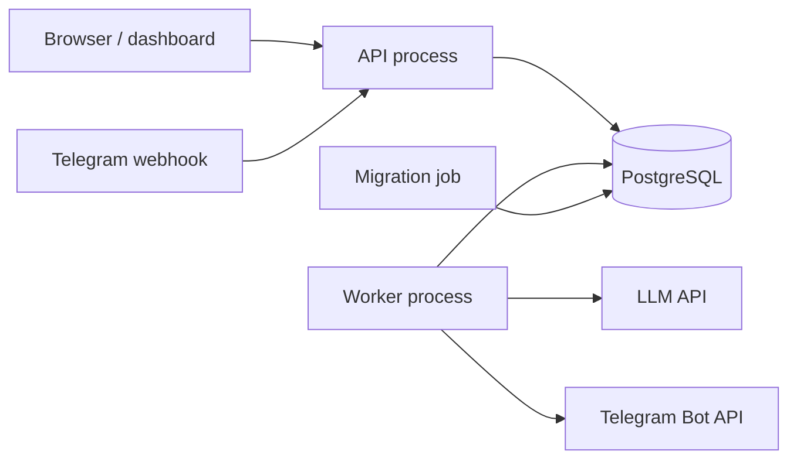

# Проектирование LLM-интерпретаций и уведомлений

Статус на 2026-08-06: основной application-контур реализован. Работают snapshot/generation/
validation/publication pipeline, YandexGPT adapter, dashboard read projection, operator actions,
daily store pulse, Telegram linking/webhook, durable fanout и delivery worker. Реальный YandexGPT 5.1
acceptance завершен публикацией валидированной интерпретации. Production feature flags остаются
выключенными до staging-приемки внешних Telegram-сценариев и operational drills.

Связанные документы:

- [analytics-business-rules-draft.md](analytics-business-rules-draft.md) — подтверждённые правила
  расчёта аналитических показателей;
- [architecture.md](architecture.md) — текущие архитектурные границы приложения;
- [database-design.md](database-design.md) — существующая модель данных;
- [reports.md](reports.md) — формирование и фиксация отчётов;
- [deployment-and-operations.md](deployment-and-operations.md) — будущий production deployment;
- [security-hardening.md](security-hardening.md) — действующие ограничения безопасности;
- [telegram-notification-fanout.md](telegram-notification-fanout.md) — реализованная проекция
  weekly events в durable Telegram deliveries;
- [telegram-linking-and-webhook.md](telegram-linking-and-webhook.md) — безопасная привязка
  Telegram, dashboard API, webhook boundary и порядок production-включения;
- [telegram-delivery-worker.md](telegram-delivery-worker.md) — Bot API adapter, lease/attempt state
  machine, retry и `UNKNOWN_OUTCOME`;
- [llm-fact-catalog-v1.md](llm-fact-catalog-v1.md) — versioned allowlist фактов и
  evidenceRef для weekly snapshot;
- [employee-category-kpi-api.md](employee-category-kpi-api.md) — отдельная backend-проекция
  категорий и групп по сотрудникам;
- [weekly-analytics-facts-source.md](weekly-analytics-facts-source.md) — согласованное чтение
  current/previous KPI до построения snapshot;
- [weekly-snapshot-builder.md](weekly-snapshot-builder.md) — versioned quality/sufficiency,
  псевдонимизация и deterministic provider-neutral payload;
- [weekly-snapshot-persistence.md](weekly-snapshot-persistence.md) — immutable JDBC storage,
  CREATED/UNCHANGED и проверка revision/hash/membership;
- [weekly-snapshot-jobs.md](weekly-snapshot-jobs.md) — idempotent enqueue, SKIP LOCKED claim,
  lease/retry/fail/success state machine;
- [llm-analysis-planner.md](llm-analysis-planner.md) — crash-safe reconciliation handoff от
  `SUCCESS/CREATED` snapshot к provider-neutral `llm_analysis_job`;
- [llm-provider-worker.md](llm-provider-worker.md) — bounded provider-call worker, heartbeat,
  preflight budgets и handoff сохранённого ответа в validation.

## 1. Назначение документа

Документ должен зафиксировать:

- какие данные и метрики интерпретирует LLM;
- какие выводы допустимы и запрещены;
- какие результаты отображаются в кабинете;
- какие события доставляются через Telegram;
- единый контракт структурированной интерпретации;
- структуру хранения отчётов, интерпретаций и уведомлений;
- архитектуру фоновой обработки;
- взаимодействие backend, LLM, dashboard и Telegram;
- требования к API внешних провайдеров;
- критерии качества, безопасности и готовности к production;
- последовательность реализации.

Этот документ не изменяет существующие формулы KPI. Источником истины для чисел, периодов,
порогов и бизнес-событий остаётся backend.

## 2. Статусы решений

- **CONFIRMED** — решение принято и должно учитываться при реализации.
- **DRAFT** — рабочий вариант, который ещё может измениться.
- **OPEN** — требуется обсуждение или исследование.
- **DEFERRED** — осознанно отложено за пределы первого релиза.
- **REJECTED** — вариант рассмотрен и не используется; причина сохраняется в документе.
- **SUPERSEDED** — ранее принятое решение заменено более поздним; история сохраняется.

## 3. Подтверждённые архитектурные принципы

- **CONFIRMED**: все метрики, вычисленные сравнения, deterministic event thresholds, delivery
  severity и фактические бизнес-события определяет backend.
- **CONFIRMED**: LLM не рассчитывает KPI, зарплату, рейтинг, выполнение плана и другие числовые
  показатели.
- **CONFIRMED**: LLM самостоятельно приоритизирует факты, синтезирует несколько показателей,
  формирует evidence-grounded наблюдения, гипотезы, риски и рекомендации.
- **CONFIRMED**: backend не задаёт исчерпывающий каталог допустимых аналитических выводов и действий;
  он контролирует факты, достаточность, безопасность, delivery и структуру результата.
- **CONFIRMED**: LLM объясняет только переданные ей факты и не имеет прямого доступа к PostgreSQL.
- **CONFIRMED**: для одного зафиксированного отчёта создаётся одна каноническая структурированная
  интерпретация.
- **CONFIRMED**: полное представление в dashboard и краткое уведомление в Telegram используют одну
  каноническую интерпретацию.
- **CONFIRMED**: frontend не является источником данных для Telegram. Dashboard и Telegram получают
  данные через backend.
- **CONFIRMED**: Telegram-текст и кнопки формирует backend из сохранённых полей интерпретации.
- **CONFIRMED**: Telegram использует два независимых потока: недельный LLM-отчёт и событийные
  уведомления по текущей неделе.
- **CONFIRMED**: технические инциденты, сбои синхронизации, LLM, очередей и доставки направляются
  разработчику/оператору, а не руководителям магазина.
- **CONFIRMED**: руководитель получает только бизнес-новости о состоянии магазина; внутренние коды,
  статусы заданий, документов и интеграций в сообщения не попадают.
- **CONFIRMED**: недоступность LLM не блокирует расчёт, публикацию отчёта и отправку базового
  шаблонного уведомления.
- **CONFIRMED**: недоступность Telegram не блокирует отчёты; доставка повторяется асинхронно.
- **CONFIRMED**: интерпретация привязывается к неизменяемому снимку входных метрик.
- **CONFIRMED**: старые интерпретации не перезаписываются; повторная генерация создаёт новую версию.
- **CONFIRMED**: модель, версия промпта, схема ответа и технические параметры генерации должны
  сохраняться.
- **CONFIRMED**: Telegram не получает чувствительные подробности; полная информация остаётся в
  защищённом кабинете.
- **CONFIRMED**: первая версия ориентирована на руководителей, имеющих доступ к соответствующему
  магазину.
- **CONFIRMED**: содержательный приоритет первой версии — примерно 60% интерпретации сотрудников и
  40% интерпретации магазина.
- **CONFIRMED**: LLM не создаёт отдельный рейтинг сотрудников; она объясняет существующий backend-
  рейтинг и его компоненты с учётом рабочей нагрузки и достаточности выборки.
- **CONFIRMED**: недельная интерпретация магазина и сотрудников включает продажи по категориям,
  структуру дополнительной выручки и attach-rate с корректными знаменателями.
- **CONFIRMED**: интерпретация показывает результат, динамику, сильную сторону, слабую сторону,
  главный риск, backend-аппроксимацию выполнения плана и возможные действия.
- **CONFIRMED**: интерпретация помогает руководителю принять решение, но не принимает и не исполняет
  управленческое решение автоматически.
- **CONFIRMED**: тон спокойный и деловой, без категоричных оценок личности сотрудника.
- **CONFIRMED**: после технической и смысловой валидации интерпретация публикуется автоматически;
  ручное согласование администратором не требуется.
- **CONFIRMED**: целевая задержка первой версии — не более пяти минут после готовности снимка
  отчёта.
- **CONFIRMED**: первоначальный целевой бюджет LLM — до RUB 1,000–2,000 в месяц.
- **CONFIRMED**: внешнему LLM запрещено передавать телефоны, тексты переписок, пароли, токены и
  зарплатные данные; сотрудники передаются под внутренними псевдонимизированными идентификаторами.

## 4. План проработки

### Этап 0. Границы и критерии успеха

Нужно определить:

- аудиторию каждой интерпретации;
- управленческие решения, которым должна помогать интерпретация;
- границы production-функциональности и явно исключённые сценарии;
- ограничения по стоимости и времени генерации;
- требования к персональным данным;
- критерии качества;
- обязательные fallback-сценарии.

Результат: согласованный scope и measurable acceptance criteria.

### Этап 1. Бизнес-логика интерпретаций

Для каждого сценария определить:

- объект анализа: магазин, сотрудник, период, отчёт или качество данных;
- набор входных метрик;
- минимальную полноту данных;
- базу сравнения;
- детерминированные правила backend;
- приоритеты выводов;
- допустимые выводы и рекомендации;
- запрещённые причинные или оценочные утверждения;
- полный и краткий форматы результата;
- fallback без LLM.

Результат: каталог интерпретаций.

### Этап 2. Тестовый набор и оценка качества

Подготовить 20–50 реальных обезличенных или синтетических случаев, включая:

- стабильный рост;
- стабильное падение;
- противоречивые метрики;
- отсутствие заметных изменений;
- неполные данные;
- нового сотрудника без истории;
- аномальный период;
- выполнение и невыполнение плана;
- высокий результат при ухудшении одной ключевой метрики;
- невозможность сделать обоснованный вывод.

Для каждого случая вручную зафиксировать ожидаемые и запрещённые выводы. Результат: evaluation
dataset и rubric для сравнения моделей, промптов и версий.

### Этап 3. Telegram-события и функции

Для каждого уведомления определить:

- событие-триггер;
- получателей;
- магазины и роли;
- severity;
- канал и формат;
- тихие часы;
- дедупликацию и cooldown;
- необходимость подтверждения;
- чувствительность данных;
- fallback;
- кнопку или действие;
- правила повторной доставки.

Результат: матрица уведомлений и UX бота.

### Этап 4. Исследование внешних API

LLM:

- проверить выбранный YandexGPT на каноническом evaluation dataset;
- проверить structured output и соблюдение JSON Schema;
- измерить качество на evaluation dataset;
- проверить latency, rate limits, retries и стоимость;
- изучить коммерческие условия и обработку персональных данных;
- проверить REST API и применимость Java SDK;
- проверить мониторинг токенов, квот и расходов.

Telegram:

- webhook и secret token;
- deep linking и безопасная привязка пользователя;
- inline-кнопки и callback query;
- редактирование сообщений;
- команды и настройки;
- ограничения доставки;
- блокировка бота пользователем;
- обработка повторных updates.

Результат: выбранные провайдеры и подтверждённые технические ограничения.

### Этап 5. Единый контракт интерпретации

Определить версионируемую JSON Schema, обязательные поля, лимиты длины, ссылки на исходные метрики,
severity, priority, data limitations и формат ошибки.

Результат: контракт между backend, LLM, frontend и notification-модулем.

### Этап 6. Хранение данных

Спроектировать:

- снимки входных метрик;
- задания LLM;
- канонические интерпретации;
- отдельные элементы выводов;
- версии промптов и схем;
- notification events;
- transactional outbox;
- историю доставок;
- Telegram subscriptions и preferences;
- retention, аудит и повторную генерацию.

Результат: ER-модель, ограничения и миграционный план.

### Этап 7. Архитектура и отказные сценарии

Проработать state machine и последовательность:

```text
синхронизация
-> расчёт метрик
-> фиксация снимка отчёта
-> LLM job
-> валидация или fallback
-> публикация в dashboard
-> notification event
-> outbox
-> доставка в Telegram
```

Проверить сценарии отказа LLM, Telegram, PostgreSQL, повторного события, пересчёта отчёта,
невалидного JSON, рестарта worker и превышения бюджета.

Результат: архитектурная схема, state machine и operational invariants.

### Этап 8. Дизайн реализации в коде

Определить feature-модули и интерфейсы, предположительно:

```text
report/
interpretation/
integration/llm/
notification/
integration/telegram/
```

Кандидаты интерфейсов:

```text
LlmProvider
InterpretationService
InterpretationValidator
NotificationRuleEngine
NotificationRenderer
NotificationSender
TelegramSender
```

Проработать транзакции, outbox, retry, timeout, circuit breaker, идемпотентность, логирование,
метрики, секреты и тестовые doubles.

Результат: технический план реализации без написания production-кода.

### Этап 9. Вертикальный production-срез

Первый end-to-end сценарий:

```text
недельный отчёт магазина
-> снимок метрик
-> LLM-интерпретация
-> сохранение
-> dashboard
-> Telegram «Отчёт готов»
```

Первый production-срез должен включать один LLM-провайдер, версионируемую схему, один тип отчёта,
безопасную привязку Telegram, fallback, retry, идемпотентность, аудит, мониторинг, алерты и план
восстановления. Сценарий принимается только после выполнения всех production-критериев. Новые типы интерпретаций добавляются после стабилизации этого среза.

### Этап 10. Staging, приёмка и production

- тестирование на evaluation dataset;
- staging с синтетическими или обезличенными данными;
- приёмка формулировок заказчиком;
- фиксация prompt/schema/model version;
- проверка fallback и повторной доставки;
- проверка стоимости и персональных данных;
- нагрузочный и аварийный тест;
- постепенное включение для пользователей;
- production runbook и алерты.

## 5. Предварительный контракт результата

Это иллюстрация направления, а не утверждённая схема.

```json
{
  "store": {
    "headline": "Рост оборота сопровождается ослаблением структуры результата.",
    "strength": {
      "kind": "OBSERVATION",
      "theme": "REVENUE_DYNAMICS",
      "candidateRef": null,
      "title": "Рост выручки",
      "summary": "Магазин улучшил результат относительно предыдущей недели.",
      "evidenceRefs": ["STORE.NET_REVENUE.CURRENT", "STORE.NET_REVENUE.PREVIOUS"]
    },
    "attentionArea": {
      "kind": "SYNTHESIS",
      "theme": "SALES_QUALITY",
      "candidateRef": null,
      "title": "Структура роста требует внимания",
      "summary": "Рост оборота не сопровождался сопоставимым улучшением маржи и услуг.",
      "evidenceRefs": ["STORE.MARGIN.DELTA", "STORE.CATEGORY:SERVICE.SHARE_DELTA"]
    }
  },
  "teamInsights": [],
  "employees": [],
  "dataLimitations": []
}
```

Числа в пользовательском тексте должны либо подтверждаться входными facts, либо подставляться
backend при rendering. LLM не может создавать неизвестные `metricCodes`.

## 6. Подтверждённые сущности хранения

Подтверждённая граница хранения LLM и Telegram включает:

- `analytics_snapshot_jobs`;
- `analytics_snapshots`;
- `analytics_snapshot_employees`;
- `llm_analysis_jobs`;
- `llm_analysis_attempts`;
- `llm_interpretations`;
- `notification_events`;
- `notification_deliveries`;
- `notification_delivery_attempts`;
- `notification_preferences`;
- `telegram_subscriptions`;
- `telegram_link_tokens`;
- `telegram_update_receipts`.

Основные часто фильтруемые атрибуты должны быть колонками, расширяемый структурированный результат
может храниться в JSONB. Финальный отправленный текст сохраняется для аудита.

### 6.1 Граница хранения недельной LLM-интерпретации

Первый блок хранения проектируется отдельно от Telegram и состоит из шести сущностей:

```text
analytics_snapshot_jobs
└── analytics_snapshots
    ├── analytics_snapshot_employees
    └── llm_analysis_jobs
        ├── llm_analysis_attempts
        └── llm_interpretations
```

`analytics_snapshot_jobs` — durable handoff между успешно завершённой синхронизацией и созданием
снимка. Job хранит store/week, source sync job, state machine, retry schedule, lease и ссылку на
созданный snapshot. Без этой записи рестарт между sync success и snapshot insert мог бы потерять
понедельничную генерацию. Отдельные attempt rows ему не нужны: построение выполняется внутри БД и
не вызывает внешний API.

`analytics_snapshots` — неизменяемые ревизии входных фактов одного магазина и одной завершённой
недели. Таблица хранит период, provenance, версии расчётов, quality status, канонический facts JSONB
и его SHA-256. Изменение исходных данных создаёт новую snapshot revision, а не UPDATE старого payload.

`analytics_snapshot_employees` — неизменяемое соответствие псевдонима `employeeRef` реальному
`employee_id` внутри конкретного snapshot. Метрики сотрудника не дублируются в этой таблице: их
канонический источник остаётся в facts JSONB. Таблица нужна для FK-целостности, безопасного добавления
displayName после LLM и выборки истории конкретного сотрудника.

`llm_analysis_jobs` — логические задачи генерации для конкретного snapshot и набора версий
schema/prompt/policy/provider configuration. Job владеет state machine, lease, retry schedule и
итоговым статусом, но не является отдельным внешним запросом.

`llm_analysis_attempts` — фактические попытки обращения к LLM внутри job. Первая генерация и
единственный validation retry являются двумя attempt rows. Здесь фиксируются provider request ID,
фактическая model version, latency, token usage, стоимость, безопасный error code и validation
violations. Полный prompt не дублируется: он воспроизводится из snapshot и versioned template.

`llm_interpretations` — неизменяемые, структурно и семантически валидные канонические результаты.
Запись создаётся только после обеих runtime-проверок и хранит полный WeeklyInterpretationContent
в JSONB, content hash, версии контракта и ссылку на successful attempt. Для магазина/недели новая
публикация создаёт следующую interpretation revision со ссылкой на предыдущую.

Отдельная `llm_interpretation_item` не используется. Атомарный ответ содержит максимум десять
сотрудников, читается и публикуется как единое целое, поэтому разложение каждого insight по строкам
увеличит сложность и создаст риск частично сохранённой интерпретации. Часто фильтруемые поля остаются
обычными колонками, а содержательный nested contract хранится одним JSONB.

`report_snapshots` не переиспользуется: это финансовый архив месячных/годовых документов с другим
жизненным циклом. Все шесть новых сущностей ссылаются на существующие `stores`, `employees`,
`sync_jobs` и `app_users`, не копируя их справочные данные.

Статус подраздела: **CONFIRMED** 2026-07-31.

### 6.2 Контракт snapshot job и snapshot tables

#### analytics_snapshot_jobs

Mutable durable-job table содержит:

- `id`, `store_id`, nullable `requested_by`;
- `job_type`: INITIAL, AUTO_REVISION или MANUAL_BACKFILL;
- `period_start`, `period_end`, `timezone`;
- `source_sync_job_id`, `source_data_cutoff`;
- `facts_schema_version`, `metrics_contract_version`, `calculation_version`,
  `quality_policy_version`;
- nullable `base_snapshot_id` для сравнения с последней опубликованной ревизией;
- `status`: PENDING, RUNNING, WAITING_RETRY, SUCCESS, FAILED или CANCELLED;
- nullable `outcome`: CREATED или UNCHANGED;
- nullable `result_snapshot_id`;
- `attempt_count`, `max_attempts`, `next_attempt_at`;
- `lease_owner`, `lease_until`, `cancel_requested`;
- безопасные `error_code`, `error_summary`;
- `started_at`, `finished_at`, `version`, `created_at`, `updated_at`.

Один и тот же request уникален по store/period/source sync и всем версиям расчёта. Partial unique index
разрешает только один PENDING/RUNNING/WAITING_RETRY job на store/week. Claim выполняется через
`FOR UPDATE SKIP LOCKED`; RUNNING всегда имеет lease, terminal status — `finished_at`.

SUCCESS всегда имеет outcome и result snapshot. При CREATED result указывает на новую ревизию; при
UNCHANGED — на `base_snapshot_id`, потому что новый snapshot не создаётся. AUTO_REVISION требует
base snapshot. DB trigger проверяет, что source sync job завершён SUCCESS и принадлежит connection
текущего магазина.

#### analytics_snapshots

Immutable snapshot table содержит:

- `id`, `store_id`, `snapshot_type=WEEKLY`;
- `period_start`, `period_end`, `timezone`, `revision`;
- nullable `supersedes_snapshot_id`;
- `revision_reason_code` и nullable `revision_note`;
- `source_sync_job_id`, `source_sync_completed_at`, `source_data_cutoff`;
- `facts_schema_version`, `metrics_contract_version`, `calculation_version`,
  `quality_policy_version`;
- `quality_status`: READY, PARTIAL или BLOCKED;
- `facts_payload` JSONB object и lowercase SHA-256 `facts_hash`;
- `created_at`.

Unique key: store/type/period/revision. Revision 1 не имеет supersedes и использует reason INITIAL.
Следующая ревизия обязана ссылаться на предыдущую ревизию того же store/type/period. WEEKLY period
начинается в понедельник и заканчивается воскресеньем; timezone первой версии — Europe/Kaliningrad.
`facts_payload`, header identity и hash повторно проверяются backend при чтении.

Snapshot считается изменившимся, если отличается facts hash либо одна из schema/metrics/calculation/
quality-policy versions. Отдельный `is_current` не хранится: актуальная запись выбирается по максимальной
revision. UPDATE/DELETE snapshot запрещены DB trigger.

#### analytics_snapshot_employees

Immutable membership table содержит:

- `snapshot_id`, `employee_id`;
- `employee_ref` формата E01–E9999, уникальный внутри snapshot;
- `display_name_snapshot`, который не передаётся LLM;
- `created_at`.

Primary key: snapshot/employee; дополнительный unique key: snapshot/employeeRef. Индекс
employee/recent snapshot обслуживает историю карточки. Метрики не дублируются из facts JSONB.
Backend перед commit проверяет точное совпадение employee refs в payload и membership rows; БД
контролирует FK и уникальность, но не разбирает versioned JSON contract.

Создание snapshot и terminal transition snapshot job остаются короткими отдельными транзакциями.
Последующий LLM job ставит reconciliation planner по зафиксированному `SUCCESS/CREATED`: это
устраняет crash-gap без связывания snapshot и будущего внешнего provider worker одной транзакцией.
Постановка идемпотентна по snapshot/generation revision и блокировке snapshot. Для `BLOCKED`
snapshot LLM job не создаётся; backend показывает детерминированное объяснение quality gate.

Статус подраздела: **CONFIRMED** 2026-08-01.

### 6.3 Контракт LLM jobs, attempts и interpretations

#### llm_analysis_jobs

Один job представляет одну логическую генерацию для неизменяемого snapshot. Он содержит:

- `id`, `snapshot_id`, `generation_revision`, `trigger_type`, nullable `requested_by`;
- `provider_code`, `requested_model`, `provider_config_version`;
- `content_schema_version`, `prompt_version`, `analysis_policy_version`, `budget_policy_version`;
- безопасный `generation_parameters` JSONB и SHA-256 `input_hash`;
- `status`: PENDING, RUNNING, WAITING_RETRY, SUCCESS, VALIDATION_FAILED, FAILED, SKIPPED или CANCELLED;
- `phase`: PREPARE, CALL_PROVIDER, VALIDATE_RESPONSE или PUBLISH;
- `attempt_count`, `transport_retry_count`, `validation_retry_count` и их versioned limits;
- `next_attempt_at`, `deadline_at`, `lease_owner`, `lease_until`, `cancel_requested`;
- `terminal_reason_code`, безопасный `error_summary`;
- `started_at`, `finished_at`, `version`, `created_at`, `updated_at`.

Unique key snapshot/generationRevision позволяет осознанную повторную генерацию того же snapshot,
но делает повторную доставку одной команды идемпотентной. INITIAL, SNAPSHOT_REVISION,
MANUAL_REGENERATION и MODEL_CHANGE различаются trigger type. Полный prompt и секреты провайдера
в job не сохраняются: canonical request воспроизводится из snapshot и versioned configuration.

PENDING/WAITING_RETRY jobs выбираются через `FOR UPDATE SKIP LOCKED`. RUNNING всегда имеет lease;
terminal status всегда имеет `finished_at` и не имеет lease. SKIPPED означает ожидаемое policy-
решение до внешнего вызова, например исчерпанный бюджет или отключённый provider, а не техническую
ошибку.

Transient transport errors используют backoff с jitter и `Retry-After`, но не выходят за deadline.
Validation retry разрешён ровно один раз и получает только машинные violation codes. Transport retry
и validation retry имеют независимые счётчики: timeout не должен лишать систему единственной попытки
исправить невалидный content.

#### llm_analysis_attempts

Один attempt соответствует одному фактическому внешнему запросу и содержит:

- `id`, `job_id`, последовательный `attempt_number`;
- `attempt_type`: INITIAL, TRANSPORT_RETRY или VALIDATION_RETRY;
- `status`: STARTED, RESPONSE_RECEIVED, SUCCEEDED, TRANSIENT_FAILED, PERMANENT_FAILED,
  STRUCTURAL_INVALID, SEMANTIC_INVALID, UNKNOWN_OUTCOME или CANCELLED;
- `provider_code`, `requested_model`, nullable `resolved_model`, `provider_request_id`;
- SHA-256 `request_hash`, nullable `response_hash`;
- bounded nullable `response_body` для crash recovery и краткосрочной диагностики;
- nullable `validation_violations` JSONB;
- `input_tokens`, `output_tokens`, `cached_input_tokens`, `reasoning_tokens`, `total_tokens`;
- nullable `cost_amount`, ISO `cost_currency`, `latency_ms`, `http_status`;
- безопасные `error_code`, `error_summary`;
- `started_at`, `response_received_at`, `finished_at`, `created_at`.

Перед сетевым вызовом attempt фиксируется как STARTED, после ответа raw body/hash и usage атомарно
фиксируются как RESPONSE_RECEIVED, а job переводится в VALIDATE_RESPONSE. После рестарта worker
продолжает проверку сохранённого ответа без нового платного вызова. Если процесс умер при STARTED и
невозможно определить результат запроса, attempt становится UNKNOWN_OUTCOME; повтор безопасен для
данных, но учитывается в стоимости.

Request body не хранится, потому что он воспроизводим из snapshot/configuration. Response body
ограничивается по размеру, не входит в пользовательский API и позже очищается retention job;
response hash, usage, outcome и violation codes остаются. Terminal attempt нельзя менять, кроме
разрешённого обнуления diagnostic body политикой retention.

#### llm_interpretations

Таблица содержит только прошедшие обе runtime-проверки и автоматически опубликованные результаты:

- `id`, `store_id`, `snapshot_id`, unique `analysis_job_id`, unique `successful_attempt_id`;
- `interpretation_type=WEEKLY`, `period_start`, `period_end`, `revision`;
- nullable `supersedes_interpretation_id`, `publication_reason_code`;
- `content_payload` JSONB object, lowercase SHA-256 `content_hash`;
- `validated_at`, `published_at`, `created_at`.

Отдельного lifecycle status у interpretation нет: наличие строки означает, что content валиден и
опубликован. Envelope metadata собирается join из snapshot, job, successful attempt и interpretation.
Store/period продублированы намеренно для unique store/type/period/revision и быстрого latest-read;
DB trigger проверяет их совпадение со snapshot.

Interpretation revision независима от snapshot revision: новый snapshot обычно создаёт следующую
interpretation revision, но ручная регенерация либо смена модели может создать новую интерпретацию
того же snapshot. Supersedes всегда указывает на предыдущую опубликованную интерпретацию того же
store/type/period. `is_current` не хранится; dashboard выбирает максимальную revision.

Validation transaction закрывает attempt как SUCCEEDED и передаёт job в PUBLISH. Следующая
publication transaction вставляет immutable interpretation, переводит job в SUCCESS и создаёт
notification event/outbox record. При любой ошибке publication transaction откатывается целиком;
SUCCEEDED attempt остаётся безопасной точкой повтора. FAILED или VALIDATION_FAILED job не скрывает
предыдущую успешную интерпретацию.

Статус подраздела: **CONFIRMED** 2026-08-01.

### 6.4 Retention LLM-данных

Retention расширяет существующий maintenance workflow и не создаёт отдельный несогласованный
планировщик. По умолчанию очистка остаётся dry-run; физическое удаление/обнуление разрешается только
при действующих policy approval, backup checkpoint и недавнем restore test. Active jobs никогда не
являются кандидатами, обработка идёт bounded batches под advisory lock и `FOR UPDATE SKIP LOCKED`.

Начальная production-политика:

| Данные | Срок | Действие и защита |
| --- | --- | --- |
| `analytics_snapshots` и membership | Бессрочно | История фактов и связь сотрудника с employeeRef не удаляются автоматически |
| `llm_interpretations` | Бессрочно | Каноническая история динамики; immutable UPDATE/DELETE trigger сохраняется |
| Успешный LLM job и linked successful attempt | Бессрочно | Нужны для полного InterpretationEnvelope, provider/model/usage/cost provenance |
| `response_body` terminal attempt | 30 дней | Обнуляется, но hash, usage, cost, outcome и validation codes сохраняются |
| Неуспешные attempts внутри successful job | 365 дней | После срока удаляются, если не являются successful attempt интерпретации |
| FAILED/VALIDATION_FAILED/SKIPPED/CANCELLED LLM jobs и attempts | 365 дней | Удаляются вместе bounded batch; active/held rows исключаются |
| SUCCESS/UNCHANGED snapshot jobs | 180 дней | Snapshot остаётся; сохраняется последний terminal job каждого store/job type |
| Неуспешные snapshot jobs | 365 дней | Сохраняется последний terminal job каждого store/job type |
| Source `sync_jobs`, referenced immutable snapshot | Бессрочно | Исключаются из существующих sync-job retention candidates |

Бессрочное хранение относится к текущему малому объёму: не более двух магазинов и примерно 104
weekly snapshots в год. Политика пересматривается до существенного роста числа магазинов, payload
или типов анализа, но сокращение срока не может уничтожить данные, на которых основана сохранённая
интерпретация.

Для attempt добавляются nullable `response_retain_until` и `response_body_cleared_at`. Retention
может изменить только эти diagnostic-поля и только после terminal status/срока. Возможность
временно продлить хранение response body для расследования должна быть отдельной аудируемой
операторской командой; публичный endpoint не требуется.

Request body и полный prompt не сохраняются ни на одном сроке. Response body ограничен по размеру,
не попадает в логи, audit metadata, пользовательский API или Telegram. Provider request ID, hashes,
token usage и стоимость не считаются raw content и остаются вместе с сохранённой attempt metadata.

Исторический display name в `analytics_snapshot_employees` является персональными бизнес-данными и
не передаётся внешнему LLM. Срок его хранения и ручная процедура удаления/анонимизации при прекращении
цели обработки должны быть подтверждены владельцем данных и договорной политикой до production;
техническая бессрочность не заменяет это решение.

Очистка из основной БД не означает немедленного исчезновения из backup/PITR. Backup retention имеет
отдельный срок; после restore maintenance workflow снова применяет просроченную политику. Retention
не заменяет backup или disaster recovery.

Каждый run публикует только aggregate candidate/affected/remaining counts, расширяет существующие
retention metrics и создаёт системный operational audit event без payload. Перед включением deletion
обязательны dry-run, backup checkpoint, restore rehearsal и сверка количества/hash бессрочных данных.

Статус подраздела: **CONFIRMED** 2026-08-01.

### 6.5 Notification events и Telegram delivery outbox

Для текущего modular monolith отдельная `notification_outbox` не создаётся. Immutable
`notification_event` является transactional outbox: weekly event появляется в одной PostgreSQL-
транзакции с interpretation, затем bounded fanout worker идемпотентно создаёт deliveries. Отдельная
outbox table понадобится только при появлении внешнего message broker или другого сервиса-
потребителя.

```text
llm_interpretation / operational rule
└── notification_event
    └── notification_delivery
        └── notification_delivery_attempt
```

#### notification_events

Immutable domain-event table содержит:

- `id`, `store_id`, `event_type`, `audience` MANAGER или OPERATOR;
- nullable `interpretation_id`, `snapshot_id` и другие source refs по типу события;
- unique `deduplication_key`;
- `notification_policy_version`, `priority`;
- `event_payload` JSONB object и SHA-256 `payload_hash`;
- `not_before`, nullable `expires_at`, `created_at`.

Начальные business event types: WEEKLY_REPORT_READY, WEEKLY_REPORT_REVISED, DAILY_STORE_PULSE и
STORE_ACHIEVEMENT. Технические события используют отдельные OPERATOR event types и не смешиваются
с пользовательскими текстами. Event payload хранит backend-owned факты/refs для аудита, но не
дублирует весь snapshot или interpretation.

Deduplication key детерминирован: например, weekly ready привязан к interpretation ID, revision
event — к новой interpretation revision и notification policy version, daily pulse — к store,
business date и policy version. Повторная обработка исходной транзакции возвращает существующий
event и не создаёт повторные deliveries.

#### notification_deliveries

Одна строка — одно зафиксированное сообщение одному channel binding. Таблица содержит:

- `id`, `event_id`, `channel=TELEGRAM`, `recipient_user_id`, `subscription_id`;
- `status`: PENDING, RUNNING, WAITING_RETRY, SENT, PERMANENT_FAILED, UNKNOWN_OUTCOME,
  EXPIRED или CANCELLED;
- `render_version`, точный `rendered_text`, nullable bounded `rendered_markup` JSONB и content hash;
- `scheduled_at`, `next_attempt_at`, `expires_at`;
- `attempt_count`, `max_attempts`, `lease_owner`, `lease_until`, `cancel_requested`;
- nullable `provider_message_id`, `sent_at`;
- безопасные `error_code`, `error_summary`;
- `version`, `created_at`, `updated_at`.

Unique event/channel/subscription исключает повторную постановку одному получателю. Точный текст
рендерится до enqueue и хранится для аудита: изменение renderer после постановки не меняет ожидающее
сообщение. Dashboard link хранится без одноразовых access tokens; авторизация всегда выполняется
самим кабинетом.

PENDING/WAITING_RETRY deliveries выбираются через `FOR UPDATE SKIP LOCKED`. RUNNING имеет lease,
terminal status — `sent_at` либо безопасную terminal reason. Quiet hours отражаются в scheduled/
nextAttemptAt. После expiresAt устаревшая сводка становится EXPIRED и не отправляется с опозданием.

#### notification_delivery_attempts

Каждый вызов channel API хранится отдельно:

- `id`, `delivery_id`, `attempt_number`;
- `status`: STARTED, SENT, TRANSIENT_FAILED, PERMANENT_FAILED, UNKNOWN_OUTCOME или CANCELLED;
- nullable `provider_message_id`, `http_status`, `retry_after_at`, `latency_ms`;
- безопасные provider `error_code`, `error_summary`;
- `started_at`, `finished_at`, `created_at`.

Bot token, request headers и полный provider response не сохраняются. Успешный attempt и delivery
переводятся в SENT одной транзакцией после получения Telegram message ID.

Telegram sendMessage не рассматривается как exactly-once side effect. Если соединение оборвалось и
неизвестно, принял ли Telegram сообщение, attempt/delivery получают UNKNOWN_OUTCOME. Такой delivery
не отправляется автоматически повторно, чтобы не создавать дубли; оператор получает технический
алерт и может принять решение вручную. Однозначный rate limit либо transient отказ до принятия
запроса использует bounded retry с `Retry-After` и jitter.

При публикации weekly interpretation одной транзакцией создаются interpretation и notification
event. Fanout worker отдельной короткой транзакцией создаёт deliveries для активных/разрешённых
subscriptions; unique event/channel/subscription делает повтор безопасным. Если получателей нет,
event остаётся durable и помечается обработанным будущей fanout-проекцией. Preferences, quiet hours
и subscription state проверяются до фиксации доставки и не меняют сохранённый текст задним числом.

Статус подраздела: **CONFIRMED** 2026-08-01.

### 6.6 Telegram subscriptions, preferences и linking

Канал привязывается только к существующему `app_user`; store access не копируется в subscription и
каждый раз берётся из текущих прав кабинета. Один app user имеет не более одной активной private-chat
subscription для одного bot identity. Telegram username, display name и телефон не используются как
identity и не сохраняются.

#### `telegram_subscriptions`

Таблица содержит:

- `id`, `user_id`, `bot_code` без bot token;
- `telegram_user_id`, `telegram_chat_id` как `bigint`, `chat_type=PRIVATE`;
- `status`: `PENDING_CONFIRMATION`, `ACTIVE`, `BOT_BLOCKED`, `REVOKED` или `EXPIRED`;
- `delivery_timezone`, `quiet_hours_enabled`, `quiet_hours_start`, `quiet_hours_end`;
- `pending_expires_at`, `confirmed_at`, `last_inbound_at`, `blocked_at`, `revoked_at`;
- `last_membership_update_id`, `last_membership_update_at` для bounded ordering lifecycle events;
- `version`, `created_at`, `updated_at`.

Partial unique indexes запрещают две active/pending/blocked subscriptions одному app user, Telegram
user или private chat в рамках `bot_code`. Destination не переназначается другому app user: reconnect либо
возобновляет подтверждённую связь, либо сначала явно отзывает старую и создаёт новую историю.

Telegram identifiers являются персональными channel identifiers: они не попадают в логи, metrics,
audit metadata или frontend-ответы целиком. Для логов используется необратимый bounded fingerprint.
Bot token хранится только в secret storage/environment и никогда не записывается в PostgreSQL.

#### `telegram_link_tokens`

Dashboard создаёт cryptographically random одноразовый bearer token с TTL 10 минут. В БД хранятся:

- `id`, `user_id`, `bot_code`, `purpose` (`LINK` или `RELINK`);
- SHA-256/HMAC `token_hash`, но не plaintext token;
- `expires_at`, nullable `consumed_at`, `revoked_at`, `pending_subscription_id`;
- `created_at`.

Выдача token rate-limited; одновременно разрешён только один неиспользованный token на user/bot.
Token показывается только в Telegram deep link и не логируется. Точный допустимый формат/длина start
parameter подтверждается на этапе Telegram API research.

Link flow:

1. Авторизованный пользователь кабинета нажимает «Подключить Telegram».
2. Backend создаёт token hash и возвращает deep link.
3. Пользователь открывает private chat и запускает бота.
4. Webhook атомарно consume token и создаёт `PENDING_CONFIRMATION` subscription.
5. Кабинет показывает pending binding; тот же авторизованный пользователь подтверждает его.
6. Только после confirmation status становится `ACTIVE` и разрешает deliveries.

Если deep link переслали другому человеку, тот может создать лишь pending binding и не получит
уведомления без подтверждения в авторизованном кабинете. Expired/consumed token повторно не работает.
Link, confirmation, revoke, relink и bot-blocked transition создают безопасные audit events.

#### `notification_preferences`

Preference — явный override для user/store/channel/event type и содержит `enabled`, `version`,
`created_at`, `updated_at`. Отсутствие строки означает default из versioned notification policy,
поэтому rollout новой настройки не требует массовой вставки rows.

Начальные manager defaults: `WEEKLY_REPORT_READY`, существенные `WEEKLY_REPORT_REVISED`,
`DAILY_STORE_PULSE` и `STORE_ACHIEVEMENT` включены. Руководитель может отключить каждый тип отдельно.
Тихие часы являются настройкой channel subscription, применяются ко всем business events и по
умолчанию рекомендуются 21:00–08:00 в `Europe/Kaliningrad`. Business notifications тихие часы не
обходят; правила `OPERATOR/HIGH` alerts проектируются отдельно.

Preference можно изменить только при текущем store access. При создании delivery backend проверяет
active user, store access, `ACTIVE` subscription, effective preference и quiet hours. Непосредственно
перед send worker повторно проверяет user/access/subscription; если доступ или связь отозваны,
delivery становится `CANCELLED` и данные магазина не отправляются.

#### `telegram_update_receipts`

Webhook updates имеют at-least-once delivery, поэтому небольшой inbox/dedup table хранит `bot_code`,
`update_id`, безопасный `update_type`, `payload_hash`, `processed_at` и terminal outcome без полного
Telegram payload. Unique `(bot_code, update_id)` делает повторный webhook идемпотентным. Receipt
создаётся в той же транзакции, что token consumption/subscription transition; при rollback Telegram
может безопасно повторить update.

Webhook принимает только HTTPS, проверяет Telegram webhook secret до бизнес-обработки, ограничивает
body size и разрешает linking только из `PRIVATE` chat. Secret header, bot token, start token и update
body никогда не логируются.

Статус подраздела: **CONFIRMED** 2026-08-01.

### 6.7 Retention и operational policy Telegram-доставок

Telegram — асинхронный дополнительный канал. Ошибка или задержка отправки не откатывает опубликованную
интерпретацию, notification event либо данные dashboard. Для каждого типа события versioned
notification policy задаёт приоритет, срок актуальности, максимальное число попыток, quiet-hours
behavior и допустимость ручной повторной отправки.

#### Начальные сроки хранения

| Данные | Срок | Действие после срока |
| --- | ---: | --- |
| `notification_events` | 24 месяца | удалить после удаления зависимых deliveries |
| `notification_deliveries`, включая точный отправленный текст | 12 месяцев после terminal status | удалить вместе с оставшимися attempts |
| успешные `notification_delivery_attempts` | 90 дней | удалить |
| failed/unknown delivery attempts | 12 месяцев | удалить |
| consumed/expired/revoked `telegram_link_tokens` | 30 дней | удалить; plaintext token никогда не хранится |
| `telegram_update_receipts` | 30 дней | удалить небольшими batches |
| active subscription и preferences | пока действуют связь и доступ | удалить/отозвать по lifecycle пользователя |
| revoked/expired subscription | 12 месяцев как audit shell | Telegram user/chat IDs затереть через 30 дней |

Удаление выполняет ежедневный maintenance job небольшими batches. Он сначала очищает дочерние
attempts/deliveries, не удаляет snapshot или interpretation и публикует только технические счётчики.
Legal hold или расследование может временно приостановить очистку конкретной записи явным audit
решением; бессрочное хранение по умолчанию запрещено.

#### Worker, lease и повторные попытки

На исходном масштабе достаточно одного delivery worker, но claim через `FOR UPDATE SKIP LOCKED`
допускает запуск нескольких экземпляров без смены модели. Poll interval, batch size, lease и API
timeouts конфигурируются; начальная цель — забирать готовые доставки каждые 5–10 секунд batches до 20.

Worker создаёт committed attempt со статусом `STARTED` непосредственно перед внешним вызовом. Если
процесс упал до создания attempt, истёкший lease позволяет безопасно вернуть delivery в очередь.
Если процесс упал после начала внешнего вызова и результат неизвестен, delivery переводится в
`UNKNOWN_OUTCOME`, а не отправляется повторно автоматически.

Начальная retry policy: не более пяти попыток, не дольше 30 минут и никогда после `expires_at`.
Backoff экспоненциальный с jitter; Telegram `Retry-After` имеет приоритет. Retry разрешён для
однозначного connect failure до отправки запроса, rate limit и явно transient provider response.
Read timeout/connection loss после передачи запроса считается ambiguous outcome.

#### Классификация ошибок

- explicit bot blocked/forbidden: текущая delivery — `PERMANENT_FAILED`, subscription —
  `BOT_BLOCKED`, остальные не начатые deliveries этой связи — `CANCELLED`;
- invalid/deleted destination: delivery — `PERMANENT_FAILED`, subscription — `REVOKED`, требуется
  новая безопасная привязка;
- invalid bot token или provider authentication failure: глобальный circuit breaker отправки,
  немедленный alert оператору; пользовательские subscriptions не меняются;
- rate limit и подтверждённый provider/transient failure: `WAITING_RETRY` с bounded backoff;
- ambiguous result: `UNKNOWN_OUTCOME`, немедленный технический alert, без автоматического retry;
- истёкшая актуальность: `EXPIRED`; устаревшее сообщение не догоняет пользователя позднее.

Private `my_chat_member` со статусом `member` возвращает ранее подтверждённую связь из
`BOT_BLOCKED` в `ACTIVE`; pending-связь этим событием не подтверждается, а `REVOKED` всегда проходит
новый link/confirmation flow. Перед каждой фактической отправкой backend независимо повторно
проверяет active app user, роль и текущий store access.

#### Срок актуальности и тихие часы

Тихие часы сдвигают `scheduled_at` к ближайшему разрешённому времени. Если раньше наступает
`expires_at`, delivery становится `EXPIRED`. Начальные значения задаются policy, а не кодом:

- `DAILY_STORE_PULSE` актуальна до 14:00 локального дня отправки;
- `WEEKLY_REPORT_READY` и существенная `WEEKLY_REPORT_REVISED` — 24 часа;
- `STORE_ACHIEVEMENT` — до конца следующего локального дня.

Эти значения являются начальными и меняются версией notification policy после наблюдения за
реальной эксплуатацией.

#### Наблюдаемость и действия оператора

Метрики без бизнес-текста: queue depth, oldest due age, delivery latency, sent/failed/unknown counts,
retry count, blocked subscriptions и webhook processing errors. Немедленный alert создаётся при
`UNKNOWN_OUTCOME`, authentication/circuit-breaker failure и недоступности worker; backlog старше пяти
минут и рост permanent failures также считаются инцидентом. Telegram не является единственным
каналом этих алертов.

В защищённом admin view оператор видит safe error codes, timestamps, attempt history и masked
destination fingerprint. Разрешены cancel, повтор known-safe delivery и создание явно подтверждённой
ручной resend delivery. Исходная terminal delivery не изменяется; ручное действие получает audit
event и ссылку `replaces_delivery_id`. Для `UNKNOWN_OUTCOME` resend требует явного подтверждения риска
дубля.

Статус подраздела: **CONFIRMED** 2026-08-01.


## 7. Недельный аналитический снимок

Статус раздела: **DRAFT**. Требуется подтвердить момент закрытия недели, правила ревизий и состав
фактов.

### 7.1 Почему нужен отдельный тип снимка

Существующие report_snapshots предназначены для неизменяемых месячных и годовых документов.
Месячный документ создаётся из выплаченной payroll revision, а годовой — из точных месячных
ревизий. Недельная оперативная интерпретация имеет другой жизненный цикл и не должна расширять
финансовую семантику этой таблицы.

Для LLM предлагается отдельный неизменяемый analytics_snapshot либо эквивалентная сущность. Она
фиксирует факты так, как они были известны после конкретной успешной синхронизации, и служит общей
основой dashboard, LLM и Telegram.

### 7.2 Рассмотренные варианты

#### Вариант A. Повторно рассчитать данные при каждом обращении

Dashboard и LLM независимо вызывают текущие сервисы метрик.

Плюсы:

- минимум новых таблиц;
- всегда используются последние данные.

Минусы:

- dashboard и LLM могут увидеть разные состояния БД;
- результат невозможно надёжно воспроизвести;
- повторная генерация может дать вывод по изменившимся данным;
- отсутствует точная история входных фактов;
- Telegram может содержать значения, уже отличающиеся от открытого отчёта.

Статус: **REJECTED** для production-интерпретаций.

#### Вариант B. Сохранить ответы существующих frontend API

В снимок копируются DTO отдельных dashboard endpoint.

Плюсы:

- быстро собрать первый payload;
- frontend и LLM получают похожие значения.

Минусы:

- snapshot-контракт становится зависимым от presentation API;
- одни факты дублируются в нескольких DTO;
- сложно обеспечить единый момент расчёта;
- изменение frontend-контракта становится изменением исторического формата.

Статус: **REJECTED** как постоянная архитектура. Существующие calculation services можно
переиспользовать, но snapshot должен иметь собственный versioned contract.

#### Вариант C. Отдельный снимок для магазина и отдельный для каждого сотрудника

Плюсы:

- небольшие payload;
- можно независимо перегенерировать сотрудника;
- удобно открывать отдельную карточку.

Минусы:

- много LLM-вызовов;
- каждый сотрудник может анализироваться относительно различного состояния команды;
- сложнее определить лучших сотрудников по категориям;
- возможны противоречия между общей и персональными интерпретациями.

Статус: **REJECTED** как основной вариант первой версии. Позднее допустим как производная
детализация уже зафиксированного общего снимка.

#### Вариант D. Один недельный снимок магазина со срезом всех сотрудников

Плюсы:

- магазин и сотрудники сравниваются на одной базе данных;
- один input hash и единая provenance;
- LLM видит командный контекст;
- можно определить, кто лучше работает с конкретными категориями;
- одна каноническая интерпретация не противоречит сама себе;
- один основной LLM-вызов на магазин и неделю.

Минусы:

- payload больше;
- нужна строгая структура и ограничение состава фактов;
- повторная ревизия затрагивает весь недельный анализ;
- для карточки сотрудника backend должен извлекать его блок из общего результата.

Статус: **CONFIRMED**.

### 7.3 Рекомендуемая единица снимка

Один снимок соответствует одному магазину, одной завершённой календарной неделе, всем сотрудникам,
участвовавшим в показателях этой недели, контексту предыдущего периода, контексту выполнения
месячного плана на конец недели и сведениям о качестве/provenance данных.

Неделя определяется в Europe/Kaliningrad и идёт с понедельника по воскресенье включительно.
Сотрудник включается не потому, что он сейчас активен в справочнике, а потому что участвовал в
продажах, сменах, рейтинге или другом показателе снимка. Это сохраняет историческую полноту после
увольнения или перевода.

Один snapshot может физически храниться как:

- корневая запись analytics_snapshot с периодом, магазином, provenance и store-level facts;
- дочерние записи analytics_snapshot_employee с employee-level facts;
- канонический JSON и его hash для воспроизводимого LLM input.

Точная таблица утверждается на этапе 6 после фиксации бизнес-контракта.

### 7.4 Временные границы внутри снимка

Рекомендуется различать три контекста:

1. analysisPeriod — завершённая неделя понедельник–воскресенье;
2. comparisonPeriod — предыдущая завершённая неделя той же длины;
3. planContext — прогресс и backend-прогноз месячного плана на конец воскресенья.

Продажи понедельника, в который создаётся снимок, не должны попадать в завершённую неделю или её
plan context. Иначе повторное создание в течение дня будет менять исходную базу.

Для недели, пересекающей границу месяцев, требуется отдельное правило. Кандидаты:

- показывать плановый контекст месяца, в котором находится period_end;
- хранить два plan context для обоих месяцев;
- не формировать единый прогноз и явно указать ограничение.

Статус: **CONFIRMED** — хранить отдельный plan context для каждого календарного месяца, затронутого
неделей. Проценты и прогнозы разных месяцев не объединяются. Для слишком короткого нового периода
backend устанавливает низкую надёжность прогноза или отсутствие достаточных данных.

### 7.5 Момент создания

Возможные варианты:

1. **Сразу после закрытия магазина в воскресенье.** Быстро, но последние документы могут ещё не
   синхронизироваться или измениться.
2. **В фиксированное время в понедельник.** Проще, но cron может запуститься до завершения
   синхронизации.
3. **После успешной понедельничной синхронизации, покрывшей воскресенье.** Снимок создаётся событием
   завершения sync job, а не предположением по времени.

Статус: **CONFIRMED** — вариант 3. Планировщик инициирует sync, а завершившийся job ставит задачу
создания snapshot. Snapshot job дополнительно проверяет coverage и data quality.

Целевой утренний сценарий:

- плановая синхронизация запускается ночью в понедельник;
- после её завершения автоматически создаются snapshot и LLM job;
- валидная интерпретация должна быть доступна в dashboard до начала рабочего дня;
- целевая задержка LLM остаётся не более пяти минут после готовности snapshot;
- Telegram-уведомление планируется на согласованное утреннее время с учётом тихих часов;
- при неготовности к утреннему cutoff система показывает статус задержки и уведомляет оператора.

### 7.6 Provenance и воспроизводимость

Снимок должен сохранять как минимум:

- store_id;
- тип и границы периода;
- timezone;
- revision;
- source_sync_job_id или набор source job references;
- момент окончания исходной синхронизации;
- source-data cutoff;
- версии calculation и metrics contract;
- data quality status и ограничения;
- канонический facts payload;
- facts_hash;
- момент создания;
- ссылку на предыдущую ревизию и причину изменения.

LLM job всегда ссылается на конкретный snapshot ID и facts hash.

### 7.7 Ревизии после поздних изменений

После снимка LiveSklad может получить позднюю продажу, возврат или исправление документа.

Возможные стратегии:

1. никогда не менять недельный снимок;
2. перезаписывать существующий снимок;
3. создавать новую неизменяемую ревизию, если пересчитанный facts hash изменился.

Вариант 2 несовместим с воспроизводимостью и статусом отправленных уведомлений.

Статус: **CONFIRMED** — вариант 3:

- предыдущая ревизия остаётся доступной;
- новая содержит supersedes_snapshot_id и reason;
- LLM создаёт новую интерпретацию;
- dashboard показывает текущую ревизию и время обновления;
- Telegram-сообщение об исправлении отправляется только при существенном изменении ключевых
  фактов, чтобы не создавать шум.

Порог существенности для повторного Telegram-уведомления: **CONFIRMED**.

Окно автоматического пересмотра означает ограниченный срок после первого snapshot, в течение
которого backend после новых синхронизаций повторно считает тот же недельный facts payload и
сравнивает facts_hash. Если данные не изменились, ничего не происходит. Если изменились — создаётся
новая ревизия. После завершения окна старые недели автоматически больше не пересчитываются, но
администратор может запустить явный backfill/revision.

Статус: **CONFIRMED** — production-окно автоматического пересмотра составляет 72 часа с момента
публикации первой ревизии. После каждой успешной синхронизации в этом окне backend пересчитывает
facts payload, но повторно вызывает LLM только при изменении facts_hash. После 72 часов автоматический
пересмотр прекращается; явный административный backfill и выпуск новой ревизии доступны без
временного ограничения.

#### 7.7.1 Периодичность и существенность Telegram-коррекций

Основная недельная интерпретация формируется один раз: в понедельник после ночной синхронизации за
полностью завершившуюся неделю понедельник–воскресенье. Она сравнивается с предшествующей полной
неделей и отправляется руководителю в согласованное утреннее время.

Во вторник–четверг отдельный ежедневный анализ не формируется. После очередной синхронизации backend
может создать ревизию понедельничной интерпретации внутри 72-часового окна. Telegram-коррекция
отправляется событийно и только при существенном изменении. Если существенных изменений нет,
руководитель не получает сообщение, но актуальная ревизия и время её создания видны в dashboard.

Изменение считается существенным, если выполнено хотя бы одно правило:

- quality status изменился между READY, PARTIAL и BLOCKED;
- хотя бы одно направление плана изменило status;
- абсолютное изменение чистой выручки одновременно не меньше 2% и RUB 10,000;
- абсолютное изменение валовой прибыли одновременно не меньше 2% и RUB 5,000;
- маржа изменилась не меньше чем на 1 процентный пункт;
- сменился лидер общего рейтинга или согласованной важной категории;
- сотрудник вошёл в рейтинг или выбыл из него из-за изменения eligibility/coverage;
- overall score сотрудника изменился не меньше чем на 5 пунктов и rank — не меньше чем на две
  позиции.

Денежные пороги хранятся в версионируемой политике и могут настраиваться для магазина. Изменение
только округления, порядка элементов или формулировки LLM не является существенным.

Существенность рассчитывается относительно последней ревизии, о которой уже уведомили руководителя,
а не только относительно непосредственно предыдущей ревизии. Поэтому накопившиеся небольшие
исправления в итоге могут вызвать одну корректировку.

Все изменения одного sync batch объединяются в одно сообщение. Для некритичных корректировок
действует ограничение не более одного сообщения на магазин за шесть часов и соблюдаются тихие часы.
Технические сбои направляются операторам отдельным каналом и не смешиваются с бизнес-уведомлениями.

#### 7.7.2 Оперативные уведомления текущей недели

Оперативные уведомления — отдельный поток, а не новая ревизия понедельничного отчёта. После каждой
успешной синхронизации backend проверяет текущие метрики и формирует кандидатов бизнес-новостей по
версионируемым правилам. Каталог и периодичность таких новостей прорабатываются отдельно.

Сообщение руководителю описывает бизнес-факт, сравнение, влияние на магазин и при необходимости
понятное возможное действие. Внутренние статусы документов, sync jobs, quality issues, очередей и
интеграций в этот поток не входят.

Триггер и severity всегда определяет backend. LLM может дополнить уже обнаруженное событие кратким
объяснением, но не является обязательной для обнаружения или доставки: при её недоступности
отправляется безопасный шаблонный текст.

Потоки используют общие подписки, права доступа, тихие часы и Telegram transport, но разные
eventType, правила дедупликации и cooldown. Недельный отчёт сообщает итог и сравнение двух полных
недель; оперативный поток сообщает только о значимом изменении состояния незавершённой недели.

#### 7.7.3 Подтверждённый формат бизнес-новостей

Базовая периодичность в timezone магазина:

- понедельник утром — недельная LLM-интерпретация вместо отдельной дневной сводки;
- вторник–воскресенье утром — одна короткая сводка за завершившийся предыдущий день;
- значимые достижения и существенные изменения — отдельное событийное сообщение;
- в последние пять дней месяца ежедневная сводка усиливает блок остатка до плана и необходимого
  дневного темпа.

Утреннее время настраивается получателем; production default — 09:00. Одна сводка объединяет все
новости магазина и не дробится на сообщения по каждой метрике.

Daily store pulse может содержать:

- выручку завершившегося дня и сравнение с тем же днём предыдущей недели;
- результат с начала недели и динамику относительно сопоставимого периода;
- текущий темп и backend forecast месячного плана;
- средний чек, валовую прибыль и маржу;
- наиболее заметный рост и снижение категорий;
- дополнительную выручку и attach-rate;
- подтверждённые достижения сотрудников при достаточной выборке;
- существенное влияние возвратов;
- один главный успех, одну зону внимания и одно возможное действие.

К отдельным бизнес-событиям относятся достижение 25%, 50%, 75% и 100% месячного плана, новый
сопоставимый дневной или недельный рекорд, устойчивое ускорение/замедление, заметный рост категории,
командное или личное достижение при достаточной выборке и существенное изменение прогноза плана.
Точные числовые пороги являются частью версионируемой notification policy.

Ограничения шума:

- не более одной плановой сводки на магазин в день;
- milestone отправляется один раз для конкретного порога и месяца;
- события одного sync batch объединяются;
- отдельное событие не дублирует уже отправленную утреннюю сводку;
- действуют пользовательские подписки и тихие часы.

Backend рассчитывает сравнения, прогнозы, рекорды и лидеров. LLM получает компактные агрегированные
факты и необязательные deterministic signals, самостоятельно определяет главные новости и формирует
связное объяснение; при её недоступности используется детерминированный шаблон. При текущей ночной синхронизации новости доступны утром по итогам
предыдущего дня. Для внутридневных новостей потребуется отдельно увеличить частоту синхронизации и
проверить допустимую нагрузку LiveSklad API.

### 7.8 Состав фактов

Store-level candidate facts:

- итоговые KPI и их числители/знаменатели;
- сравнение с предыдущей неделей;
- динамика по дням недели;
- категории продаж и attach-rate;
- текущий месячный план, факт, требуемый темп и backend forecast;
- качество данных и coverage;
- ограничения, из-за которых вывод нельзя считать полным.

Employee-level candidate facts:

- фактическое участие и отработанное время;
- KPI сотрудника;
- динамика относительно предыдущей недели;
- отклонение от team average/median;
- rank только по метрикам, где backend имеет утверждённое правило;
- сильные категории и attach-rate;
- вклад в результат магазина;
- finalized/dynamic rating context без зарплатных данных;
- достаточность выборки;
- category leaders, рассчитанные backend.

#### 7.8.1 Справедливое сравнение сотрудников

Сравнение разделяется на независимые направления:

- коммерческий вклад: чистая выручка и доля выручки магазина;
- эффективность времени: выручка за час и смену;
- структура продаж: доли аксессуаров, услуг и дополнительной выручки;
- attach-rate: допродажи относительно релевантных устройств;
- личная динамика: изменение нормализованных метрик относительно предыдущей полной недели.

Основные точки сравнения — собственная предыдущая неделя сотрудника, медиана команды текущей недели
и утверждённые ориентиры магазина. Сотрудники разных магазинов напрямую не сравниваются. Общий план
остаётся планом магазина: LLM не должна приписывать сотруднику выполнение или невыполнение
несуществующего персонального плана.

Существующая formula employee-rating-v1 остаётся единственным общим рейтингом. LLM не создаёт второй
балл и не выбирает лидеров самостоятельно. Backend передаёт overall score, rank, coverage, четыре
компонента рейтинга и отдельно рассчитанных лидеров направлений.

Достаточность определяется отдельно для каждой метрики и передаётся одним из статусов SUFFICIENT,
LIMITED или INSUFFICIENT с причиной. Отсутствие смен означает отсутствие данных, а не слабый
результат. При недостаточной выборке запрещены категоричные сильные и слабые стороны.

Низкая общая выручка не считается слабостью без контекста смен и часов. Существенный возврат
описывается как фактор, повлиявший на результат, а не как доказательство ухудшения работы сотрудника.
Запрещены оценки личности и неподтверждённые причинные утверждения.

#### 7.8.2 Начальная политика достаточности выборки

Статус метрики определяется backend до вызова LLM:

| Область | INSUFFICIENT | LIMITED | SUFFICIENT |
| --- | --- | --- | --- |
| Рабочая нагрузка | Нет корректных смен или часов | Одна смена или менее 12 часов | Не менее двух смен и 12 часов |
| Структура продаж | Менее трёх завершённых продаж | От трёх до пяти продаж | Не менее шести продаж |
| Attach-rate | Менее трёх релевантных устройств | Три–четыре устройства | Не менее пяти устройств |
| Общий вывод | Coverage менее 50% или критическая проблема данных | Coverage 50–74% либо ограниченная рабочая нагрузка | Coverage не менее 75% и достаточная рабочая нагрузка |
| Недельная динамика | Одна из недель недостаточна | Одна из недель имеет LIMITED | Обе недели имеют SUFFICIENT |

Для командного benchmark требуется не менее трёх сотрудников с достаточной метрикой. Лидером-
ориентиром может быть только сотрудник со статусом SUFFICIENT. Если его преимущество над вторым
результатом меньше 5%, backend возвращает co-leaders либо отсутствие явного лидера.

Это начальная production-политика, а не навсегда зашитые константы. После накопления фактических
закрытых недель распределения смен, часов, продаж и знаменателей анализируются по каждому магазину.
Корректировка выполняется явно: создаётся новая effective-dated версия политики, а её identifier
сохраняется в snapshot. Пороговые значения не должны самопроизвольно изменяться в работающей системе
и не должны менять старые интерпретации задним числом.

#### 7.8.3 Категории и дополнительные продажи

Для магазина snapshot хранит текущие и предыдущие значения по business groups и категориям:
netRevenue, netQuantity, grossProfit, marginPercent, долю в выручке магазина, абсолютную и
относительную динамику и contribution to total revenue/profit change. Отдельно хранится группа
ADDITIONAL_REVENUE и её динамика.

Для сотрудника используются выручка и доли аксессуаров, услуг и всей дополнительной выручки, а также
доступные category facts. Attach-rate передаётся по каждому metricCode вместе с numeratorQuantity,
denominatorQuantity, ratePerHundred, значением предыдущей недели, benchmark магазина/команды и
sample sufficiency.

Отдельная employee category projection является обязательным backend-компонентом. Текущий общий
employee KPI и агрегаты rating API не заменяют полный разрез продаж сотрудника по категориям.

Рекомендуемый read model: EmployeeCategoryKpiProjection. Рекомендуемый защищённый контракт:

GET /api/stores/{storeId}/kpi/employees/categories?periodStart=YYYY-MM-DD&periodEnd=YYYY-MM-DD

Проекция:

- читает только нормализованные факты PostgreSQL и не обращается к LiveSklad;
- использует те же inclusive business_date, category snapshots, EXCLUDE/UNMAPPED и return rules, что
  category-kpi-v2;
- относит возврат к сотруднику исходной продажи по действующим правилам KPI;
- возвращает formulaVersion/categoryFormulaVersion;
- содержит employees с category/group metrics: netRevenue, netQuantity, costAmount, grossProfit,
  marginPercent, revenueSharePercent и локальный dataQuality;
- сохраняет признаки categoryKind, deviceFamily, countsAsPhone, countsAsDevice и
  countsAsAdditionalRevenue;
- агрегирует весь период пакетно, без отдельного запроса на каждого сотрудника или категорию;
- соблюдает те же правила включения назначенных, исторических и unassigned продаж, что employee KPI.

Snapshot builder получает через эту проекцию текущую и предыдущую недели, рассчитывает динамику и
сохраняет версию проекции в analytics snapshot. Dashboard использует полный разрез, а LLM payload
получает компактные допустимые category facts и необязательные materiality hints. Точный публичный DTO и окончательный URL утверждаются на
этапе контракта, но сама отдельная backend-проекция обязательна.

Backend может формировать необязательные category signals как подсказки:

- основной драйвер роста и снижения выручки/прибыли;
- категория с наиболее заметной положительной и отрицательной динамикой;
- изменение структуры продаж;
- выполнение ориентиров аксессуаров, услуг и дополнительной выручки;
- сильные и слабые attach-rate при достаточном знаменателе;
- вклад возвратов в изменение конкретной категории.

Семантические ограничения:

- PHONES входит в DEVICES, а business groups пересекаются и не суммируются;
- ADDITIONAL_REVENUE включает только категории с countsAsAdditionalRevenue и не включает устройства;
- attach-rate — число единиц допродажи на 100 релевантных устройств, а не конверсия чеков;
- attach-rate выше 100% допустим;
- при нулевом/отрицательном знаменателе вывод не формируется;
- неполные cost data блокируют выводы о gross profit/margin только затронутой категории, но не
  доступные выводы о её выручке и количестве;
- LLM не рассчитывает category contribution, доли, средние цены и attach-rate самостоятельно.

Полный набор category facts сохраняется для воспроизводимости. В prompt передаётся компактный
агрегированный разрез всех категорий, прошедших базовый quality/sample gate. Backend signals могут
подсветить материальные изменения, но не ограничивают пространство допустимых выводов LLM.

LLM не должна самостоятельно вычислять rank, forecast, team average, category leader или
статистическую значимость из сырых продаж. Эти факты подготавливает backend.

### 7.9 Quality gate

Подтверждённые статусы:

- READY — coverage и обязательные факты достаточны для полной интерпретации;
- PARTIAL — интерпретация разрешена, но обязана показать dataLimitations;
- BLOCKED — LLM не вызывается; dashboard и Telegram показывают причину отсутствия анализа.

Точные критерии будут определены после каталога метрик. Отсутствие части необязательных категорий не
должно блокировать весь отчёт, но неуспешная синхронизация, неизвестный период coverage или
критическое нарушение целостности должны блокировать LLM-анализ.

Quality gate и диагностический блок выполняют разные задачи:

- backend quality gate определяет, разрешён ли вызов и публикация LLM;
- при READY в интерпретации достаточно компактного признака актуальности данных;
- при PARTIAL структурированное поле dataLimitations обязательно перечисляет ограничения и выводы,
  на которые они влияют;
- при BLOCKED LLM не вызывается, а backend показывает детерминированную причину и возможное действие;
- dashboard содержит отдельную подробную диагностику качества независимо от LLM;
- технические уведомления о качестве и восстановлении направляются разработчику/оператору;
  руководителю dashboard показывает только понятную бизнесу актуальность доступных данных, без
  внутренних диагностических кодов.

Качество данных не должно занимать значительную часть нормального недельного отчёта со статусом READY.

### 7.10 Структура недельной интерпретации магазина

Недельная store-level интерпретация имеет фиксированные блоки:

1. headline — главный итог недели одним предложением;
2. resultSummary — выручка, валовая прибыль, маржа и средний чек;
3. dynamicsSummary — изменение относительно предыдущей полной недели;
4. categoryPerformance — главные драйверы результата и изменения по категориям;
5. additionalSalesPerformance — дополнительная выручка, её структура и attach-rate;
6. planOutlook — месячный план в состоянии на конец воскресенья;
7. strength — один наиболее значимый подтверждённый успех;
8. attentionArea — один уже наблюдаемый слабый результат;
9. primaryRisk — одно наиболее важное возможное последствие текущей динамики;
10. recommendedActions — не более трёх возможных действий.

Командное резюме не дублируется: его единственный источник — teamInsights.summary.

Глобальные store/team dataLimitations хранятся один раз на корневом уровне
WeeklyInterpretationContent. Персональные ограничения остаются внутри employee cards.

Attention area описывает уже зафиксированное отклонение. Primary risk описывает возможное будущее
последствие и требует backend forecast либо другого явно переданного основания. Один и тот же факт не
должен дублироваться в обоих блоках.

Backend передаёт LLM проверенные агрегированные факты: динамику выручки, прибыли, маржи, среднего
чека, категорий, attach-rate, темпа плана, результатов команды и влияние возвратов. Дополнительно
могут передаваться deterministic signals с direction, magnitude и materiality как подсказки.

LLM самостоятельно выбирает одну strength, одну attentionArea и один primaryRisk, может объединять
несколько фактов и создавать новый смысловой вывод без candidateRef. Каждый такой вывод обязан
содержать существующие evidenceRefs. CandidateRef используется опционально только тогда, когда вывод
напрямую опирается на подготовленный backend signal.

Category performance объясняет, какие категории сформировали изменение общей выручки и прибыли.
Additional sales performance отдельно показывает дополнительную выручку, её долю, дополнительную
выручку на телефон и материальные attach-rate. Процент attach-rate никогда не называется конверсией.

Plan outlook содержит факт, календарный темп, backend forecast, остаток и требуемый средний дневной
результат. План остаётся месячным. Для недели на границе месяцев используются два независимых plan
context.

Каждое suggested action ссылается на evidence/metricCodes и имеет горизонт выполнения. Запрещено
предлагать штрафы, увольнения, изменение зарплаты, автоматическое управленческое действие или
гарантировать результат. Пользовательское название поля attentionArea — «Зона внимания».

### 7.11 Структура недельной интерпретации сотрудников

Для каждого сотрудника формируется структурированная карточка:

1. employeeRef — внутренний псевдонимизированный identifier для LLM;
2. analysisStatus/confidence — SUFFICIENT, LIMITED или INSUFFICIENT и причина;
3. headline — нейтральный главный вывод;
4. workloadContext — смены, часы и число завершённых продаж;
5. performanceSummary — коммерческий вклад и эффективность времени;
6. dynamicsSummary — сравнение с собственной предыдущей полной неделей;
7. categoryPerformance — до трёх сильных и трёх требующих внимания категорий;
8. additionalSalesPerformance — дополнительная выручка, доля, выручка на телефон и attach-rate;
9. strength — одна главная подтверждённая сильная сторона либо null;
10. attentionArea — одна зона внимания либо null;
11. primaryRisk — опциональный риск, основанный на переданных evidence;
12. recommendedActions — не более двух возможных действий;
13. dataLimitations — ограничения персональной интерпретации.

Сравнение с собственной предыдущей неделей имеет приоритет над местом в рейтинге. Персональный план
не существует и не приписывается сотруднику. При LIMITED выводы маркируются как предварительные. При
INSUFFICIENT возвращаются только workloadContext, доступные факты и причина отсутствия полноценной
оценки. LLM не обязана искусственно находить слабость или риск.

Category performance использует EmployeeCategoryKpiProjection. Dashboard показывает полный
доступный разрез, а LLM получает максимум три сильных и три требующих внимания category candidates.
Additional sales performance включает агрегаты аксессуаров, услуг и дополнительной выручки, а также
материальные attach-rate с достаточным знаменателем.

Team roles и employee learning opportunities не дублируются внутри employee content. Backend
производит их представление для карточки фильтрацией teamInsights.competencyLeaders и
teamInsights.learningOpportunities по employeeRef. Employee displayName также подставляется backend
после ответа модели.

Suggested actions относятся к рабочим практикам следующей недели и содержат evidence/metricCodes.
Запрещены выводы о личности, дисциплинарные решения, штрафы, изменение зарплаты и гарантии
результата.

Отдельный teamInsights содержит:

- лидеров по вкладу и эффективности;
- лидеров категорий и дополнительных продаж;
- сотрудника с лучшей подтверждённой положительной динамикой;
- сильные компетенции и общую зону внимания команды;
- backend-карту обмена опытом.

Dashboard хранит и показывает карточки всех доступных сотрудников. Недельное Telegram-сообщение
содержит только 2–4 приоритетных командных наблюдения и ссылку на защищённый кабинет; полный
персональный разбор в Telegram не дублируется.

### 7.12 Атомарная граница недельной генерации

Для одного weekly analytics snapshot магазина выполняется один LLM-вызов. Он возвращает один strict
structured response, содержащий store interpretation, teamInsights и карточки всех ожидаемых
employees. При текущем ограничении до десяти сотрудников на магазин разделение на отдельные
employee-вызовы не используется.

Атомарность означает:

- все employeeRef из разрешённого snapshot-набора присутствуют ровно один раз;
- response целиком проходит JSON Schema и semantic validation;
- частичная публикация store/team/employee блоков запрещена;
- при невалидной части повторяется весь generation job с тем же snapshotId и factsHash;
- после успешной проверки весь canonical result сохраняется одной транзакцией вместе с outbox event;
- внешний LLM-вызов выполняется до транзакции PostgreSQL;
- dashboard и Telegram получают только полностью опубликованную версию.

Если атомарная генерация не завершилась, рассчитанный backend snapshot и dashboard-метрики остаются
доступными, а система использует утверждённый fallback. Daily store pulse и другие оперативные
сводки имеют отдельные eventType/schema и не включаются в недельный атомарный response.

### 7.13 Backend envelope и LLM content

Каноническая интерпретация состоит из двух уровней с разными владельцами.

InterpretationEnvelope создаёт только backend. Минимальный состав:

- interpretationId, snapshotId и snapshot revision;
- factsHash и contentHash;
- schemaVersion и promptVersion;
- provider, model и существенные generation parameters;
- providerRequestId/attempt при наличии;
- inputTokens, outputTokens, totalTokens и рассчитанная стоимость;
- generationStartedAt, generationCompletedAt, validatedAt и publishedAt;
- lifecycle status и сведения об ошибке для непубликованной попытки;
- WeeklyInterpretationContent.

Модель не получает право задавать или изменять identifier, hash, version, provider/model metadata,
стоимость, timestamps и lifecycle status.

WeeklyInterpretationContent — единственная часть, возвращаемая LLM:

- store;
- teamInsights;
- employees;
- dataLimitations.

Employee items используют только выданные backend псевдонимизированные employeeRef. Display names
подставляются после semantic validation. Content проверяется strict JSON Schema с
additionalProperties=false, затем проходит semantic validation и только после этого помещается в
backend envelope.

Сырой ответ провайдера и технические ошибки могут храниться отдельно для ограниченного аудита, но
не входят в пользовательский API и Telegram rendering.

### 7.14 Evidence references и числовой rendering

Каждый прошедший quality/sample gate факт snapshot получает стабильный evidenceRef. Подготовленный
backend deterministic signal может дополнительно иметь candidateRef. Пространства имён отражают
уровень и метрику, например:

- STORE.NET_REVENUE.CURRENT;
- STORE.PLAN.FORECAST;
- EMP:E01.CATEGORY:SERVICE.REVENUE;
- EMP:E01.ATTACH:CASE_IPHONE.

LLM свободно формирует аналитические выводы внутри переданного набора фактов и не переносит
числовые значения самостоятельно. Insight содержит kind, theme, nullable candidateRef, title,
summary и evidenceRefs. Допустимые kind: OBSERVATION, SYNTHESIS, HYPOTHESIS, RISK и OPPORTUNITY.

Semantic validator проверяет, что:

- каждый evidenceRef существует, относится к нужному scope и прошёл необходимый gate;
- nullable candidateRef при наличии соответствует переданному deterministic signal;
- employee evidence принадлежит указанному employeeRef;
- отсутствуют неизвестные metric/category codes;
- narrative не содержит произвольных сумм, процентов, рангов и иных числовых утверждений;
- персональная карточка использует хотя бы один факт именно этого сотрудника в каждом narrative block.

Причинность, непротиворечивость и полезность синтеза проверяются offline quality evaluation, а не
runtime `if/else`: backend не располагает полной формальной моделью смысла, достаточной для надёжного
автоматического решения этих задач.

Backend не отклоняет новый смысловой вывод только потому, что для него заранее не существовало
candidateRef. Качество выбора, синтеза и приоритизации проверяется evaluation dataset и acceptance
rubric, а не исчерпывающим набором if/else правил.

Backend renderer подставляет точные current/previous values, delta, единицы измерения, локализованное
округление и display names. Dashboard показывает narrative рядом с evidence values, а Telegram
формирует сокращённый текст из того же content и snapshot. Изменение presentation format не требует
повторного LLM-вызова.

Evidence values читаются из привязанной неизменяемой snapshot revision, а не из текущих mutable
таблиц. Это гарантирует одинаковые числа в сохранённой интерпретации, dashboard и отправленном
уведомлении.

### 7.15 Strict schema и представление отсутствующих данных

WeeklyInterpretationContent использует строгий и стабильный JSON-контракт:

- все свойства каждого object перечислены в required;
- семантически отсутствующее одиночное значение передаётся как null;
- отсутствующая коллекция передаётся как пустой array;
- пропуск ожидаемого поля запрещён;
- additionalProperties=false применяется на каждом object level;
- значения code/status/type ограничены enum либо allowlist из snapshot;
- строки имеют заданные minLength/maxLength;
- narrative использует plain text ru-RU без Markdown и HTML;
- array cardinality ограничивается JSON Schema и semantic validator;
- employeeRef должен встретиться ровно один раз для каждого ожидаемого сотрудника.

Для INSUFFICIENT employee card сохраняются employeeRef, analysisStatus, headline и
dataLimitations; workload context необязателен и для недостаточных данных не создаётся. Недоступные
одиночные выводы равны null, коллекции — пусты. Модель не должна
заполнять отсутствующие выводы общими фразами ради прохождения required.

Semantic validation проверяет cross-field invariants, которые неудобно или невозможно полностью
описать JSON Schema: соответствие analysisStatus backend-факту, допустимость insight при sample
status, лимиты действий, согласованность candidate/evidence refs, отсутствие противоречий и точное
множество сотрудников.

### 7.16 Свободные рекомендации в безопасных границах

RecommendedAction не использует закрытый actionRef и не выбирается из исчерпывающего списка
готовых действий. LLM самостоятельно формулирует рекомендацию в следующем контракте:

- type;
- title;
- summary;
- evidenceRefs;
- targetScope и при необходимости targetEmployeeRefs;
- horizon.

Type — широкая классификация для rendering и аналитики, а не ограничение формулировки:
COACHING, PEER_LEARNING, PROCESS_REVIEW, CATEGORY_FOCUS, MONITORING или INVESTIGATION. Horizon
ограничен утверждёнными значениями CURRENT_WEEK, NEXT_WEEK, MONTH_END и MONITORING_PERIOD.

Backend проверяет, что evidenceRefs существуют и относятся к target scope, упомянутые сотрудники
доступны руководителю, а PEER_LEARNING использует подтверждённого backend лидера компетенции.
Рекомендация не должна содержать придуманные факты, автоматическое управленческое решение,
дисциплинарное действие, увольнение, штраф, изменение зарплаты, раскрытие чувствительных данных или
гарантию результата.

Отсутствие готового текста рекомендации в backend-каталоге не является причиной отклонения. Качество,
полезность и разнообразие рекомендаций проверяются evaluation dataset и rubric; backend остаётся
контролёром фактической опоры и safety boundary, а не автором рекомендации.

### 7.17 Точный контракт StoreInterpretation

StoreInterpretation содержит:

- headline: NarrativeBlock с отдельным maxLength=160;
- resultSummary: NarrativeBlock;
- dynamicsSummary: NarrativeBlock;
- categoryPerformance: CategoryInterpretation;
- additionalSalesPerformance: AdditionalSalesInterpretation;
- planOutlook: NarrativeBlock;
- strength: Insight либо null;
- attentionArea: Insight либо null;
- primaryRisk: Insight либо null;
- recommendedActions: array от нуля до трёх RecommendedAction.

Team summary отсутствует в StoreInterpretation и берётся только из TeamInterpretation.

NarrativeBlock содержит text и evidenceRefs. Text имеет длину от 1 до 600 символов, использует
plain text без числовых значений, Markdown и HTML. EvidenceRefs содержит от одной до восьми
существующих ссылок snapshot.

CategoryInterpretation содержит summary, growthDrivers, declineDrivers и mixInsights. Каждый insight
array содержит от нуля до трёх элементов. AdditionalSalesInterpretation содержит summary,
revenueInsights и attachRateInsights максимум по три элемента, opportunities — максимум два.

Strength обязателен при READY store interpretation; для PARTIAL может быть null, если доступных
фактов недостаточно. AttentionArea и primaryRisk всегда nullable. Пустой insight array означает
отсутствие подтверждённого вывода, а не ошибку генерации.

PlanOutlook объясняет месячный контекст, но точные факт, completion, календарный темп, forecast,
остаток и required daily result рендерит backend. PrimaryRisk может использовать plan evidence, но
не должен дублировать planOutlook.

Глобальные ограничения магазина и команды находятся только в корневом dataLimitations. Это исключает
дублирование одинаковых текстов внутри store. Полные category metrics не копируются в LLM content:
dashboard объединяет StoreInterpretation с evidence values snapshot.

### 7.18 Точный контракт TeamInterpretation

Корневое поле teamInsights имеет тип TeamInterpretation и содержит:

- summary: NarrativeBlock;
- highlights: array от нуля до четырёх Insight;
- competencyLeaders: array от нуля до двенадцати CompetencyLeader;
- mostImproved: array от нуля до двух EmployeeHighlight;
- learningOpportunities: array от нуля до шести LearningOpportunity.

При READY и достаточных данных минимум по двум сотрудникам highlights содержит от двух до четырёх
главных командных наблюдений. При PARTIAL/INSUFFICIENT либо недостаточном размере команды массив
может быть пустым. Эти highlights являются каноническим источником верхнего team block dashboard и
недельной Telegram-выжимки; отдельный дублирующий Telegram-текст LLM не генерирует.

CompetencyLeader содержит competencyCode, непустой employeeRefs, summary и evidenceRefs.
EmployeeRefs поддерживает co-leaders. Допустимые competency families:
COMMERCIAL_CONTRIBUTION, TIME_EFFICIENCY, ACCESSORY_SALES, SERVICE_SALES, ADDITIONAL_SALES,
ATTACH_RATE и CATEGORY:<categoryCode>. Backend рассчитывает eligible leaders, а LLM выбирает
значимые компетенции и объясняет их роль.

EmployeeHighlight содержит employeeRef, kind, summary и evidenceRefs и используется только для
подтверждённой положительной динамики, улучшения навыка или устойчивого результата. Специальный
«худший сотрудник» не формируется.

LearningOpportunity содержит competencyCode, mentorEmployeeRefs, targetEmployeeRefs, summary и
evidenceRefs. Mentor refs должны входить в backend-confirmed leaders. Пустой targetEmployeeRefs
означает рекомендацию всей команде. При близких результатах используются co-leaders.

Highlights являются единственным массивом общих командных выводов; kind/theme различают сильную
сторону, синтез, риск и opportunity. Полные персональные зоны внимания остаются в employee cards и
не выводятся в Telegram.


### 7.19 Точный контракт EmployeeInterpretation

Каждый элемент employees содержит:

- employeeRef;
- analysisStatus: SUFFICIENT, LIMITED или INSUFFICIENT;
- headline: NarrativeBlock;
- workloadContext: NarrativeBlock;
- performanceSummary: nullable NarrativeBlock;
- dynamicsSummary: nullable NarrativeBlock;
- categoryPerformance: EmployeeCategoryInterpretation;
- additionalSalesPerformance: nullable EmployeeAdditionalSalesInterpretation;
- strength: nullable Insight;
- attentionArea: nullable Insight;
- primaryRisk: nullable Insight;
- recommendedActions: array от нуля до двух RecommendedAction;
- dataLimitations: array от нуля до пяти DataLimitation.

EmployeeCategoryInterpretation содержит nullable summary и массивы strengths, attentionAreas,
dynamics максимум по три Insight. EmployeeAdditionalSalesInterpretation содержит summary,
revenueInsights максимум два, attachRateInsights максимум три и opportunities максимум два.

Team roles и learning opportunities не входят в EmployeeInterpretation. Backend выводит их в
карточке из канонических teamInsights.competencyLeaders и teamInsights.learningOpportunities.
DisplayName отсутствует в LLM payload/content и добавляется backend после валидации.

При INSUFFICIENT обязательны employeeRef, analysisStatus, headline, workloadContext и
dataLimitations. Performance/dynamics/additional sections и основные insights равны null,
category arrays и actions пусты. При LIMITED каждый блок разрешается отдельно только при
достаточности его evidence; ограничение одной метрики не блокирует независимые доступные выводы.

LLM не обязана формировать attentionArea или risk для каждого сотрудника. Employee array не
сортируется моделью: semantic validator проверяет точное множество employeeRef, а backend задаёт
пользовательский порядок. RecommendedAction должен иметь targetScope=EMPLOYEE и включать текущий
employeeRef. Персональные attention areas остаются в dashboard; Telegram использует только
агрегированные teamInsights.

### 7.20 Нормализованный корневой контракт без смысловых дублей

WeeklyInterpretationContent содержит только store, teamInsights, employees и глобальные
dataLimitations.

StoreInterpretation не содержит teamSummary. TeamInterpretation является единственным владельцем
summary, highlights, competencyLeaders, mostImproved и learningOpportunities. EmployeeInterpretation
не дублирует teamRoles или learningOpportunity; backend view assembler производит эти элементы
карточки фильтрацией TeamInterpretation по employeeRef.

Team strengths/attention не хранятся отдельными массивами: канонический highlights использует
Insight.kind/theme и одновременно обслуживает dashboard и Telegram. Это устраняет расхождение
нескольких текстовых версий одного командного вывода.

Вложенные store/category/employee insights сохраняются в своих семантических секциях. Единый
глобальный insightCatalog не вводится: выигрыш в нормализации не компенсирует cross-reference
сложность и риск невалидного атомарного LLM-response. Semantic validator запрещает точное
дублирование narrative/evidence внутри одного scope, но допускает executive synthesis, который
объединяет несколько детальных фактов.

### 7.21 Точный контракт DataLimitation

DataLimitation содержит:

- code;
- scope: STORE, TEAM, EMPLOYEE, CATEGORY или METRIC;
- nullable employeeRef;
- nullable categoryCode;
- impact: REDUCED_CONFIDENCE или UNAVAILABLE;
- affectedSections;
- summary;
- evidenceRefs.

Для scope=EMPLOYEE employeeRef обязателен и limitation хранится только в соответствующей employee
card. Для scope=CATEGORY categoryCode обязателен. Глобальные STORE/TEAM limitations находятся только
в корневом dataLimitations и не копируются сотрудникам. METRIC limitation использует evidenceRefs для
однозначной идентификации затронутой метрики.

Допустимые affectedSections: RESULT, DYNAMICS, PLAN, PROFITABILITY, CATEGORY_PERFORMANCE,
ADDITIONAL_SALES, TIME_EFFICIENCY, RATING, TEAM_COMPARISON и RECOMMENDATIONS. Один limitation может
затрагивать несколько секций.

Backend определяет code, scope, identifiers, impact, affectedSections и допустимые evidenceRefs.
LLM формирует только business-friendly summary длиной от 1 до 300 символов без внутренних кодов,
stack traces и неподтверждённых причин. Code должен присутствовать во входных backend limitations.

REDUCED_CONFIDENCE разрешает вывод с явной оговоркой. UNAVAILABLE запрещает только затронутую секцию,
не блокируя независимые блоки. При полном BLOCKED LLM не вызывается, а backend формирует
детерминированное объяснение.

Telegram может показать одну краткую оговорку, только если limitation существенно влияет на
недельную интерпретацию. Техническое описание и алерт всегда направляются разработчику/оператору.

После утверждения этого раздела содержательный WeeklyInterpretationContent считается завершённым.
Формальная JSON Schema должна реализовать все подтверждённые type/cardinality/nullability правила,
а semantic validator — cross-field invariants и evidence grounding.

### 7.22 Каноническая JSON Schema и версионирование

Канонический structural contract хранится отдельно:

- [weekly-interpretation-content-v1.schema.json](schemas/weekly-interpretation-content-v1.schema.json);
- [READY example](schemas/examples/weekly-interpretation-content-v1-ready.json);
- [INSUFFICIENT employee example](schemas/examples/weekly-interpretation-content-v1-insufficient-employee.json).

Входной provider-neutral контракт зафиксирован отдельно:

- [WeeklyInterpretationInput v1](schemas/weekly-interpretation-input-v1.schema.json);
- [минимальный псевдонимизированный пример](schemas/examples/weekly-interpretation-input-v1-minimal.json).

Он описывает не хранимый frontend DTO, а воспроизводимую проекцию одного immutable snapshot:
provenance, input manifest, компактные backend-факты и deterministic candidate signals. ФИО,
зарплатные данные, секреты и произвольные инструкции из источников в этот контракт не входят.

Schema использует JSON Schema Draft 2020-12. Backend InterpretationEnvelope хранит integer
schemaVersion=1; WeeklyInterpretationContent не просит LLM генерировать version metadata. Prompt
version, provider/model version, formula/policy versions и schema version независимы.

После появления production responses опубликованный v1-файл не изменяется несовместимым образом.
Любое изменение required properties, nullability, enum, cardinality либо additionalProperties
создаёт новый immutable schema file v2. Backend сохраняет старые readers/adapters для исторических
интерпретаций.

JSON Schema является источником истины для provider structured output и runtime structural
validation. Java DTO и frontend TypeScript contracts проверяются CI contract tests относительно
этой схемы. Генерация DTO не обязательна, но ручное расхождение должно обнаруживаться round-trip и
golden example tests.

Рядом со схемой хранятся валидные примеры READY/INSUFFICIENT, а targeted negative cases создаются
JUnit-тестами из валидного дерева в памяти. CI валидирует schema, examples,
additionalProperties=false, enum/null/cardinality и
Jackson round-trip. После публикации schema checksum фиксируется, а изменение v1 блокируется.

Основной Markdown содержит решения и ссылки, но не дублирует полный schema text.

Статус артефакта на 2026-08-02: **RUNTIME IMPLEMENTED, STAGING PENDING**. Schema, valid examples,
structural и semantic validator реализованы и покрыты unit/PostgreSQL integration tests. До
production rollout необходимо сверить structured-output реальным contract request на staging и
завершить атомарную публикацию.

### 7.23 Runtime-валидация и quality evaluation

В production-потоке последовательно выполняются две runtime-проверки. Quality evaluation является
отдельным CI/pre-release процессом, а не третьим runtime-валидатором. Это сохраняет правильную границу
ответственности: backend защищает факты и целостность данных, но не подменяет аналитическое мышление
модели набором жёстко запрограммированных бизнес-выводов.

**Structural validation (JSON Schema)** проверяет только форму ответа: обязательные поля, типы,
enum, nullability, cardinality, форматы идентификаторов и отсутствие неизвестных полей. Такой ответ
может быть структурно корректным, но всё ещё ссылаться на несуществующего сотрудника или чужой факт.

**Semantic validation (backend context)** сопоставляет ответ с конкретным immutable snapshot и
input manifest. Проверяются следующие инварианты:

| Группа | Проверка | Реакция |
| --- | --- | --- |
| Состав ответа | `employees` содержит точное множество ожидаемых `employeeRef`, без дублей | REJECT |
| Ссылки на людей | Все employee/mentor/target refs принадлежат текущему snapshot | REJECT |
| Evidence | Каждый `evidenceRef` существует во входном manifest и разрешён для текущего scope | REJECT |
| Категории | Использованные category/competency codes присутствуют во входном snapshot | REJECT |
| Кандидаты | Ненулевой `candidateRef` входит в backend-generated candidate set | REJECT |
| Ограничения данных | Code, scope, identifiers, impact и affectedSections совпадают с backend limitations | REJECT |
| Статус сотрудника | `INSUFFICIENT` не содержит запрещённых выводов и действий; `LIMITED` использует только доступные секции | REJECT |
| Недоступные секции | Для `UNAVAILABLE` отсутствуют выводы по затронутой секции | REJECT |
| Действия | STORE/TEAM/EMPLOYEE согласованы с target refs; employee action направлен только на текущего сотрудника | REJECT |
| Наставничество | Mentor входит в backend-confirmed leaders соответствующей компетенции; mentor и target не пересекаются | REJECT |
| Числа в тексте | LLM narrative не содержит самостоятельно напечатанных чисел, процентов или денежных значений | REJECT |
| Дублирование | Один и тот же текст с тем же evidence не повторяется внутри одного scope | REJECT |
| Полнота evidence | Каждый содержательный блок имеет минимум одну допустимую ссылку на evidence | REJECT |

Input manifest — это не весь prompt, а компактный backend-owned индекс допустимых `employeeRef`,
`categoryCode`, `evidenceRef`, candidate refs, limitations и доступности секций. Validator работает
только относительно manifest той же snapshot/revision; данные другого магазина или периода не могут
случайно пройти проверку.

Проверка чисел не означает, что руководитель останется без точных значений. LLM формирует смысловой
текст, а dashboard и Telegram renderer рядом выводят подтверждённые backend-метрики, связанные через
`evidenceRefs`. Это исключает расхождение числа в тексте с фактическим значением после ревизии.

**Quality evaluation (CI/pre-release)** не является runtime-правилом допустимости факта. На тестовом наборе отдельно
оцениваются полезность приоритизации, конкретность рекомендаций, отсутствие банальностей, деловой тон,
правильное различение наблюдения и гипотезы, отсутствие причинных и логически противоречивых выводов,
а также баланс 60/40 между сотрудниками и магазином.
Эти свойства нельзя надёжно заменить `if/else` в production backend; они улучшаются prompt/policy,
evaluation-набором и сравнением версий модели.

Runtime outcome атомарен: ответ либо полностью проходит structural и semantic validation, либо не
публикуется частично. После первой ошибки допускается одна повторная генерация с машинно сформированным
списком кодов нарушений без раскрытия внутренних данных. Если повторная попытка невалидна, job получает
статус `VALIDATION_FAILED`, dashboard сохраняет последнюю успешно опубликованную интерпретацию с её
периодом, а разработчик получает техническое уведомление. Backend не «чинит» смысловой ответ по частям.

Targeted invalid fixtures должны покрывать как минимум: неизвестное поле, отсутствие required field,
неизвестный enum, неверную nullability, превышение cardinality и дублирование unique item. Эти fixtures
проверяют JSON Schema. Отдельные semantic test cases строятся как `valid content + input manifest +
expected violation code`, поскольку большинство смысловых ошибок невозможно выразить одной schema.

Статус раздела: **CONFIRMED** 2026-07-31.

### 7.24 Формат contract tests для валидаторов

Для каждой ошибки не создаётся отдельный полный JSON-файл и не вводится специальный mutation format.
Сохраняются два канонических валидных fixture-примера: полный READY и вариант с INSUFFICIENT employee.
Обычные JUnit-тесты загружают валидный пример и намеренно изменяют его в памяти либо создают нужный
объект через test builder.

Parameterized structural tests используют тот же JSON Schema validator, что production. Каждый тест
сначала подтверждает валидность исходного fixture, затем меняет одно условие и проверяет ожидаемые
schema keyword и JSON Pointer path. Полный текст ошибки не фиксируется, поскольку зависит от версии
Java validator library.

Начальный structural-набор покрывает:

- неизвестное поле (`additionalProperties`);
- отсутствие required property;
- неизвестный enum;
- запрещённый null;
- превышение maxItems;
- повтор unique item;
- неверный identifier pattern.

Semantic tests создают WeeklyInterpretationContent и соответствующий InputManifest через test builders.
Изменённый content обязан оставаться валидным по JSON Schema, иначе тест проверяет не тот уровень.
После вызова production SemanticValidator проверяется точный набор стабильных `violationCode` и paths.

Начальный каталог semantic violation codes:

- `EMPLOYEE_SET_MISMATCH`;
- `UNKNOWN_EMPLOYEE_REF`;
- `EVIDENCE_NOT_FOUND`;
- `EVIDENCE_SCOPE_MISMATCH`;
- `UNKNOWN_CATEGORY_CODE`;
- `UNKNOWN_CANDIDATE_REF`;
- `LIMITATION_MISMATCH`;
- `ANALYSIS_STATUS_CONFLICT`;
- `SECTION_UNAVAILABLE`;
- `ACTION_TARGET_MISMATCH`;
- `MENTOR_NOT_CONFIRMED_LEADER`;
- `MENTOR_TARGET_OVERLAP`;
- `FORBIDDEN_NUMERIC_LITERAL`;
- `DUPLICATE_CONTENT`.

Validator возвращает машинный объект `ValidationViolation`: стабильный `code`, JSON Pointer `path`
до проблемного поля и безопасные diagnostic parameters. Человеческий текст формируется по `messageKey`
для логов и технического уведомления и не используется в assertions. В первой версии все semantic
violations имеют результат REJECT; предупреждения качества относятся к evaluation, а не к runtime.

Каждый негативный тест создаёт одну целевую ситуацию. Итоговый набор violation codes должен точно
совпасть с ожидаемым: тест не должен продолжать проходить, если validator начал возвращать побочную
ошибку. Валидные fixtures, structural tests и semantic tests запускаются в обязательном CI `check`.

Размещение schema вне `docs/schemas` пока не меняется. Необходимость общего top-level `contracts/llm`
будет пересмотрена, только если LLM-контракт станет независимо использоваться несколькими сервисами
или языками.

Статус раздела: **CONFIRMED** 2026-07-31.

## 8. Предварительные нефункциональные требования

- LLM и Telegram не входят в транзакцию расчёта метрик.
- Все фоновые задания переживают рестарт приложения.
- Повторное событие не создаёт новую интерпретацию или доставку без явной версии.
- Один отчёт имеет стабильный input hash.
- Любой внешний вызов имеет timeout и ограниченное число retries.
- Невалидный ответ LLM не публикуется.
- Fallback доступен для каждого production-сценария.
- Dashboard остаётся работоспособным без LLM и Telegram.
- Telegram не является единственным каналом технического мониторинга.
- API-ключи не попадают в БД, Git, Docker images и логи.
- Персональные данные минимизируются и псевдонимизируются перед внешним LLM API.
- Стоимость и потребление токенов измеряются по типу анализа.
- Все версии промптов проходят evaluation перед production.

## 9. Runtime-архитектура

Статус раздела: topology, orchestration, Java contracts, HTTP resource layout и точные backend
response/error contracts и Telegram provider contract **CONFIRMED** 2026-08-01; LLM provider
research остаётся **DRAFT для обсуждения**.

### 9.1 Выбранная topology

LLM и Telegram добавляются в существующий modular monolith, а не выделяются в микросервисы. Один
Spring Boot codebase и один Docker image запускаются существующими runtime roles:

- `MIGRATION` — одноразово применяет Flyway migrations;
- `API` — обслуживает dashboard API, настройки/привязку Telegram и Telegram webhook;
- `WORKER` — выполняет sync, snapshot, LLM, notification delivery и maintenance jobs;
- `COMBINED` — только локальная разработка; production использует раздельные API и WORKER процессы.



PostgreSQL остаётся единственным source of truth и durable queue. Redis, RabbitMQ/Kafka и отдельные
LLM/Telegram services на текущем масштабе не нужны: они увеличат стоимость и количество сценариев
отказа, не решая существующей нагрузки.

### 9.2 Feature boundaries

Предлагаются четыре явные границы пакетов:

- `interpretation` владеет analytics snapshots, snapshot/LLM jobs и attempts, сборкой LLM input,
  structural/semantic validation, публикацией interpretations и dashboard read API;
- `notification` владеет events, deliveries, delivery attempts, preferences, Telegram subscriptions,
  linking, rendering и operator use cases;
- `integration.llm` содержит только provider HTTP clients, auth и transport DTO;
- `integration.telegram` содержит Bot API client, provider DTO/error mapping и webhook transport
  parsing; бизнес-решения остаются в `notification`.

`metrics`, `performance`, `quality`, `employee` и другие существующие features продолжают
владеть формулами. `interpretation` получает их результат через узкие application/query facades и
не читает чужие repositories напрямую. Интерфейс вводится на реальной межfeature-границе, а не для
каждого внутреннего класса.

### 9.3 Ответственность runtime roles

API process:

- отдаёт только опубликованные interpretations и технический status их подготовки;
- управляет notification preferences, link/revoke/confirm use cases;
- принимает Telegram webhook через отдельную security boundary;
- не запускает schedulers и не вызывает LLM/Telegram send API.

WORKER process:

- подбирает durable jobs/outbox rows из PostgreSQL;
- использует отдельные bounded scheduler/executor families для snapshot, LLM и notifications;
- выполняет внешние вызовы с timeout, retry/circuit-breaker policy и observability;
- не обслуживает пользовательские HTTP-запросы.

Telegram webhook завершается быстро: проверяет secret, дедуплицирует update и фиксирует изменение
subscription в короткой транзакции. Он не вызывает LLM и не отправляет бизнес-уведомление синхронно.

Статус подразделов 9.1–9.3: **CONFIRMED** 2026-08-01.

### 9.4 Handoff после синхронизации

Рассмотрены три способа запустить аналитику после sync:

#### Вариант A. Прямой вызов из `SyncJobCoordinator.completeStep`

В той же транзакции, где sync job становится `SUCCESS`, downstream service создаёт snapshot jobs.

Плюс — минимальная задержка и атомарность. Минус — ошибка analytics-модуля откатывает успешное
завершение sync и заставляет повторять уже выполненный внешний этап. Кроме того, sync feature
начинает владеть fan-out логикой будущих потребителей.

Статус: **не рекомендуется**.

#### Вариант B. Только process-local Spring event after commit

Связь слабая и код простой, но рестарт сразу после commit теряет событие. Даже
`@TransactionalEventListener(AFTER_COMMIT)` не является durable queue.

Статус: **REJECTED** как единственный production-handoff.

#### Вариант C. Reconciliation planner по PostgreSQL

`WeeklySnapshotPlanner` регулярно сопоставляет ожидаемые store/week requests с завершёнными
`sync_jobs` и создаёт отсутствующие `analytics_snapshot_jobs`. Sync success уже сохранён, поэтому
рестарт до следующего tick ничего не теряет. Unique request key делает повторное планирование
идемпотентным, а analytics failure не меняет статус sync.

Это сохраняет подтверждённый `analytics_snapshot_job` как durable handoff, не требует общей outbox
table и обычно добавляет только несколько секунд задержки.

Статус варианта: **CONFIRMED** 2026-08-01.

### 9.5 Точная недельная orchestration

1. `WeeklySnapshotPlanner` на отдельном analytics-control scheduler определяет завершённую неделю,
   активные магазины и newest suitable `sync_job=SUCCESS`, покрывающий нужный source cutoff.
2. `WeeklySnapshotPlanningService` короткой транзакцией создаёт отсутствующие INITIAL/AUTO_REVISION
   snapshot jobs. Один магазин обрабатывается независимо; unique keys разрешают безопасный повтор.
3. `AnalyticsSnapshotJobWorker` claim-ит одну готовую задачу через coordinator и освобождает
   транзакцию.
4. `AnalyticsSnapshotJobExecutionService` в bounded `REPEATABLE_READ` transaction повторно
   проверяет source sync, собирает facts через feature query facades, применяет quality gate,
   canonicalization/hash и сохраняет snapshot, employee membership и следующий LLM job. При
   неизменном hash job получает `SUCCESS/UNCHANGED`; при `BLOCKED` LLM job не создаётся.
5. `LlmAnalysisJobWorker` claim-ит job и создаёт attempt `STARTED` короткой транзакцией, затем
   формирует provider request из immutable snapshot и versioned prompt.
6. Provider вызывается без DB-транзакции. Полученный body, hashes, usage и статус
   `RESPONSE_RECEIVED` фиксируются до валидации, чтобы после рестарта продолжить validation без
   повторной оплаты запроса.
7. Structural и semantic validators работают над зафиксированным response. Validation retry создаёт
   новый attempt в рамках того же job; частичный результат не публикуется.
8. `InterpretationPublicationService` одной транзакцией блокирует актуальный job/attempt, сохраняет
   immutable interpretation, переводит job в `SUCCESS` и создаёт durable notification event.
9. `NotificationEventFanoutWorker` идемпотентно создаёт deliveries по event и фиксирует отдельный
   fanout receipt; отсутствие получателей также является terminal outcome.
10. `NotificationDeliveryWorker` независимо claim-ит deliveries, вызывает Telegram и фиксирует
   attempts по подтверждённой state machine.

Dashboard query service только читает последнюю опубликованную interpretation. Состояния
`PREPARING`, `DELAYED`, `UNAVAILABLE` и backend fallback строятся из job/quality state; HTTP GET
никогда не создаёт job и не ожидает LLM.

### 9.6 Оперативные уведомления без LLM

`OperationalNotificationPlanner` отдельно сверяет ожидаемую утреннюю сводку/достижения с newest
successful sync и notification deduplication keys. `DailyStorePulseProjection` и
`StoreAchievementDetector` используют backend metrics; при готовности event и deliveries
создаются одной транзакцией. Если процесс упал раньше commit, следующий tick повторяет расчёт; после
commit unique key возвращает существующее событие.

Для этого потока отдельный LLM job не создаётся. Telegram reply на `/start` также не отправляется
из API process напрямую: webhook-транзакция меняет subscription и ставит служебную delivery, которую
забирает notification worker.

### 9.7 Компоненты и transaction boundaries

| Компонент | DB-транзакция | Внешний I/O |
| --- | --- | --- |
| `WeeklySnapshotPlanner` | read/short enqueue | нет |
| `AnalyticsSnapshotJobCoordinator` | claim/retry/terminal state | нет |
| `AnalyticsSnapshotJobExecutionService` | bounded read-consistent build + publish snapshot | нет |
| `LlmAnalysisJobCoordinator` | claim/attempt/phase transitions | нет |
| `LlmProviderClient` | нет открытой DB transaction | LLM HTTPS |
| `InterpretationPublicationService` | interpretation + event | нет |
| `NotificationEventFanoutWorker` | event receipt + deliveries | нет |
| `NotificationDeliveryCoordinator` | claim/attempt/final state | нет |
| `TelegramBotClient` | нет открытой DB transaction | Telegram HTTPS |
| `TelegramWebhookService` | receipt + linking/subscription + optional delivery | нет |

Worker вызывает coordinator/execution service как отдельные Spring beans; self-invocation
`@Transactional` не используется. Один гигантский `@Scheduled` метод, держащий всю цепочку, не
создаётся.

### 9.8 Crash recovery и failure isolation

| Момент сбоя | Что останется | Восстановление |
| --- | --- | --- |
| после sync success, до planner tick | durable successful sync | planner создаст missing job |
| после claim snapshot job, до commit snapshot | RUNNING job с lease | lease recovery и безопасный retry |
| после snapshot commit | snapshot и LLM job созданы вместе | LLM worker продолжит |
| во время LLM call до сохранения response | attempt без usable response | bounded retry; возможна лишняя стоимость, но не пользовательский дубль |
| после `RESPONSE_RECEIVED` | bounded raw response сохранён | продолжить validation/publish без нового LLM call |
| после interpretation commit | interpretation/event созданы вместе | fanout worker создаст deliveries, затем delivery worker продолжит |
| во время Telegram send с неясным исходом | `UNKNOWN_OUTCOME` | без automatic retry; operator decision |

Недоступность LLM не блокирует KPI, dashboard, sync и deterministic notifications. Недоступность
Telegram не блокирует snapshot/interpretation и dashboard. Ошибка webhook влияет на linking/commands,
но не на уже поставленные исходящие deliveries. Для snapshot, LLM и Telegram используются отдельные
scheduler families, concurrency limits, connection pools, circuit breakers и queue metrics.

Масштабирование начинается с дополнительных API/WORKER replicas; `SKIP LOCKED` координирует
workers. Broker или отдельный сервис рассматривается только при доказанной нагрузке, нескольких
consumers или необходимости независимого scaling/release cadence.

Статус подразделов 9.4–9.8: **CONFIRMED** 2026-08-01.

### 9.9 Внутренние Java-контракты

Цель — держать provider/framework details на краях системы и передавать между features только
типизированные immutable records. JPA entities, repositories, Telegram DTO и LLM HTTP DTO не
возвращаются через межfeature-контракты. Произвольные `Map<String, Object>` допустимы только внутри
versioned codec/transport boundary, но не как основной application API.

#### Interpretation contracts

- `WeeklySnapshotPlanningService` определяет недостающие store/week requests и идемпотентно создаёт
  jobs; scheduler только вызывает этот use case.
- `WeeklyAnalyticsFactsSource.load(WeeklyAnalyticsFactsQuery)` возвращает типизированный набор
  backend facts. Query содержит store, period, timezone, source sync/cutoff и version set. Результат
  не является frontend DTO и не содержит prompt/text.
- `AnalyticsSnapshotJobCoordinator` владеет claim, lease, retry и terminal transitions;
  `AnalyticsSnapshotJobExecutionService` строит и атомарно сохраняет snapshot.
- `LlmGenerationGateway.generate(LlmGenerationCommand)` — provider-neutral outbound interface,
  принадлежащий `interpretation`. Command содержит только подготовленный prompt/input/schema
  contract и безопасные generation settings, но не entity и не secret.
- `LlmGenerationResult` возвращает provider request ID, resolved model, response body, usage,
  latency и transport metadata. Ошибки маппятся в стабильные `LlmFailureKind`, а не выпускают
  provider SDK/HTTP exception в application layer.
- `InterpretationPublicationService.processReceivedAttempt(jobId, attemptId, owner)` повторно
  загружает snapshot/attempt, выполняет validation и публикует результат; вызывающий worker не может
  передать непроверенный content напрямую.
- `WeeklyInterpretationQueryService` возвращает manager view опубликованной revision либо безопасный
  preparation/fallback status и никогда не запускает генерацию.

`WeeklyAnalyticsFactsSource` внутри адаптера композиции вызывает feature-owned query services
`metrics`, `performance`, `quality` и `employee`. Подтверждённая
`EmployeeCategoryKpiProjection` остаётся отдельной set-based backend projection. Числовые формулы
не переносятся в `interpretation`.

#### Notification contracts

- `NotificationEventPublisher.publish(BusinessNotificationCommand)` принимает типизированную
  команду конкретного event type, разрешает recipients/preferences, рендерит exact text и создаёт
  event/deliveries. Он использует propagation `MANDATORY`: вызывающий use case уже открыл
  транзакцию с business source.
- Команды `WeeklyReportReady`, `WeeklyReportRevised`, `DailyStorePulse` и
  `StoreAchievement` имеют отдельные payload records; единого неограниченного JSON/map API нет.
- `NotificationDeliveryCoordinator` владеет claim/lease/attempt/final transitions.
- `TelegramDeliveryGateway.send(TelegramSendCommand)` — outbound interface, принадлежащий
  `notification`. Результат содержит только message ID и безопасную metadata; adapter переводит
  ответы в `TelegramFailureKind` и nullable `retryAfter`.
- `TelegramLinkService` владеет create/confirm/revoke/relink, а
  `TelegramWebhookService.process(TelegramUpdateCommand)` — deduplication и inbound transitions.
- `NotificationPreferenceService` проверяет текущий store access и optimistic version при update.

Для interpretation notification-команда содержит source IDs, policy version и уже подготовленную
типизированную render model. `notification` не загружает LLM entity/repository и поэтому не создаёт
обратную зависимость на `interpretation`.

#### Adapter и dependency direction

```text
metrics/performance/quality query facades
                  ↓
            interpretation
                  ↓ publish command
             notification
              ↑          ↑
integration.llm           integration.telegram
implements LLM gateway    implements Telegram gateway/webhook adapter
```

Outbound interface принадлежит вызывающему feature, а provider adapter его реализует.
`integration.llm` не импортируется из domain/service кода; выбор реализации выполняет Spring
configuration. Аналогично `notification` не зависит от Telegram SDK/HTTP DTO.

Inbound `TelegramWebhookController` размещается в `integration.telegram.web`: он проверяет
transport secret/limits, маппит provider DTO в `TelegramUpdateCommand` и вызывает
`notification`. Dashboard controllers link/preferences остаются в `notification.web`.

#### Spring и test rules

- Worker, coordinator, execution service и gateway — разные beans; transactional self-invocation
  запрещена.
- Gateway вызывается только после выхода из DB transaction. Integration test с fake gateway явно
  проверяет отсутствие active Spring transaction.
- Publication rollback test доказывает атомарность interpretation/event/job transition.
- ArchUnit запрещает provider DTO/SDK imports в `interpretation` и `notification`, repositories
  одного feature в service другого и `@Scheduled` вне WORKER/COMBINED role.
- Unit tests используют typed builders; provider adapters проверяются contract tests с stub HTTP
  server, без реальных LLM/Telegram вызовов.
- Секреты читаются adapter configuration из environment/secret files и не входят в command/result,
  persistence entity или logs.

Статус подраздела: **CONFIRMED** 2026-08-01.

### 9.10 Backend HTTP API

API использует существующие session/CSRF, `ApiError`, server-owned correlation ID,
`PageResponse`, store-access authorization и strong ETag conventions. Пользовательские routes не
содержат слова LLM/provider и не раскрывают job IDs, prompt/model, token usage или внутренние errors.

#### Dashboard: недельные выводы

| Метод и route | Назначение |
| --- | --- |
| `GET /api/stores/{storeId}/insights/weekly/current` | ожидаемая последняя завершённая неделя вместе с READY/PREPARING/DELAYED/UNAVAILABLE state |
| `GET /api/stores/{storeId}/insights/weekly/{weekStart}` | текущая опубликованная revision либо availability state конкретной недели |
| `GET /api/stores/{storeId}/insights/weekly/history?page=&size=` | paged summaries опубликованных недель |
| `GET /api/stores/{storeId}/insights/weekly/revisions/{interpretationId}` | точная immutable revision для истории исправлений |
| `GET /api/stores/{storeId}/employees/{employeeId}/insights/weekly?page=&size=` | недельная динамика конкретного сотрудника из канонических interpretations |

Для текущей/запрошенной недели отсутствие готовой interpretation возвращает `200` с business state,
а не `404`: dashboard должен отличать подготовку, задержку, quality-blocked fallback и отсутствие
запланированного периода. Exact interpretation ID, которого нет в доступном store scope, возвращает
обычный безопасный `404`.

READY response содержит period/timezone, revision/publication metadata, store interpretation,
team insights, всех сотрудников с добавленными backend display names и data limitations.
Provider/model/job/attempt details остаются только в admin API. Максимум десять сотрудников позволяет
возвращать недельный content одним ответом без дополнительной пагинации.

Все endpoints требуют `canAccess(storeId)`. Исторические страницы имеют bounded `size <= 100`;
weekStart валидируется как понедельник в store timezone. Ответы с персональной аналитикой получают
`Cache-Control: private, no-store`.

#### Self-service Telegram и preferences

| Метод и route | Назначение |
| --- | --- |
| `GET /api/notifications/channels/telegram` | NOT_LINKED/LINK_ISSUED/PENDING_CONFIRMATION/ACTIVE/BOT_BLOCKED и masked channel state |
| `POST /api/notifications/channels/telegram/link` | создать rate-limited одноразовый deep link; `201`, `Cache-Control: no-store` |
| `POST /api/notifications/channels/telegram/confirm` | подтвердить конкретный pending subscription |
| `POST /api/notifications/channels/telegram/revoke` | отозвать связь и отменить не начатые deliveries |
| `PUT /api/notifications/channels/telegram/delivery-settings` | timezone и quiet hours полной заменой |
| `GET /api/stores/{storeId}/notification-preferences` | effective values и источник DEFAULT/OVERRIDE |
| `PUT /api/stores/{storeId}/notification-preferences` | полная замена overrides известных business event types |

Channel GET/link response не возвращает Telegram user/chat ID, token hash или username. После открытия
deep link frontend poll-ит channel state с bounded interval и прекращает polling при
PENDING_CONFIRMATION/ACTIVE/expiry. Confirm/revoke/settings и preference PUT используют
`If-Match`; отсутствие/stale ETag обрабатывается существующими `428/412`.

Все browser mutations требуют действующую session, завершённую смену пароля и CSRF. Store
preferences дополнительно требуют текущий store access. Повторная выдача link rate-limited;
одновременно существует только один usable link token.

#### Telegram webhook

`POST /api/integrations/telegram/{botCode}/webhook` — единственный публичный Telegram route.
Он обслуживается отдельной security chain без browser session и CSRF, но не является безусловным
`permitAll`: до JSON mapping проверяются allowlisted `botCode`, webhook secret, content type и
узкий body-size limit.

Duplicate `update_id` возвращает успешный acknowledgement без повторной обработки. Полный update,
secret header и start token не логируются. Точные имена headers, status/retry semantics и допустимый
payload подтверждаются на этапе Telegram Bot API research.

#### Admin/operator API

| Метод и route | Назначение |
| --- | --- |
| `GET /api/admin/analytics/snapshot-jobs` | фильтрованный paged список snapshot jobs |
| `GET /api/admin/analytics/llm-jobs` | jobs/attempt summaries без raw response по умолчанию |
| `POST /api/admin/stores/{storeId}/insights/weekly/backfills` | создать durable backfill; `202 Accepted` |
| `POST /api/admin/analytics/{jobType}/{jobId}/cancel` | запросить отмену допустимого job |
| `POST /api/admin/analytics/llm-jobs/{jobId}/regenerations` | создать новую generation revision, не переписать старую |
| `GET /api/admin/notifications/deliveries` | фильтры по status/event/store/date |
| `GET /api/admin/notifications/deliveries/{deliveryId}` | safe attempts/errors/hash/timestamps без secrets |
| `POST /api/admin/notifications/deliveries/{deliveryId}/cancel` | отменить не начатую/ожидающую delivery |
| `POST /api/admin/notifications/deliveries/{deliveryId}/resends` | создать audited replacement delivery |
| `GET /api/admin/notifications/telegram-subscriptions` | только masked/fingerprinted destinations и состояния |
| `POST /api/admin/notifications/telegram-subscriptions/{id}/revoke` | административный revoke с причиной |

Admin mutations требуют role `ADMIN`, `Idempotency-Key` для backfill/regeneration/resend и audit
reason. Resend из `UNKNOWN_OUTCOME` дополнительно требует
`acknowledgeDuplicateRisk=true`; исходная terminal delivery неизменяема. Default admin views не
возвращают rendered business text, raw LLM response, Telegram identifiers или provider response.

#### Общая HTTP-семантика

- `200` — reads и синхронные state transitions; `201` — новый link request; `202` — durable
  background command.
- Expected failures используют feature exceptions и стабильные business error codes; сообщения
  provider исключений никогда не выходят через API.
- GET не имеет побочных эффектов; retry/regeneration/resend всегда являются явными POST commands.
- User-facing response показывает business availability, admin response — bounded operational
  state; один DTO для этих аудиторий не переиспользуется.
- OpenAPI документирует authenticated dashboard/admin routes; webhook transport schema может быть
  скрыта из пользовательской документации и тестируется отдельно.
- Точные response records, enums и error-code catalog фиксируются следующим подшагом до реализации.

Статус подраздела: **CONFIRMED** 2026-08-01.

### 9.11 Response records, states и concurrency contract

#### `WeeklyInsightResponse`

Один record используется для `current` и запроса конкретной недели:

| Поле | Тип/правило |
| --- | --- |
| `period` | `periodStart`, `periodEnd`, IANA `timezone`; всегда присутствует |
| `state` | `READY`, `PREPARING`, `DELAYED` или `UNAVAILABLE` |
| `reasonCode` | безопасная причина из закрытого enum |
| `message` | bounded ru-RU business message без provider/job details |
| `statusUpdatedAt` | UTC instant последнего значимого перехода |
| `nextRefreshAt` | nullable; только когда автоматическое продолжение ожидается |
| `interpretationId`, `revision`, `publishedAt` | non-null только при опубликованной revision |
| `sourceDataUpdatedAt` | nullable безопасная дата актуальности исходных данных |
| `revisionState` | nullable `CURRENT`, `UPDATING` или `UPDATE_DELAYED` |
| `content` | nullable `WeeklyInsightContentView` |
| `fallback` | nullable deterministic `WeeklyInsightFallbackView` |

`WeeklyInsightReasonCode` первой версии:

- `READY`;
- `WAITING_FOR_DATA`;
- `ANALYSIS_IN_PROGRESS`;
- `SOURCE_DELAYED`;
- `ANALYSIS_DELAYED`;
- `DATA_QUALITY_BLOCKED`;
- `ANALYSIS_TEMPORARILY_UNAVAILABLE`;
- `PERIOD_NOT_AVAILABLE`.

Инварианты:

- `READY` всегда имеет interpretation identity и content;
- если новая revision готовится, последняя опубликованная остаётся `READY`, а
  `revisionState=UPDATING/UPDATE_DELAYED`;
- `PREPARING` означает, что SLA ещё не нарушен и `nextRefreshAt` присутствует;
- `DELAYED` означает, что процесс продолжает работу после SLA;
- `UNAVAILABLE` не обещает automatic completion; для quality/provider failure возвращается
  безопасный fallback, если он сформирован;
- `PARTIAL` quality всё ещё может быть `READY`, но content обязан содержать data limitations;
- технический job status напрямую в этот enum не сериализуется.

`WeeklyInsightContentView` повторяет канонические store/team/employees/dataLimitations, но является
отдельным API DTO. `EmployeeInsightView` содержит реальный `employeeId` и текущий безопасный
`displayName`; внутренний `employeeRef` наружу не выходит.

Все процитированные моделью ссылки backend преобразует в response-local opaque-коды
`EV001`, `EV002`, ... . Исходные snapshot `evidenceRef` и псевдонимы сотрудников вида `E01`
consumer API не публикует. В корневом `content.evidence` возвращается не более 200 элементов
`WeeklyInsightEvidenceView`:

- `evidenceCode` и безопасный `label`;
- `formattedValue`, `previousFormattedValue`;
- `absoluteDeltaFormatted`, `relativeDeltaFormatted`, `comparisonText`;
- `unit`, `sufficiency`, `scope`;
- nullable `employeeId`, `displayName`, `categoryLabel`;
- `available`.

Каждый вложенный `evidenceRefs` в store/team/employee/dataLimitations содержит только эти
response-local коды. Bundle строится только из evidence опубликованного immutable snapshot;
неизвестная или противоречивая ссылка завершает projection fail-closed. Форматирование денег,
процентов, количества, часов, рейтинга и сравнений полностью принадлежит backend. Frontend лишь
сопоставляет `evidenceCode` и показывает уже подготовленные строки рядом с выводом.

#### История

- `WeeklyInsightSummaryView`: interpretation ID, period, revision, published/source-data timestamps,
  quality status, headline, revised flag и employee analysis counts;
- `EmployeeWeeklyInsightSummaryView`: interpretation ID, period/revision, analysis status, headline,
  strength/attention summaries и data-limitation flag;
- paged endpoints используют существующий `PageResponse<T>`; сортировка фиксирована
  `periodStart DESC, revision DESC`;
- exact revision response использует тот же content view, но дополнительно показывает
  `supersededByRevision` при наличии.

#### Telegram channel records

`TelegramChannelView` содержит:

- `state`: `NOT_LINKED`, `LINK_ISSUED`, `PENDING_CONFIRMATION`, `ACTIVE` или `BOT_BLOCKED`;
- nullable aggregate `version`, `linkExpiresAt`, `pendingSince`, `confirmedAt`, `blockedAt`;
- nullable `TelegramDeliverySettingsView`;
- `allowedActions`: `LINK`, `CONFIRM`, `REVOKE`, `UPDATE_SETTINGS` или `OPEN_BOT`;
- безопасный public bot URL без start token.

`REVOKED/EXPIRED` persistence states отображаются пользователю как `NOT_LINKED`. GET никогда не
возвращает ранее выданный deep link. `TelegramLinkCreatedView(deepLink, expiresAt)` возвращается
ровно один раз из POST link и не кэшируется. Confirm/revoke не принимают subscription ID из другого
пользовательского scope: они работают с единственной текущей pending/active связью authenticated
user и требуют её ETag.

`TelegramDeliverySettingsReplaceRequest` содержит IANA `timezone`, `quietHoursEnabled`,
`quietHoursStart` и `quietHoursEnd`. Время задаётся как `HH:mm`; start=end запрещено, интервал
через полночь поддерживается.

#### Notification preferences records

`NotificationPreferencesView` содержит store ID, channel, policy version и ровно четыре начальных
event types. Для каждого возвращаются `effectiveEnabled` и `mode`:

- `DEFAULT` — строки override нет, используется versioned policy;
- `ENABLED` — явный пользовательский override;
- `DISABLED` — явный пользовательский override.

`NotificationPreferencesReplaceRequest` обязан перечислить каждый известный business event type
ровно один раз. `DEFAULT` удаляет override, поэтому последующие изменения default policy снова
применяются к пользователю. Неизвестный, пропущенный или повторный type отклоняется до записи.

#### ETag и idempotency

- Channel ETag строится через существующий `StrongEtag` из subscription ID/version и возвращается,
  когда существует pending/active/blocked aggregate.
- Preference-set ETag — strong hash от user/store/channel, notification policy version и
  канонически отсортированных overrides/versions.
- Preference PUT берёт transaction advisory lock на user/store/channel, повторно вычисляет ETag,
  проверяет `If-Match` и заменяет overrides одной транзакцией.
- После `412` frontend перечитывает ресурс; blind retry запрещён.
- Backfill, regeneration и resend переиспользуют существующий `IdempotencyService`: key 8–100 safe
  characters, actor/action/resource/request hash и точный сохранённый response.
- Повтор с тем же key/body возвращает прежний response; другой body получает существующий
  `409 IDEMPOTENCY_KEY_CONFLICT`.

#### Admin response records

`SnapshotJobAdminView` и `LlmJobAdminView` содержат IDs, store/period, state/phase, version sets,
attempt counters, timestamps и safe error code/summary. LLM view может показывать provider/model,
usage и стоимость, но не prompt или raw body.

`NotificationDeliveryAdminView` содержит delivery/event IDs, event type, store/recipient app-user
IDs, masked destination fingerprint, status, schedule/expiry/sent timestamps, attempt count,
provider message ID, content hash и safe errors. `renderedText`, markup, Telegram IDs, request body
и provider response не входят в API.

Command requests:

- backfill: `weekStart`, bounded audit `reason`;
- regeneration: bounded `reason` и nullable approved provider/model override;
- cancel/revoke: bounded `reason`;
- resend: bounded `reason`, `acknowledgeDuplicateRisk`.

#### Новые business error codes

| Code | HTTP | Когда |
| --- | ---: | --- |
| `WEEKLY_INSIGHT_NOT_FOUND` | 404 | exact interpretation отсутствует в доступном store scope |
| `ANALYTICS_JOB_NOT_FOUND` | 404 | admin job отсутствует |
| `ANALYTICS_JOB_STATE_CONFLICT` | 409 | cancel/regeneration недопустимы в текущем состоянии |
| `ACTIVE_ANALYTICS_BACKFILL_EXISTS` | 409 | для store/week уже есть active backfill |
| `TELEGRAM_LINK_STATE_CONFLICT` | 409 | confirm/revoke/link противоречит текущей связи |
| `TELEGRAM_LINK_THROTTLED` | 429 | превышен лимит выдачи link token |
| `NOTIFICATION_DELIVERY_NOT_FOUND` | 404 | admin delivery отсутствует |
| `NOTIFICATION_DELIVERY_STATE_CONFLICT` | 409 | cancel/resend недопустимы либо не подтверждён duplicate risk |
| `TELEGRAM_SUBSCRIPTION_NOT_FOUND` | 404 | admin subscription отсутствует |
| `TELEGRAM_SUBSCRIPTION_STATE_CONFLICT` | 409 | административный transition недопустим |

Неверная дата/enum/cardinality использует существующие `INVALID_ARGUMENT` или
`VALIDATION_ERROR`; stale/missing ETag — `PRECONDITION_FAILED/PRECONDITION_REQUIRED`; конфликт
idempotency — существующий `IDEMPOTENCY_KEY_CONFLICT`. Асинхронный provider failure не возвращается
менеджеру как HTTP 502: он отражается business availability state и техническим alert.

Все JSON fields records присутствуют в response: семантически отсутствующий scalar равен `null`,
коллекция — пустой array. Business dates используют ISO `YYYY-MM-DD`, instants — UTC ISO-8601,
timezone — IANA ID. Bounded string/array limits фиксируются Bean Validation и OpenAPI.

Статус подраздела: **CONFIRMED** 2026-08-01.

### 9.12 Telegram Bot API provider contract

Исследование выполнено 2026-08-01 по текущей официальной документации и changelog Telegram Bot API
10.2 от 2026-07-14. Для уведомлений кабинета используется обычный облачный Bot API. Telegram
Business, Mini Apps, Login Widget, группы, локальный Bot API server, Rich Messages и Ephemeral
Messages не нужны. Этот notification bot не связан с отдельной интеграцией клиентских переписок
магазина.

#### Bot identities и environments

- Production и staging используют разных ботов, tokens, webhook secrets и `bot_code`. У одного бота
  одновременно может быть только один webhook, поэтому общий бот не обеспечивает независимые среды.
- Боты регистрируются через официальный `@BotFather`; owner и процедура восстановления должны
  принадлежать заказчику, а разработчик получает только необходимый operational access.
- Bot token и webhook secret поступают только через secret storage/environment. Они не входят в
  Git, image, PostgreSQL, application config dump, metrics или логи.
- При настройке окружения одноразовый deploy job вызывает `getMe`, проверяет ожидаемые bot ID и
  username, выполняет `setWebhook`, затем сверяет `getWebhookInfo`. API process не перенастраивает
  webhook при каждом старте и не требует доступности Telegram для readiness.

#### Точный linking transport

Backend создаёт 32 cryptographically secure random bytes и кодирует их как unpadded base64url:
получается 43 символа, помещающихся в официальный лимит `start` parameter 64 символа. В параметр
добавляется короткий version/purpose prefix; в БД сохраняется HMAC-SHA-256 с отдельным server pepper,
а plaintext существует только в одноразовом response кабинета.

Формат ссылки:

```text
https://t.me/<bot_username>?start=<versioned_link_token>
```

Переход по ссылке сам по себе не даёт боту право отправлять сообщения: пользователь должен нажать
Start, после чего webhook получает private message `/start <token>`. Принимается только сообщение из
`chat.type=private`, отправленное не ботом. Telegram username, имя и телефон не доказывают identity;
привязка основывается на одноразовом token и завершается подтверждением тем же authenticated user в
кабинете по уже утверждённому двухшаговому flow.

Bot commands первой версии:

- `/start` — начать или восстановить linking flow;
- `/help` — объяснить назначение бота и безопасный способ переподключения;
- `/settings` — дать обычную HTTPS-ссылку на настройки уведомлений в кабинете.

Команды конфигурируются через BotFather или отдельный provisioning step. Они не превращают бота в
чат с LLM и не принимают произвольные аналитические запросы.

#### Webhook provisioning и inbound contract

`setWebhook` получает:

- production HTTPS URL на стандартном порту 443 с публично доверенным сертификатом и без redirect;
- независимый случайный `secret_token`, который Telegram передаёт в
  `X-Telegram-Bot-Api-Secret-Token`;
- явный `allowed_updates=["message","my_chat_member"]`;
- начальный `max_connections=5`, достаточный для текущего масштаба;
- `drop_pending_updates=false` при обычном deployment.

`drop_pending_updates=true` разрешён только как ручное incident/migration решение, поскольку удаляет
необработанные updates. `getUpdates` в production не используется: long polling и webhook взаимно
исключаются. Telegram хранит ожидающие updates не более 24 часов, поэтому outage webhook дольше
суток может потерять inbound `/start` или block/unblock event; уже поставленные исходящие deliveries
и dashboard от этого не зависят.

Webhook controller:

1. Проверяет method/content type, ограничение body и secret header до бизнес-обработки; secrets и body
   не логируются.
2. Десериализует только необходимые поля `Update`; неизвестные новые поля игнорируются.
3. Для корректного update одной короткой транзакцией создаёт receipt по `(bot_code, update_id)` и
   выполняет допустимый subscription transition.
4. Возвращает `2xx` только после commit. Duplicate либо поддерживаемый no-op также возвращает `2xx`;
   transient DB failure — `503`, чтобы Telegram повторил update.
5. Не вызывает `sendMessage` внутри webhook response: такой способ не возвращает подтверждение
   результата. Любой ответ `/start` создаётся как durable service delivery и отправляется WORKER.

`update_id` используется для deduplication и локального ordering membership events, но не как вечная
строгая sequence: subscription хранит последний membership ID и время получения, отклоняет меньший
ID в пределах семи дней и допускает новую последовательность после недельной паузы. Это учитывает
документированный Telegram reset после недели без updates. `my_chat_member` в private chat служит
ранним сигналом block/unblock; окончательное состояние также reconcile-ится по результатам отправок.

#### Outbound `sendMessage` contract

Первая версия отправляет один обычный `sendMessage`:

- `chat_id` берётся только из подтверждённой active subscription и хранится как PostgreSQL `bigint` /
  Java `long`, поскольку Telegram IDs могут превышать 32 bits;
- текст — plain UTF-8 без `parse_mode`, целевой лимит renderer 3,000 символов при provider hard limit
  4,096; если view не помещается, backend создаёт одну компактную версию, а не дробит атомарное
  уведомление;
- link preview отключён;
- `protect_content=true` для снижения случайного forwarding/saving; это не защита от screenshot или
  скомпрометированного устройства;
- одна inline URL button «Открыть кабинет» ведёт на обычный HTTPS route без access token в URL;
- `disable_notification` определяется quiet-hours/event policy; `allow_paid_broadcast=false`.

Успехом считается только `ok=true` и полученный `Message.message_id`. Bot API не имеет idempotency key
для `sendMessage`, поэтому exactly-once delivery недостижима: установленная ранее модель
`UNKNOWN_OUTCOME` и ручной resend остаётся обязательной.

#### Provider response и error mapping

Adapter разбирает envelope `ok`, `result`, `description`, `error_code` и optional `parameters`.
Официальная документация предупреждает, что смысл `error_code` может меняться, поэтому application
layer не зависит от необработанного кода или текста `description`.

- `parameters.retry_after` — контрактный источник задержки при flood control;
- подтверждённый rate limit и однозначный connect failure до передачи запроса — bounded retry;
- read timeout/reset после возможной передачи запроса — `UNKNOWN_OUTCOME` без automatic retry;
- invalid bot token/authentication — global configuration incident без изменения subscriptions;
- `BOT_BLOCKED` ставится по `my_chat_member` либо по versioned allowlist фактически проверенных
  provider responses;
- остальные однозначные permanent rejects маппятся в безопасный `PERMANENT_PROVIDER_REJECTED`.

Точные ответы «blocked», «chat not found», удалённый destination и server-side transient response
фиксируются contract tests в staging. Нестабильный текст `description` не используется как
единственное основание разрушительного subscription transition.

Официальные бесплатные ограничения — примерно не более одного сообщения в секунду в один chat и
около 30 сообщений в секунду для bulk distribution. При ожидаемых не более чем 20 руководителях
платные broadcast limits не нужны; worker всё равно имеет global и per-chat rate limiter.

#### Health и observability

- `getMe` применяется при provisioning и для редкой cached authentication probe.
- `getWebhookInfo` контролирует ожидаемые URL, `pending_update_count`, `last_error_date/message`,
  `last_synchronization_error_date`, `max_connections` и `allowed_updates`.
- Эти проверки влияют на operator health/alerts, но не на API readiness и не блокируют dashboard.
- Метрики и логи содержат `bot_code`, safe failure kind, latency, attempt и masked destination, но не
  Telegram IDs, payload, provider description целиком или secrets.
- Alert создаётся при неверном webhook config, свежей webhook error, растущем pending count,
  authentication failure, `UNKNOWN_OUTCOME` и устойчивом delivery backlog.

#### Configuration contract

```text
app.telegram.enabled
app.telegram.bot-code
app.telegram.bot-username
app.telegram.api-base-url=https://api.telegram.org
app.telegram.bot-token                  # secret
app.telegram.webhook.public-url
app.telegram.webhook.secret-token       # secret
app.telegram.webhook.allowed-updates=message,my_chat_member
app.telegram.webhook.max-connections=5
app.telegram.http.connect-timeout
app.telegram.http.read-timeout
app.telegram.delivery.poll-interval
app.telegram.delivery.batch-size
app.telegram.delivery.lease-duration
app.telegram.delivery.max-attempts
```

Properties имеют typed `@ConfigurationProperties` и startup validation. `enabled=true` требует всех
обязательных значений; bot username/URL не выводятся из token. Значения timeout/retry согласуются с
подтверждённой delivery policy, а не дублируют независимую скрытую политику HTTP client.

#### Обязательные staging acceptance tests

- normal link, confirm, delivery и revoke;
- forwarded, expired и повторно использованный start token;
- duplicate/out-of-order `update_id`;
- invalid webhook secret, oversized/malformed payload и transient DB rollback/retry;
- block и unblock через `my_chat_member`, затем reconcile первой отправкой;
- 429 с `retry_after`, known permanent response и invalid bot token;
- connect failure и simulated ambiguous read timeout;
- текст около 4,096 символов, compact fallback, URL button и `protect_content`;
- `getWebhookInfo` drift: неправильные URL, allowed updates и растущий pending count;
- доказательство, что staging bot не может создать/изменить production subscription или delivery.

Официальные источники:

- [Telegram Bot API](https://core.telegram.org/bots/api);
- [Telegram Bot API changelog](https://core.telegram.org/bots/api-changelog);
- [Telegram Bot Features: commands и deep linking](https://core.telegram.org/bots/features);
- [Telegram Bots FAQ: webhook и rate limits](https://core.telegram.org/bots/faq);
- [Telegram Bots introduction](https://core.telegram.org/bots).

Статус подраздела: **CONFIRMED** 2026-08-01.

### 9.13 Исследование LLM providers

Исследование выполнено 2026-08-01 по актуальной официальной документации Yandex AI Studio.
**CONFIRMED**: YandexGPT — единственный LLM provider проекта. Второй provider и второй adapter не
реализуются. Evaluation нужен для приёмки модели и конфигурации, а не для выбора между providers.

#### Обязательные критерии

Provider/model допускается к production только если одновременно выполнены требования:

- синхронный REST API доступен из production-инфраструктуры РФ;
- один atomic request вмещает prompt, facts, schema и ответ всех сотрудников с запасом;
- provider-native structured output принимает совместимую проекцию канонической JSON Schema;
- response содержит resolved model/version, usage и request/trace identifier;
- доступны bounded timeout/retry и понятная классификация rate-limit/transient/permanent errors;
- paid provider account и billing принадлежат заказчику с первого дня; личный платёжный аккаунт
  допустим только если его условия разрешают production-сценарий;
- подтверждены допустимость передаваемых данных, место обработки и режим хранения;
- качество и стабильность проходят общий evaluation dataset;
- оценочная стоимость укладывается в versioned budget policy.

#### Выбранный provider

| Критерий | YandexGPT |
| --- | --- |
| Подтверждённый evaluation candidate | явный URI `gpt://<folder_ID>/yandexgpt-5.1`, без alias `latest/rc` |
| Context | 32,768 tokens; обязательны token preflight и запас не менее 20% |
| Structured output | provider JSON Schema |
| Основной REST | synchronous Foundation Models completion |
| Auth | service account API key; least-privilege role |
| Начальная квота | 10 concurrent synchronous generations |
| Usage | input/completion/total tokens и resolved model version |
| Data controls | logging каждого request отключается header `x-data-logging-enabled: false` |
| Главный риск | atomic report может не вместиться в context с безопасным запасом |

YandexGPT выбран из-за личного billing account, раздельных IAM-доступов, service account,
структурированного ответа и простой эксплуатации из российской инфраструктуры.

Документация structured output не гарантирует поддержку всего JSON Schema Draft 2020-12. Поэтому
каноническая schema остаётся внутренним контрактом, а `ProviderSchemaCompiler` создаёт Yandex-
совместимую проекцию. CI проверяет каждый используемый keyword. Backend structural и semantic
validators всегда выполняются после ответа.

#### Обоснование одного provider

Для текущего масштаба один provider достаточен: не более двух магазинов и примерно двадцати
сотрудников, недельная batch-генерация и отсутствие требования к непрерывной LLM-доступности.
Второй provider потребовал бы отдельные auth, schema projection, prompts, contract tests,
наблюдаемость, юридическую проверку и постоянную двойную evaluation.

Подтверждённый evaluation candidate — `YandexGPT Pro 5.1` в личном Yandex Cloud billing account
заказчика. Explicit URI допускается в production только после token preflight с запасом не менее
20% и прохождения утверждённой quality rubric.

Pricing snapshot на 2026-08-01 для synchronous generation: 0.8 RUB за 1,000 input tokens и
0.8 RUB за 1,000 output tokens, включая НДС.

| Report profile | Input | Reserved output | Цена одной generation |
| --- | ---: | ---: | ---: |
| Compact | 10,000 | 4,000 | 11.2 RUB |
| Target | 14,000 | 6,000 | 16 RUB |
| Upper safe | 18,000 | 8,000 | 20.8 RUB |

`Upper safe` использует около 26,000 из 32,768 tokens и сохраняет требуемый запас context. Для
одного магазина weekly reports стоят ориентировочно 50–90 RUB в месяц; для двух — 100–180 RUB.
С monthly report, retries и 30% revision reserve эксплуатационная оценка составляет 80–150 RUB
на один магазин и 160–300 RUB на два. Annual report добавляет около 15–25 RUB на магазин в год.
Оперативные Telegram-сводки формируются backend-кодом и новых LLM tokens не расходуют.

Начальная budget policy:

- разовый evaluation/shadow budget — 1,500 RUB;
- monthly operational target — 500 RUB;
- hard backend generation ceiling — 1,000 RUB в месяц;
- billing alerts — 300, 600 и 900 RUB;
- при достижении ceiling новая generation не запускается, применяется последний опубликованный
  результат либо deterministic fallback.

Фактические input/output usage и стоимость каждого attempt сохраняются; estimates пересматриваются
после evaluation и первого месяца production.

#### Provider и fallback

В production существует только один YandexGPT adapter:

- transient errors обрабатываются bounded retry с backoff;
- исчерпание retries переводит job в контролируемое terminal-состояние;
- dashboard показывает последнюю успешно опубликованную интерпретацию и её дату;
- если успешной интерпретации нет, backend отдаёт согласованный deterministic fallback без LLM;
- Telegram не отправляет неполный или непроверенный LLM-результат;
- ручная regeneration создаёт новый attempt того же Yandex provider/model config.

Добавление второго provider считается отдельным будущим архитектурным решением и не входит в
текущий scope.

#### Data boundary и legal gate

LLM request не содержит display name, LiveSklad ID, email, телефон, Telegram ID, зарплату, переписки,
raw receipts или свободный пользовательский текст. Employee references должны быть request-scoped
случайными aliases (`E01`, `E02`...), не позволяющими provider связывать сотрудника между вызовами;
backend mapping хранится только в snapshot membership.

Псевдонимизация технически снижает риск, но сама по себе не доказывает, что employee performance
facts перестали быть персональными данными. До production заказчик должен подтвердить с ответственным
за данные/юристом:

- правовое основание анализа данных сотрудников;
- допустимость набора полей конкретному provider;
- договор, поручение обработки и требуемые уведомления/согласия;
- отсутствие запрещённых категорий данных;
- retention, logging и location условий выбранного тарифа.

Для Yandex adapter header `x-data-logging-enabled: false` является обязательным и проверяется
contract test. До production заказчик отдельно подтверждает допустимость передачи согласованного
псевдонимизированного набора employee facts в Yandex AI Studio.

#### Владение личным provider account

Создание production account на личном Yandex ID разработчика с последующей передачей остаётся
**REJECTED**. Подтверждён onboarding отдельного аккаунта, который с момента регистрации принадлежит
заказчику, даже если технические действия выполняет разработчик.

Схема для заказчика без ИП/юрлица:

1. Разработчик с согласия заказчика помогает зарегистрировать отдельный Yandex ID только для проекта,
   используя телефон, recovery email и персональные данные заказчика. Подтверждения и принятие условий
   выполняет заказчик.
2. До подключения billing и production заказчик самостоятельно входит в аккаунт, меняет временный
   пароль, включает 2FA, сохраняет recovery codes, проверяет recovery phone/email и завершает лишние
   сессии. Разработчик не хранит master password, cookies или recovery codes.
3. Заказчик создаёт личный billing account и подключает собственную карту или СБП.
4. Из аккаунта заказчика разработчику отправляется приглашение на его отдельный Yandex ID.
5. Разработчику назначаются временные минимально необходимые роли на выделенный folder проекта;
   organization owner и billing owner не передаются.
6. Production-приложение работает от отдельного service account с ролью не выше
   `ai.languageModels.user` и отдельным API key в secret storage.
7. При завершении внедрения API key ротируется, заказчик проверяет доступ, а роль разработчика
   отзывается либо сокращается до согласованной поддержки.

Это не передача личного аккаунта разработчика, а контролируемый onboarding customer-owned account.
Если заказчик не завершил смену пароля, 2FA и проверку recovery, подключать billing, production data
и автоматическую публикацию запрещено.

#### YandexGPT HTTP contract

Для production используется direct synchronous OpenAI-compatible Chat Completions API:

`POST https://ai.api.cloud.yandex.net/v1/chat/completions`

Chat Completions выбран вместо Responses API, потому что наш вызов stateless, не использует agents,
tools, files и conversations, поддерживает `json_schema` и требует только
`ai.languageModels.user`. Provider SDK не проникает в application layer; adapter использует
контролируемый HTTP client и собственные DTO.

##### Keys и least privilege

- staging/evaluation и production используют разные folder, service account и API key;
- production service account имеет только `ai.languageModels.user` на production folder;
- production key имеет только scope `yc.ai.languageModels.execute`;
- scope проверяется минимальным contract call; 403 не исправляется выдачей `ai.editor` или всех
  scopes без отдельного анализа;
- ключ, автоматически созданный кнопкой AI Studio с широкими AI/MCP/Search scopes, допустим только
  для evaluation, маркируется как temporary и удаляется после выпуска production key;
- production key имеет конечный срок действия; alerts создаются за 30, 14 и 7 дней, rotation
  завершается до последнего окна;
- secret никогда не попадает в Git, database, logs, support payload или frontend.

##### Request headers

| Header | Значение |
| --- | --- |
| `Authorization` | `Api-Key <secret>` |
| `Content-Type` | `application/json` |
| `Accept` | `application/json` |
| `OpenAI-Project` | production folder ID |
| `x-client-request-id` | новый UUID для каждого provider call |
| `x-data-logging-enabled` | обязательное `false` |

Folder ID в header, model URI и service account parent folder должны совпадать. Adapter запрещает
старт, если configuration не проходит эту локальную проверку. Authorization header маскируется
целиком; безопасные request/trace identifiers можно логировать.

##### Request body

Стартовая форма transport contract; значения temperature и output limit остаются versioned
configuration и утверждаются evaluation:

~~~json
{
  "model": "gpt://<folder_ID>/yandexgpt-5.1",
  "messages": [
    {
      "role": "system",
      "content": "<immutable prompt instructions>"
    },
    {
      "role": "user",
      "content": "<canonical pseudonymized weekly snapshot JSON>"
    }
  ],
  "temperature": 0.2,
  "max_tokens": 8000,
  "stream": false,
  "store": false,
  "response_format": {
    "type": "json_schema",
    "json_schema": {
      "name": "weekly_interpretation_v1",
      "description": "Canonical weekly store interpretation",
      "strict": false,
      "schema": "<versioned full output schema>"
    }
  }
}
~~~

`strict=false` выбран осознанно: полная schema использует более широкий JSON Schema, а строгая
проверка выполняется backend после durable response handoff. Не отправляются `metadata`, `tools`,
`tool_choice`, `web_search_options`, files, conversation IDs, `prompt_cache_retention=24h` и
персональный `safety_identifier`. В prompt явно указывается
необходимость вернуть только JSON; это дублирует transport constraint, но не заменяет validation.

##### Success response

HTTP 200 принимается только если:

- `choices` содержит ровно один элемент с `index=0`;
- `finish_reason=stop`;
- `message.refusal` отсутствует, а `message.content` содержит непустую JSON string;
- JSON успешно парсится, затем проходит canonical structural и semantic validation;
- `model` соответствует разрешённой versioned configuration;
- `usage.prompt_tokens`, `completion_tokens` и `total_tokens` присутствуют и согласованы.

В `LlmGenerationResult` нормализуются body hash, response `id`, resolved `model`,
`system_fingerprint`, usage, latency, `x-request-id` и `x-server-trace-id`. Raw response
сохраняется только в уже утверждённом bounded retention window.

`finish_reason=length` означает truncation, `content_filter` — moderation failure,
`tool_calls/function_call` — нарушение нашего transport contract. Ни один из этих ответов не
публикуется.

##### Error mapping и retry budget

| HTTP/событие | `LlmFailureKind` | Поведение |
| --- | --- | --- |
| 400 `INVALID_ARGUMENT` | `INVALID_REQUEST` | без blind retry; schema/model/context/config diagnostics |
| 401 `UNAUTHENTICATED` | `AUTHENTICATION` | terminal, немедленный operator alert |
| 403 `PERMISSION_DENIED` | `AUTHORIZATION_OR_BILLING` | terminal, проверить role/scope/billing |
| 429 `RESOURCE_EXHAUSTED` | `RATE_LIMITED` | один bounded retry с jitter, если позволяет deadline |
| 500 `INTERNAL`, 503 `UNAVAILABLE` | `PROVIDER_TRANSIENT` | один bounded retry |
| 504 `DEADLINE_EXCEEDED` | `PROVIDER_TIMEOUT` | один bounded retry; вызов может быть тарифицирован |
| 501 `UNIMPLEMENTED` | `PROVIDER_INCOMPATIBLE` | terminal, отключить configuration |
| connect/reset/read timeout | `NETWORK_TRANSIENT` | один bounded retry; read timeout считается ambiguous |
| invalid JSON/schema/semantics | `INVALID_CONTENT` | не transport retry; один targeted repair при наличии budget |
| refusal/content filter | `MODERATION_OR_REFUSAL` | не публиковать и не повторять автоматически |

Начальный connect timeout — 5 секунд, response timeout — 90 секунд, job wall-clock deadline —
5 минут. На один job допускается максимум два оплачиваемых provider calls суммарно: initial плюс
либо transient retry, либо targeted repair. Второй вызов не начинается, если не помещается в
deadline, token или monthly cost budget. Manual regeneration создаёт новый явно аудируемый attempt.

##### Application configuration

Минимальный конфигурационный контракт YandexGPT adapter:

~~~properties
app.llm.yandex.folder-id=<folder_ID>
app.llm.yandex.api-key=<secret>
app.llm.yandex.model-uri=gpt://<folder_ID>/yandexgpt-5.1
app.llm.yandex.connect-timeout=5s
app.llm.yandex.read-timeout=180s
app.llm.yandex-policy.context-window-tokens=32768
app.llm.yandex-policy.max-response-bytes=1048576
app.llm.yandex-policy.input-rub-per-thousand-tokens=0.8
app.llm.yandex-policy.cached-input-rub-per-thousand-tokens=0.8
app.llm.yandex-policy.output-rub-per-thousand-tokens=0.8
app.llm.prompt-version=<version>
app.llm.content-schema-version=1
app.llm.temperature=0.2
app.llm.max-output-tokens=8000
app.llm.max-provider-calls=2
app.interpretation.generation-planner.job-deadline=5m
~~~

`api-key` поступает только из secret storage или environment injection. Остальные параметры
версионируются как environment-specific deployment configuration; реальные значения production не
копируются в staging. В репозитории допустим только `.env.example` с пустым placeholder, без
рабочего ключа и folder ID.

При старте LLM worker выполняет локальную проверку: provider allowlisted, key непустой, folder ID
имеет допустимый формат, model URI содержит тот же folder ID, temperature/output/timeouts находятся
в разрешённых пределах, prompt и schema versions известны приложению. Ошибка делает неготовым только
LLM worker role и создаёт технический alert; manager API и чтение ранее опубликованных
интерпретаций продолжают работать. Сетевой provider call не входит в liveness probe и не выполняется
на каждом readiness probe.

При каждом job adapter сохраняет безопасный fingerprint активной конфигурации, но не секрет. Это
позволяет воспроизвести модель, prompt/schema version и generation settings конкретного результата.

Статус HTTP contract: **CONFIRMED AND IMPLEMENTED** 2026-08-02. Реализация и rollout gate: [yandexgpt-adapter.md](yandexgpt-adapter.md).

#### Generation policy

- temperature, output limit и schema projection являются частью immutable provider config version;
- стартовый диапазон temperature 0.1–0.3 проверяется evaluation, точное значение пока не утверждено;
- streaming, tools, web search, files, assistants, embeddings и provider-side conversation history
  отключены;
- каждый вызов stateless и содержит полный immutable input;
- tokenizer/preflight отклоняет запрос до оплаты, если `input + reserved output + safety margin`
  превышает context;
- rate-limit использует provider delay при наличии и bounded jitter;
- ambiguous timeout допускает bounded retry как новый attempt: пользовательского дубля нет, но
  возможная дополнительная стоимость учитывается;
- moderation/refusal и schema incompatibility являются отдельными failure kinds, а не transport
  errors.

#### Evaluation и acceptance gates

Evaluation проверяет конкретную immutable configuration:
`model URI + promptVersion + schemaVersion + temperature + input/output limits`.

##### Dataset

Используются 20–30 обезличенных канонических weekly snapshot fixtures. Набор обязательно покрывает:

- обычную стабильную неделю и выполнение плана;
- заметный рост, падение и провал плана;
- слабые допродажи, низкий attach-rate и перекос по категориям;
- лидера, отстающего и нового сотрудника с малой выборкой;
- отсутствие продаж, неполные данные и data-quality limitations;
- пограничную неделю месяца и противоречивые сигналы метрик.

Критические fixtures запускаются три раза с одной configuration version. Формулировки могут
различаться, но факты, главный риск и ключевой приоритет не должны противоречить друг другу.

##### Автоматические gates

Evaluation считается пройденной только если:

- 100% ответов после не более чем одного repair attempt проходят canonical JSON Schema;
- все `evidenceRefs` разрешаются в snapshot и соответствуют допустимому scope;
- отсутствуют вымышленные числа, сотрудники, категории и causal claims, выданные за факты;
- каждый обязательный employee представлен ровно один раз;
- соблюдены cardinality, null/empty-array и conditional availability rules;
- отсутствуют запрещённые поля и персональные идентификаторы;
- token preflight оставляет не менее 20% context;
- полный generation/validation pipeline укладывается в SLA до пяти минут;
- прогноз месячной стоимости укладывается в бюджет RUB 1,000–2,000.

Дополнительно сохраняются initial/final structural pass rate, semantic pass rate, input/output
tokens, latency p50/p95, retry/refusal rate и стоимость report.

##### Human quality rubric

Разработчик и представитель заказчика оценивают каждый сценарий по шкале 1–5:

- фактическая точность;
- полезность для руководителя;
- правильность приоритетов;
- качество и применимость рекомендаций;
- спокойный деловой тон и корректная работа с неопределённостью.

Проходной результат — средняя оценка не ниже 4.0 и отсутствие critical error. Critical error:
придуманный факт или сотрудник, опасная рекомендация, раскрытие запрещённых данных, существенное
искажение главного риска либо внутреннее противоречие atomic report.

##### Временный shadow gate

Перед первой автоматической публикацией выполняются не более двух weekly generation cycles в
режиме `SHADOW`: интерпретации сохраняются и валидируются, но не видны руководителям. Это временный
release gate, а не постоянная ручная премодерация. Выход из shadow разрешён после прохождения
автоматических gates и ручной проверки результатов разработчиком и представителем заказчика.

##### Работа после допуска

После выхода из shadow прошедшая validation интерпретация публикуется автоматически без ручного
согласования. Если runtime validation не пройдена:

1. выполняется не более одного targeted repair request;
2. повторно невалидный результат не публикуется;
3. dashboard сохраняет последнюю успешную интерпретацию либо показывает backend fallback;
4. Telegram не отправляет непроверенный LLM-content;
5. разработчику создаётся техническое уведомление с failure kind и correlation ID.

Ручная проверка требуется только после изменения model/prompt/schema/business projection, для
заблокированных случаев, по жалобе руководителя и для небольшой контрольной выборки. Начальная
выборка — один report в месяц; после стабильного периода частота может быть снижена. Она не
блокирует штатную публикацию.

Provider уже зафиксирован. До результатов evaluation не фиксируются точный model URI, temperature
и final output-token limit. Конфигурация выбирается по quality gate, а не по нескольким ответам.

Официальные источники:

- [Yandex AI Studio: structured output](https://aistudio.yandex.ru/docs/ru/ai-studio/concepts/generation/structured-output.html);
- [Yandex AI Studio: модели и context](https://aistudio.yandex.ru/docs/ru/ai-studio/concepts/generation/models.html);
- [Yandex AI Studio: authentication](https://aistudio.yandex.ru/docs/en/ai-studio/api-ref/authentication.html);
- [Yandex AI Studio: отключение logging](https://aistudio.yandex.ru/docs/ru/ai-studio/operations/disable-logging.html);
- [Yandex AI Studio: quotas](https://aistudio.yandex.ru/docs/ru/ai-studio/concepts/limits.html);
- [Yandex AI Studio: pricing](https://aistudio.yandex.ru/docs/ru/ai-studio/pricing.html);
- [Yandex Cloud: личный billing account](https://yandex.cloud/ru/docs/billing/concepts/billing-account);
- [Yandex Cloud IAM: service accounts](https://yandex.cloud/ru/docs/iam/concepts/users/service-accounts);
- [Yandex AI Studio: Chat Completions](https://aistudio.yandex.ru/docs/ru/ai-studio/api/Chat-Completions/createChatCompletion.html);
- [Yandex AI Studio: structured Chat Completions](https://aistudio.yandex.ru/docs/ru/ai-studio/operations/generation/completions-structured.html);
- [Yandex AI Studio: error codes](https://aistudio.yandex.ru/docs/ru/ai-studio/troubleshooting/error-codes.html);
- [Yandex AI Studio: support headers](https://aistudio.yandex.ru/docs/ru/ai-studio/api-ref/support-headers.html);
- [Yandex IAM: scoped API keys](https://yandex.cloud/ru/docs/iam/operations/authentication/manage-api-keys);


Статус выбора provider и evaluation protocol: **CONFIRMED**. Локальный acceptance
`yandexgpt-5.1` с versioned model URI выполнен 2026-08-06; production URI и параметры должны
быть отдельно закреплены после staging gate.

## 10. Текущий статус и следующий этап

Основная вертикаль от проверенных фактов до публикации ИИ-разбора и Telegram-доставки реализована.
Frontend содержит пользовательский `/insights`, Telegram lifecycle в профиле и административные
экраны операций. Реальная YandexGPT 5.1 генерация прошла acceptance.

До production остаются:

1. На staging проверить regenerate/cancel, Telegram link/confirm/revoke/resend и повторную доставку.
2. Проверить customer-owned credentials, webhook routing, monitoring, alerting и recovery runbooks.
3. Включать snapshot, generation, publication и Telegram flags последовательно с наблюдением метрик.
4. Подтвердить rollback и disable-процедуры без потери уже опубликованных immutable результатов.

Разделы 10.1–10.2 ниже сохраняют историю ранней реализации Phase 0–1 и больше не являются текущим
roadmap.

### 10.1 Реализованная основа Phase 0

На 2026-08-01 в репозитории реализована подготовительная основа, но не основная бизнес-логика:

- канонические input/output JSON Schema и versioned system prompt упаковываются в backend JAR;
- production structural validator использует JSON Schema Draft 2020-12;
- JUnit contract tests проверяют валидные примеры и targeted structural violations;
- добавлены типизированные настройки YandexGPT и независимые feature flags snapshot/generation/
  publication/Telegram, все выключены по умолчанию;
- WORKER/COMBINED fail fast при включённой генерации без полного YandexGPT configuration, API от
  provider credentials не зависит;
- Flyway V22 создаёт snapshot, LLM job/attempt и published interpretation storage;
- Flyway V23 создаёт Telegram linking/preferences, notification events, delivery outbox и attempts;
- GitHub Actions запускает backend check и frontend check без production secrets;
- dependency lock и SHA-256 verification metadata включают runtime JSON Schema validator.

Проверено локально: contract/config/checkstyle tests проходят, V1–V23 применяются one-shot
MIGRATION-процессом на чистом PostgreSQL 16. Реальных обращений к YandexGPT и Telegram в тестах нет.

Phase 0 не реализует snapshot builder, semantic validator, provider HTTP adapter, workers,
dashboard API, Telegram renderer/webhook и evaluation runner.

### 10.2 Реализованная основа Phase 1

На 2026-08-01 подготовлен первый проверенный источник фактов:

- создан DRAFT-каталог фактов v1 с атомарными evidenceRef и разделением CATEGORY/GROUP;
- реализована set-based EmployeeCategoryKpiProjection с одной SQL-выборкой;
- проекция включает назначенных сотрудников с нулевыми строками, исторических сотрудников и
  отдельный unassigned scope;
- каждый сотрудник получает все категории кроме EXCLUDE и пять пересекающихся групп PHONES,
  DEVICES, ACCESSORY, SERVICE и ADDITIONAL_REVENUE;
- category math переиспользует общий calculator с category-kpi-v2, а не дублирует формулы;
- добавлен защищённый read-only endpoint
  `GET /api/stores/{storeId}/kpi/employees/categories`;
- API внесён в сгенерированный OpenAPI contract как обратно совместимое расширение;
- unit/controller tests и PostgreSQL integration test проверяют возвраты, cost-quality,
  assigned/historical/unassigned/zero scopes и reconciliation с employee-kpi-v1;
- реализован typed WeeklyAnalyticsFactsSource для current/previous недели;
- единый read выполняется в транзакции REPEATABLE_READ;
- неделя на границе месяцев получает независимые plan contexts обоих месяцев;
- source пока не строит provider payload и не вызывает LLM.

Следующая часть Phase 1 также реализована без внешних вызовов:

- добавлены versioned `weekly-quality-v1` и sufficiency boundaries;
- deterministic builder формирует store/category/plan/team/employee facts и evidence manifest;
- UUID/display name изолированы в snapshot membership, provider projection использует E01–E10;
- canonical hash учитывает payload и membership, поэтому смена сотрудника не станет ложным
  `UNCHANGED`;
- `BLOCKED` snapshot невозможно собрать в provider input;
- generated input проходит production JSON Schema validator в тестах.

Persistence-часть Phase 1 также реализована:

- JDBC store атомарно сохраняет snapshot и membership в таблицы V22;
- store-level row lock сериализует конкурентное создание ревизий;
- совпадение hash/versions/quality/timezone возвращает `UNCHANGED`;
- изменение создаёт следующую immutable ревизию с `supersedes_snapshot_id`;
- source sync consistency и запрет UPDATE/DELETE дополнительно обеспечиваются DB triggers;
- чтение повторно проверяет typed JSONB, membership, contract version и canonical SHA-256;
- decimal JSONB round-trip сохраняет деньги как `BigDecimal`.

Durable state machine `analytics_snapshot_jobs` также реализована: idempotent enqueue, проверка
source/base, active-job conflict, `FOR UPDATE SKIP LOCKED` claim, lease ownership, retry/max-attempts
и terminal SUCCESS/FAILED/CANCELLED transitions.

Production snapshot-контур Phase 1 дополнен execution service, lease recovery/heartbeat, cancellation
checkpoints, scheduled worker и reconciliation planner. Planner выбирает newest suitable successful sync,
строит initial за предыдущую полную неделю и auto revision только при новом cutoff внутри 72 часов.
Все runtime flags выключены по умолчанию; LLM по-прежнему не вызывается. Следующая граница — operator
alerts, полный staging flow planner → worker → snapshot, затем token preflight и semantic validator.

## 11. Журнал решений

| Дата | Решение | Статус |
| --- | --- | --- |
| 2026-07-25 | Использовать одну каноническую интерпретацию для dashboard и Telegram | CONFIRMED |
| 2026-07-25 | Хранить структурированный результат, а не только готовый текст | CONFIRMED |
| 2026-07-25 | Формировать Telegram-сообщение backend-кодом из сохранённой интерпретации | CONFIRMED |
| 2026-07-25 | Перенести исследование внешних API до окончательного проектирования архитектуры | CONFIRMED |
| 2026-07-25 | Начать с недельного снимка магазина, включающего анализ команды | CONFIRMED |
| 2026-07-26 | Приоритет содержания: сотрудники 60%, магазин 40% | CONFIRMED |
| 2026-07-26 | Публиковать прошедшую валидацию интерпретацию без ручного согласования | CONFIRMED |
| 2026-07-26 | Использовать спокойный деловой тон и не принимать решения за руководителя | CONFIRMED |
| 2026-07-26 | Целевая задержка до пяти минут и бюджет до RUB 1,000–2,000 в месяц | CONFIRMED |
| 2026-07-26 | Создавать отдельный аналитический snapshot, не расширяя финансовые report snapshots | CONFIRMED |
| 2026-07-26 | Гранулярность: один магазин и неделя со срезом всех сотрудников | CONFIRMED |
| 2026-07-26 | Готовить snapshot и LLM ночью после успешного sync, чтобы результат был доступен утром | CONFIRMED |
| 2026-07-26 | Для пограничной недели хранить отдельный plan context каждого месяца | CONFIRMED |
| 2026-07-26 | Поздние изменения оформлять новой неизменяемой ревизией | CONFIRMED |
| 2026-07-26 | Автоматически пересматривать недельный snapshot в течение 72 часов; позднее — явный backfill | CONFIRMED |
| 2026-07-26 | Проектировать первый вертикальный срез сразу как полноценный production-сценарий | CONFIRMED |
| 2026-07-26 | Основную недельную интерпретацию отправлять в понедельник; позднее — только существенные событийные корректировки | CONFIRMED |
| 2026-07-26 | Использовать согласованные пороги существенности и сравнивать с последней уведомлённой ревизией | CONFIRMED |
| 2026-07-26 | Разделить Telegram на недельный LLM-отчёт и независимые оперативные уведомления текущей недели | CONFIRMED |
| 2026-07-26 | Сравнивать сотрудников по вкладу, эффективности, структуре, attach-rate и личной динамике | CONFIRMED |
| 2026-07-26 | Не создавать LLM-рейтинг; интерпретировать employee-rating-v1 и backend-лидеров с учётом выборки | CONFIRMED |
| 2026-07-26 | Использовать начальные пороги достаточности и менять их только версионируемой калибровкой по фактическим данным | CONFIRMED |
| 2026-07-26 | Использовать качество данных как backend-gate и отдельную диагностику; LLM получает ограничения только при PARTIAL | CONFIRMED |
| 2026-07-26 | Технические уведомления отправлять только разработчику/оператору | CONFIRMED |
| 2026-07-26 | Руководителям отправлять бизнес-новости магазина без внутренних статусов и кодов | CONFIRMED |
| 2026-07-26 | По понедельникам отправлять недельный отчёт, со вторника по воскресенье — одну утреннюю сводку магазина | CONFIRMED |
| 2026-07-26 | Отдельно отправлять значимые достижения; в последние пять дней месяца усиливать акцент на плане | CONFIRMED |
| 2026-07-26 | Использовать фиксированную структуру store-level интерпретации с одной strength, attentionArea и primaryRisk | CONFIRMED |
| 2026-07-26 | Ограничить store-level рекомендации тремя действиями, связанными с backend evidence | CONFIRMED |
| 2026-07-26 | Добавить в store-level и employee-level интерпретации категории, дополнительную выручку и attach-rate | CONFIRMED |
| 2026-07-26 | Реализовать отдельную EmployeeCategoryKpiProjection для полного категорийного разреза сотрудников | CONFIRMED |
| 2026-07-26 | Использовать фиксированную employee-level карточку с категориями, допродажами, teamRole и learningOpportunity | SUPERSEDED |
| 2026-07-26 | Показывать в Telegram только 2–4 командных наблюдения; полный персональный анализ оставлять в dashboard | CONFIRMED |
| 2026-07-26 | Получать store, teamInsights и всех employees одним атомарным LLM-ответом на weekly snapshot | CONFIRMED |
| 2026-07-26 | Разделить backend-owned InterpretationEnvelope и возвращаемый моделью WeeklyInterpretationContent | CONFIRMED |
| 2026-07-26 | Запретить произвольные числа в LLM narrative; значения рендерит backend по evidenceRefs, а candidateRef остаётся необязательным | CONFIRMED |
| 2026-07-26 | Использовать strict JSON: обязательные поля, null для отсутствующего scalar и пустой array для коллекции | CONFIRMED |
| 2026-07-26 | Дать LLM evidence-grounded свободу синтеза; candidateRef использовать только как необязательный deterministic signal | CONFIRMED |
| 2026-07-26 | Backend контролирует факты и безопасность, LLM — приоритет, смысловые связи, гипотезы и рекомендации | CONFIRMED |
| 2026-07-26 | Запрещено передавать внешнему LLM переписки, телефоны, секреты и зарплатные данные | CONFIRMED |
| 2026-07-27 | Разрешить LLM свободно формулировать recommendations; backend проверяет evidence, scope и safety | CONFIRMED |
| 2026-07-27 | Использовать широкие action types для структуры, а не закрытый каталог готовых действий | CONFIRMED |
| 2026-07-27 | Утвердить StoreInterpretation с NarrativeBlock, category/additional sections и ограниченной cardinality | CONFIRMED |
| 2026-07-27 | Хранить глобальные store/team dataLimitations только на корневом уровне content | CONFIRMED |
| 2026-07-27 | Утвердить TeamInterpretation с highlights, leaders, dynamics и learning map | CONFIRMED |
| 2026-07-27 | Использовать team highlights как единый источник dashboard и недельной Telegram-выжимки | CONFIRMED |
| 2026-07-27 | Утвердить EmployeeInterpretation с category/additional sections и conditional availability | CONFIRMED |
| 2026-07-27 | Не передавать displayName в LLM; связывать карточки только через employeeRef | CONFIRMED |
| 2026-07-27 | Удалить teamSummary из store и брать его только из TeamInterpretation | CONFIRMED |
| 2026-07-27 | Не дублировать team roles/learning внутри employees; собирать view фильтрацией teamInsights | CONFIRMED |
| 2026-07-27 | Использовать единый team highlights вместо отдельных strengths/attention arrays | CONFIRMED |
| 2026-07-27 | Не вводить глобальный insightCatalog в LLM response | CONFIRMED |
| 2026-07-27 | Утвердить DataLimitation со scope, impact и affectedSections под контролем backend | CONFIRMED |
| 2026-07-27 | Считать содержательный WeeklyInterpretationContent завершённым | CONFIRMED |
| 2026-07-27 | Использовать отдельную immutable JSON Schema Draft 2020-12 как канонический structural contract | CONFIRMED |
| 2026-07-27 | Версионировать schema независимо от prompt/model/formula и сохранять readers старых версий | CONFIRMED |
| 2026-07-27 | Создать structural schema v1 и два валидных fixture-примера | DRAFT |
| 2026-07-31 | Использовать две runtime-проверки; quality evaluation выполнять отдельно в CI/pre-release | CONFIRMED |
| 2026-07-31 | Негативные contract tests реализовывать JUnit-кодом без mutation/invalid fixture-файлов | CONFIRMED |
| 2026-07-31 | Использовать durable analytics snapshot job и шесть сущностей LLM-core | CONFIRMED |
| 2026-08-01 | Утвердить колонки и инварианты snapshot job/snapshot/membership tables | CONFIRMED |
| 2026-08-01 | Утвердить state machine и контракт LLM jobs/attempts/interpretations | CONFIRMED |
| 2026-08-01 | Утвердить начальную retention-политику LLM-данных | CONFIRMED |
| 2026-08-01 | Использовать notification deliveries как transactional outbox без отдельной outbox table | CONFIRMED |
| 2026-08-01 | Использовать двухшаговую Telegram-привязку, preferences и webhook inbox/dedup | CONFIRMED |
| 2026-08-01 | Утвердить retention и operational policy Telegram-доставок; завершить структуру хранения | CONFIRMED |
| 2026-08-01 | Сохранить modular monolith: один image, раздельные API/WORKER/MIGRATION roles и PostgreSQL queue | CONFIRMED |
| 2026-08-01 | Использовать reconciliation planner и независимые durable workers для orchestration | CONFIRMED |
| 2026-08-01 | Утвердить типизированные Java use-case/gateway contracts и dependency inversion для adapters | CONFIRMED |
| 2026-08-01 | Утвердить backend HTTP resource layout и разделение manager/admin/webhook contracts | CONFIRMED |
| 2026-08-01 | Утвердить точные response records, business states, ETag/idempotency и business error codes | CONFIRMED |
| 2026-08-01 | Утвердить Telegram Bot API provider contract и границы первой версии | CONFIRMED |
| 2026-08-01 | Создавать provider account на учётной записи разработчика и позднее передавать master credentials заказчику | REJECTED |
| 2026-08-01 | Использовать только YandexGPT; не реализовывать второй LLM adapter и cross-provider failover | CONFIRMED |
| 2026-08-01 | Создать customer-owned Yandex ID на данных заказчика и выдать разработчику отдельный отзывной IAM-доступ | CONFIRMED |
| 2026-08-01 | Использовать временный shadow gate; после допуска публиковать автоматически без постоянной ручной премодерации | CONFIRMED |
| 2026-08-01 | Использовать YandexGPT Pro 5.1 как evaluation candidate; target 500 RUB и ceiling 1,000 RUB в месяц | CONFIRMED |
| 2026-08-01 | Использовать атомарные evidenceRef и различать реальные CATEGORY от пересекающихся GROUP | DRAFT |
| 2026-08-01 | Реализовать EmployeeCategoryKpiProjection через set-based SQL и общий category calculator | CONFIRMED |
| 2026-08-01 | Использовать Chat Completions, strict structured output и scoped production key | CONFIRMED |

## 12. Журнал изменений документа

| Дата | Изменение |
| --- | --- |
| 2026-07-25 | Создан каркас документа, зафиксирован план и ранее принятые решения |
| 2026-07-26 | Уточнён утренний SLA и смысл окна автоматического пересмотра |
| 2026-07-26 | Зафиксированы границы первой версии и добавлены варианты недельного snapshot |
| 2026-07-26 | Все этапы приведены к production-критериям; подтверждено 72-часовое окно пересмотра |
| 2026-07-26 | Зафиксированы периодичность и пороги событийных Telegram-коррекций |
| 2026-07-26 | Добавлен отдельный поток оперативных уведомлений текущей недели |
| 2026-07-26 | Зафиксирована модель справедливого сравнения сотрудников |
| 2026-07-26 | Зафиксирована начальная production-политика достаточности выборки и её калибровка |
| 2026-07-26 | Зафиксирована гибридная схема quality gate, LLM-ограничений и диагностики |
| 2026-07-26 | Разделены технический мониторинг разработчика и бизнес-новости руководителя |
| 2026-07-26 | Зафиксированы состав, периодичность и ограничения шума для бизнес-новостей магазина |
| 2026-07-26 | Зафиксирована структура недельной интерпретации магазина и правила выбора главных выводов |
| 2026-07-26 | Добавлены правила интерпретации категорий, дополнительной выручки и attach-rate |
| 2026-07-26 | Зафиксирована обязательная backend-проекция категорийных KPI сотрудников |
| 2026-07-26 | Зафиксированы employee-level и team-level структуры недельной интерпретации |
| 2026-07-26 | Зафиксирована атомарная граница недельной LLM-генерации и публикации |
| 2026-07-26 | Разделены технический envelope и бизнес-content канонической интерпретации |
| 2026-07-26 | Зафиксированы evidence references, semantic validation и backend rendering чисел |
| 2026-07-26 | Зафиксированы strict-schema правила и единое представление отсутствующих данных |
| 2026-07-26 | Скорректирована граница ответственности: открытый LLM-анализ внутри проверенного evidence space |
| 2026-07-27 | Зафиксирована свобода LLM-рекомендаций внутри evidence и safety boundary |
| 2026-07-27 | Зафиксирован точный StoreInterpretation и нормализовано хранение dataLimitations |
| 2026-07-27 | Зафиксирован точный TeamInterpretation и канонические team highlights |
| 2026-07-27 | Зафиксирован точный EmployeeInterpretation и поведение при недостаточных данных |
| 2026-07-27 | Устранены дубли store/team/employee и зафиксирован нормализованный корневой контракт |
| 2026-07-27 | Зафиксирован DataLimitation; содержательный structured output contract завершён |
| 2026-07-27 | Зафиксированы каноническая JSON Schema, immutable versioning и CI contract checks |
| 2026-07-27 | Созданы и Draft202012Validator-проверены schema v1, READY и INSUFFICIENT fixtures |
| 2026-07-31 | Уточнена реализация: structural и semantic runtime validation отделены от quality evaluation |
| 2026-07-31 | Упрощён формат contract tests: негативные сценарии перенесены в JUnit и test builders |
| 2026-07-31 | Добавлен durable handoff между sync и snapshot; граница из шести LLM-сущностей подтверждена |
| 2026-08-01 | Подтверждён контракт колонок и инвариантов трёх snapshot-таблиц |
| 2026-08-01 | Подтверждены LLM job/attempt state machines и независимые interpretation revisions |
| 2026-08-01 | Подтверждены сроки хранения LLM-данных и очистки raw response bodies |
| 2026-08-01 | Подтверждены notification events, delivery outbox и история channel attempts |
| 2026-08-01 | Подтверждены Telegram linking, subscriptions, preferences и webhook deduplication |
| 2026-08-01 | Подтверждены retention, retry/error policy Telegram и завершена структура хранения |
| 2026-08-01 | Подтверждены runtime topology, feature boundaries и распределение process roles |
| 2026-08-01 | Подтверждены post-sync handoff, transaction boundaries и crash recovery всей цепочки |
| 2026-08-01 | Подтверждены внутренние Java-контракты, provider boundaries и architecture test rules |
| 2026-08-01 | Подтверждены backend routes, authorization boundaries и общая HTTP-семантика |
| 2026-08-01 | Подтверждены точные backend response/error contracts |
| 2026-08-01 | Подтверждён Telegram Bot API provider contract и добавлено исследование YandexGPT/GigaChat API |
| 2026-08-01 | Уточнена схема владения личным LLM account; отклонена передача master credentials разработчика |
| 2026-08-01 | YandexGPT утверждён единственным LLM provider; сравнительный GigaChat path удалён из scope |
| 2026-08-01 | Подтверждены evaluation protocol, временный shadow gate и автоматическая публикация после допуска |
| 2026-08-01 | Подтверждён onboarding customer-owned Yandex Cloud account и отдельный доступ разработчика |
| 2026-08-01 | Зафиксированы YandexGPT Pro 5.1 candidate, token estimates и начальная budget policy |
| 2026-08-01 | Добавлен точный draft YandexGPT HTTP/error/key contract по актуальной документации |
| 2026-08-01 | Добавлен application configuration contract и startup-проверки YandexGPT worker |
| 2026-08-01 | Подтверждён YandexGPT HTTP/key contract; текущий фокус перенесён на implementation roadmap |
| 2026-08-01 | Реализована Phase 0: executable contracts/config/CI и Flyway V22–V23; зафиксирована следующая вертикаль |
| 2026-08-01 | Добавлен DRAFT-каталог LLM-фактов v1 и нормализованы evidenceRef fixtures |
| 2026-08-01 | Реализована и PostgreSQL-проверена EmployeeCategoryKpiProjection; обновлён OpenAPI |
| 2026-08-01 | Реализован typed WeeklyAnalyticsFactsSource с current/previous KPI и plan contexts |
| 2026-08-06 | Актуализирован статус: application-контур и YandexGPT acceptance завершены; зафиксированы оставшиеся staging/production gates |
| 2026-08-15 | Добавлен неактивный prompt v5: меньше обязательного текста, workload без заглушки и явное разделение типов выводов |
