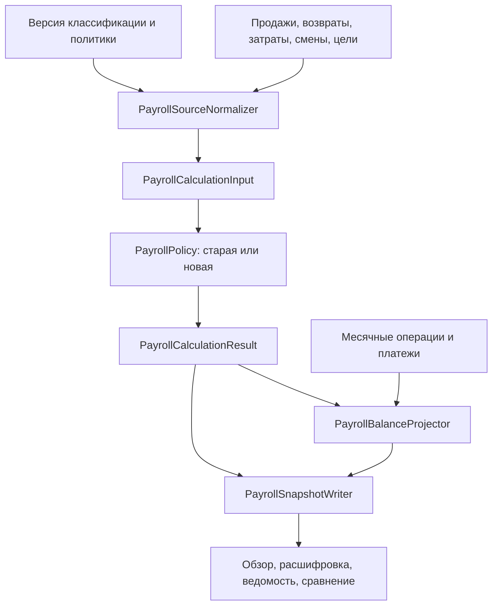

# Зарплата: детальный технический проект

## Статус и границы

Продуктовые решения `D-001`–`D-020` приняты в [реестре](payroll-redesign.md).
Граница истории после `D-020` оставляет открытым `Q-10` для возвратов 2026 к исходным
продажам декабря 2025; ниже нет утверждённой формулы для этого случая.
Этот файл задаёт проект реализации; названия новых классов, таблиц, полей и маршрутов ниже
**ещё не реализованы**. Они не являются новыми требованиями заказчика. Текущий код и API
продолжают описываться в current-контрактах. Дату включения новой методики здесь не назначаем.

Читать вместе с [формулами и пользовательскими сценариями](payroll-redesign-architecture.md),
[матрицей требований](payroll-redesign-requirements.md),
[контрольными примерами](payroll-redesign-acceptance.md) и
[планом реализации](payroll-redesign-implementation-plan.md). При конфликте продуктового смысла
сначала сверять источник и журнал решений. Не превращать техническую неопределённость в
самостоятельное изменение выплат.

## 1. Что переиспользовать и что изменить

Проверено чтением локального кода 2026-09-30, без проверки runtime или бизнес-данных.

| Точка кода | Наблюдаемое ограничение | Проект изменения |
|---|---|---|
| `PayrollCalculationSource` / `PayrollSaleSourceFact` | Факт не содержит автора и связи с исходной строкой возврата; месячный фильтр идёт по дате документа. | Новый нормализованный набор фактов с обеими датами и provenance; полная загрузка возвратов к исходным продажам. |
| `SalesDocumentItem` / `SalesDocument` | Есть `original_item_id`, `original_document_id`, `employee_id`, `cost_amount`, `cost_quality`. | Переиспользовать связи, проверить полноту и экономический смысл; не создавать второй каталог продаж. |
| `StorePerformancePlan` | Уже есть revenue/accessory/service/additional targets. | Одна исходная месячная цель магазина; отдельное хранение личных целей. |
| `PayrollComputationEngine` | Один дневной фонд и общие ставки. | Сохранить старую политику; новая чистая функция считает персональные компоненты. |
| `PayrollCalculationService.prepare/materialize` | `prepare` теряет вычисленные allocations, `materialize` повторно делит фонд. | Сохранять результат движка без финансовой арифметики в persistence-слое. |
| `PayrollSourceFingerprintService` | Нет общего плана допов, личных целей и продавца. | Новый состав fingerprint; старые fingerprint не переинтерпретировать. |
| `payroll_daily_pools`, `payroll_daily_allocations` | Дневной фонд с единой ставкой; allocation содержит только сумму. | Новые снимки дневных баз и персональных компонентов для новой политики. |
| `payroll_adjustments` | Вычеты привязаны к run; копируются в следующую revision новыми строками. | Независимые месячные операции с постоянным ID и immutable-снимками включения. |
| `PayrollManagementService` | APPROVED/PAID, Idempotency-Key, optimistic version и freshness уже есть. | Сохранить защиту, добавить согласованность с источниками и учёт реальных платежей. |
| `PayrollPreviewService` / `PayrollPage` | Предпросмотр и сохранение имеют отдельные пути; интерфейс требует создать расчёт. | Один DTO результата, автоматическая актуализация, явное состояние неполноты. |

Проект остаётся внутри существующего Java/Spring/PostgreSQL backend и React frontend. Отдельный
сервис, брокер сообщений и второй модуль «План» для этой задачи не требуются. Фоновая очередь —
таблица PostgreSQL и worker приложения с защитой от нескольких экземпляров.

## 2. Границы модулей и единый результат



- `PayrollPolicyRouter`: выбирает политику по исходному расчётному месяцу и сохранённой версии;
  не по дате запуска job. Старую формулу выделить с сохранением её поведения.
- `PayrollSourceNormalizer`: проверяет связи, даты, состав KPI, зарплатную роль, стоимость,
  продавца и покрытие синхронизации. Возвращает факты и типизированные проблемы.
- `PayrollPolicy` / `PersonalRatesPayrollPolicy`: чистый расчёт без БД, времени, пользователя,
  сети и округления на frontend. Все необходимые даты и настройки — явные входы.
- `PayrollBalanceProjector`: учитывает месячные операции, деньги и переносы; не меняет KPI/ставки.
- `PayrollSnapshotWriter`: записывает рассчитанные значения, input manifest и поколения;
  не распределяет фонд повторно и не копирует живые операции под новыми ID.
- `PayrollPeriodService`: команды, состояния, permissions, блокировки и аудит.
- `PayrollRecalculationWorker`: объединение событий, расчёт кандидата, публикация только
  при неизменных источниках. `PayrollReadinessService` использует те же проблемы нормализатора.

`PayrollCalculationResult` содержит store results, employee monthly results, daily bases,
персональные компоненты, quality issues и source identity. Предпросмотр, утверждение и
сравнение читают этот результат. Равенство preview и сохранённого snapshot на одинаковом
входе — отдельная интеграционная проверка.

## 3. Период, входы и классификация

### 3.1. Период и набор сотрудников

Ключ периода `(storeId, month)`, месяц — первое число. Рабочий день берётся из сохранённого
`business_date`; границу текущего дня вычислять общей логикой магазина с `timezone` и
`business_day_start`. Часовой пояс сервера не используется.

В открытом месяце `calculationThroughDate` ограничивает факты и смены текущим рабочим днём;
будущие смены не создают начисления. Сегодняшние суммы предварительные. Сохраняются
`calculatedAt`, `sourceObservedAt`, `completeThroughDate` и sync coverage; отсутствие новых
продаж не доказывает полноту загрузки. Переход дня сам инвалидирует временную область расчёта.

Список сотрудников — объединение исторических участников смен, авторов личных продаж,
получателей месячных операций/платежей/переносов. Деактивация сотрудника не удаляет историю.
Автор без смены имеет личный KPI, но не получает долю соответствующего дня (`C-11`). Сотрудник
без смен и продаж может иметь ручную премию или остаток: не применять к нему искусственный
аванс и не требовать личную ставку, если нет ни одной оплачиваемой доли.

### 3.2. Нормализованный факт

`PayrollNormalizedFact`:

- source document/item ID и version, original document/item ID и version;
- sale store/original employee ID, product ID; processing employee external ID/connection и
  resolved ID отдельно, без подмены оригиналом; признаки удаления, типа и качества источника;
- `documentBusinessDate`, `originalSaleDate`, `payrollDate`, `observedAt`;
- signed quantity, net revenue, effective cost, gross profit и provenance стоимости;
- `kpiRole` = DEVICE / ACCESSORY / SERVICE / OTHER / EXCLUDED / UNKNOWN;
- `payrollRole` = шесть существующих оплачиваемых ролей / EXCLUDE / UNMAPPED;
- immutable classification version/assignment ID и причины исключения;
- return-link status и точная связь с исходной строкой.

KPI и оплачиваемая составляющая — разные измерения. PS-подписка и платный ремонт входят один
раз в денежный SERVICE KPI, но их выплата идёт в отдельный GP-компонент. Оборотные KPI используют
согласованный экономический состав «Плана»; payrollRole сам по себе не изменяет знаменатель.
OTHER (в том числе упаковка по принятой аналитической методике) входит в общую выручку,
но не в допы; его оплачиваемая роль задаётся отдельно.
Явное исключение из выплаты не равно исключению из аналитики. Неизвестный состав KPI остаётся
проблемой данных, а не неявным нулём.

Классификация новой политики: датированное ручное назначение товара, затем опубликованная
версия зарплатного соответствия. Для автоматического соответствия разрешены проверенные
семантические свойства каталога и зафиксированное правило; нельзя вычислять историческую роль
по текущему названию товара или текущему analytics fallback. На публикации материализовать
эффективные назначения для товаров/интервалов, чтобы перенос аналитической категории сам
не менял зарплатную роль. Сохранить дату/основание назначения, исключения и связь с правилом.
Новые неразобранные товары дают UNMAPPED, без тихого назначения самой дешёвой ставки.

Не делать скрытого изменения `EXCLUDE`: при миграции сравнить фактическое покрытие. Конфликт
аналитического исключения и зарплатного назначения требует явного разбора до активации.
Не превращать все товары в бессрочные ручные overrides ради прохождения сверки.

### 3.3. Возвраты и себестоимость

Для новой политики загрузить продажи исходного месяца и все известные связанные возвраты
к ним до `sourceObservedAt`, даже если дата возврата в другом месяце. Не ограничивать вторую
часть запроса концом исходного месяца. Изменение/удаление/перепривязка возврата инвалидирует
оба прежних и новых затронутых периода; новая связь не должна оставлять старое уменьшение.

Проверить совпадение исходного документа, товара, магазина и суммарного возвращённого количества;
не сопоставлять неоднозначные строки только по названию. Неизвестная связь — issue с датой
обнаружения, затронутым магазином и блокировкой утверждения затронутых расчётов. Когда исходный
месяц неизвестен, нельзя выдавать потенциально затронутые расчёты магазина за проверенные.
После `D-020` различать разорванную связь внутри загруженного периода и известный источник
до границы истории. Пять декабрьских продаж 2025 не восстанавливать как ошибку загрузки;
их возвраты 2026 сохранять. Для их payroll-проекции фиксировать `Q-10` и признаки
неполноты/происхождения, не подставлять обработчика возврата, дату или ставку 2026 года
вместо неизвестных исходных данных. Исходную продажу сентября 2026 внутри периода
проверять отдельным read-only шагом до признания дефекта.

В зарплатном KPI продавец возврата — продавец исходной продажи. В распределении выплаты — исходная смена.
Роль и политика определяются исходной продажей/месяцем. Чистые остатки формируются на уровне
исходной строки до агрегации: повторно загруженный возврат с тем же ID не уменьшает остаток ещё раз.

Выданные позиции заказов уже нормализуются в SALE/source_document_type=orderPosition;
не добавлять их в зарплату повторно отдельной выборкой ремонтов. Проверить фактический смысл
сотрудника позиции (продавец или исполнитель) по [аудиту T-01](payroll-redesign-source-audit.md).

Для GP вернуть соответствующую исходную стоимость: использовать проверенную связь стоимости
возвращённой части. Если известны только общая стоимость и количество взаимозаменяемых единиц,
проект адаптера — пропорция по количеству, накопительное округление до копеек и остаток на
последнюю часть. Полный возврат должен погасить ровно исходную стоимость. Для неоднородных
затрат или возврата услуги без подтверждённой структуры не выводить стоимость из пропорции:
нужна проверенная сумма. Несовпадение возвращённой выручки с правилом полного погашения также
не исправлять выдуманными деньгами. Такие случаи — конкретные задачи аудита источника до выпуска.

`cost_amount` нельзя считать полной стоимостью ремонта до проверки. Адаптер выдаёт
`VERIFIED_SOURCE_TOTAL`, `VERIFIED_BREAKDOWN`, `MANUAL_CONFIRMED` либо `MISSING/AMBIGUOUS`.
Для ручного уточнения хранить запчасти и подрядчика либо подтверждённый полный итог;
не складывать полный итог и его части. История значения обязательна, исходный payload не менять.
Ноль допустим при подтверждении; null не равен нулю. Отрицательная GP допустима и не обнуляется.

Уточнение D-018/D-019: подтверждение нулевых затрат привязывается к конкретной строке,
её версии и денежным значениям, не ко всем продажам товарной карточки. Для исходной
SALE с ролью PAID_REPAIR и фактической ценой CRM 0 зарплатная база равна 0, а финансовая
GP по-прежнему равна net − cost. Не менять cost_amount на 0 ради зарплатной формулы,
не переводить карточку в EXCLUDE и не маскировать нулём неизвестную цену.
Цена именно исходной работы, а не месячный нетто-итог после возвратов. Для платного
убыточного ремонта отрицательная база остаётся; для возвратов действует D-006.
Нулевое начисление не подтверждает полноту затрат для аналитики.
Это контракт новой реализации; в текущем шаге есть только локальный what-if трёх
подтверждённых строк, без изменения runtime или исторических ведомостей.

По D-006 финансовая аналитика использует обработчика и дату возврата. Исходный факт хранит
оба происхождения сотрудников; payroll не читает общие employee aggregates. Для analytics
processing ID из источника разрешается по connection/external ID; для payroll исходный employee
берётся из связанного SALE. Не вводить общий fallback между ними. Существующий
attach_source_employee_external_id — кандидат источника, его полнота и семантика требуют аудита;
название поля не доказывает покрытие всех старых возвратов. На период миграции оба правила
чтения версионировать; не перезаписывать employee_id до готовности всех его потребителей.
Неполнота processing ID блокирует соответствующую аналитику, но не автоматически полный payroll;
отсутствие original link блокирует зарплатный расчёт, даже если обработчик известен.
Согласованная область D-006 включает не-payroll гарантии/attach/rating; реализация должна явно
заменить противоречащие правила ADR-0001/ADR-0003, а не считать прежние исключения выполнением
нового требования. Положительные факты и остальные формулы проверяются отдельно по контрактам.
Зарплатные snapshots в архиве сохраняют payroll scope; архив не меняет формулу снимка.
Финансовая аналитика сохраняет дату возврата. Общая проекция состава KPI переиспользуется,
а дата задаётся явной политикой. В «Плане» зарплатный результат показывать с расшифровкой
перенесённых возвратов; не заменять существующую финансовую аналитику молча.

## 4. Алгоритм новой политики

Пусть R — чистая выручка магазина, A/S — чистая выручка аксессуаров/услуг; Tа/Ts/Td — цели
в процентных пунктах. Для положительного R:

```text
revenueAchieved = R >= revenueTarget
additionalAchieved =
    100*S >= Ts*R
    AND 100*(A+S) >= Td*R
    AND 100*(A+S) >= (Ta+Ts)*R
personalAchieved(e) = 100*personalAdditional(e) >= personalTarget(e)*personalRevenue(e)
```

Личные суммы включают собственные продажи всего месяца, независимо от смен; база начисления
включает только доли смен. Нельзя использовать среднее дневных процентов. При нуле/отрицательной
базе процент null; состояния качества и исключение `D-005` определяют дальнейшее действие.

| Личное состояние | Процентные компоненты | TECH_TIER_1 / TECH_TIER_2 |
|---|---|---|
| ACHIEVED | 20 при выполненных допах магазина, иначе 15 | 500/300 при выполненном обороте, иначе 400/200 |
| MISSED | 15 | 400/200 |
| NO_PERSONAL_SALES_STORE_RATE | По результату магазина | По результату магазина |
| UNASSESSABLE / TARGET_MISSING | Неизвестные необходимые ставки/начисления | Не подставлять низкие ставки |

`NO_PERSONAL_SALES_STORE_RATE` — отдельное вычисленное состояние, подтверждение хранится
отдельно. В открытом месяце допустимо предварительно; утверждение требует действующего
подтверждения сотрудника/магазина/месяца с причиной и fingerprint основания. При появлении
личной положительной базы обычная формула имеет приоритет над записью исключения.
Полностью возвращённые личные продажи допускают это исключение после проверки нулевого
остатка. Отрицательная база или неполные данные не допускают его автоматически.

Для каждой даты d построить уникальных активных участников N и шесть баз B:
ACCESSORY/SERVICE — net revenue; PS/REPAIR — GP (для нулевой цены ремонта — отдельная
зарплатная база 0 по D-019, без изменения финансовой GP); TECH1/TECH2 — quantity.
Взятые по всему месяцу персональные ставки применить ко всем дням этого месяца.

```text
moneyComponent(e,d,c) = HALF_UP(B(d,c) * rate(e,c) / (N(d) * 100), 2)
unitComponent(e,d,c)  = HALF_UP(B(d,c) * rate(e,c) / N(d), 2)
dailyEarned(e,d)      = sum(rounded component amounts)
monthlyEarned(e)      = sum(dailyEarned(e,d))
dailyTotal(d)         = sum(dailyEarned(e,d))
```

Долю базы хранить как `(baseNumerator, participantCount)`. Не округлять её перед умножением;
не делить денежный фонд. Использовать BigDecimal с прямым divide в scale=2/HALF_UP для
финального компонента, без float/double. Денежные источники numeric(19,2), quantity numeric(19,3),
цели numeric(5,2); промежуточные суммы не сужать до precision БД до проверки диапазона.
Переполнение — явная ошибка, не wraparound и не усечение. Отображаемый процент округляется
только для экрана и не участвует в сравнении.

Если B заведомо 0, компонент 0 даже при неизвестной ставке; если B неизвестна, компонент null.
При N=0 и наличии хотя бы одной ненулевой/неизвестной оплачиваемой базы — проблема смены,
даже если положительные и отрицательные компоненты случайно взаимно погасились. Часы не вес.
Нулевая смена без продаж даёт 0. Неизвестные необходимые компоненты дают `earnedAmount=null`
и отдельный `knownEarnedAmount`; сумму известных компонентов не называть полным начислением.

Для магазина с неположительным оборотом общий процент неопределим. Если это проверенное
отсутствие всех оплачиваемых баз, начисление по продажам равно нулю без выдуманной ставки;
ручные операции остаются видны. Если есть ненулевые базы, требующие неизвестной ставки,
расчёт неполный. Нулевой личный target сравнивается обычным образом при положительной базе;
отсутствующая цель не подменяется нулём или 9%.

## 5. Хранение: логическая схема

Названия проектные, номера Flyway-миграций назначить при реализации с учётом параллельных работ.
Старые таблицы и snapshots сохраняются. Для новой политики использовать отдельные компоненты,
а не переопределять смысл существующих `payroll_daily_pools`.

| Сущность | Ключевые поля и ограничения |
|---|---|
| `payroll_policy_versions` | ID, immutable code/engine version, effective month, ставки, правила округления, KPI/classification version. Активация отдельна от создания; месяц начала первый день. Один выбранный policy на период. |
| `payroll_periods` | UNIQUE(store, month), policy ID, version, active generation, approved run ID, desired/processed source revision, update status. Строка блокировки периода существует даже без run. |
| `payroll_personal_targets` | UNIQUE(store, employee, month), target percent 0..100, version, actor/reason. Append-only history каждой правки; массовое копирование не затирает существующие цели без явного действия. |
| `payroll_personal_exceptions` | period/employee, state ACTIVE/REVOKED, reason, evidence fingerprint, actor/time/version; не более одного активного подтверждения. |
| `payroll_classification_versions/entries` | Immutable опубликованная версия, product/valid interval, effective payroll role, provenance rule/assignment. Без пересечений действующих интервалов одного товара в версии; ручные назначения переиспользуют существующие IDs. |
| `payroll_cost_confirmations` | original item ID, breakdown либо total, version/state/reason/actor; уникальное активное уточнение. Проверка соответствия магазину и возвратной доле. |
| `payroll_month_operations` | store/employee/month, type BONUS/PENALTY/INVENTORY/TAX, amount > 0, reason, version, state; корректировка через отмену/замену с history. Операция существует до расчёта. |
| `payroll_payments` | Employee, amount > 0, actual paid date, type ADVANCE/FINAL, creator, reason/reference, version, state DRAFT/CONFIRMED/VOIDED. Подтверждение фиксирует факт по словам руководителя, не выполняет банковский перевод. |
| `payroll_payment_allocations` | payment ID, store/month/employee, amount > 0. Сумма подтверждённых долей = сумма выдачи; employee совпадает с payment. FINAL ссылается на утверждённую ведомость. |
| `payroll_generations` | period, generation ordinal, input hash/version, source revisions, through date, observed time, complete flag, policy ID, result schema version. Immutable опубликованный расчёт. |
| `payroll_generation_inputs` | Минимальные нормализованные факты/версии/цели/смены/операции, нужные для воспроизведения, с FK на generation. Без provider payload, секретов и лишних персональных полей. |
| `payroll_day_bases` | UNIQUE(generation,date,component), exact base, unit, participant count, quality. Состав участников хранится отдельно с hours snapshot. |
| `payroll_employee_month_results` | UNIQUE(generation,employee), personal numerator/denominator/target, status, applied rates/reasons, earned nullable, known earned, monthly operation totals. |
| `payroll_employee_day_components` | UNIQUE(generation,employee,date,component), numerator/divisor, rate, amount nullable, quality reason; snapshot фактической персональной формулы. |
| `payroll_operation_snapshots` | UNIQUE(generation,operation ID), operation version/type/amount/state; исторический снимок не читает текущее изменяемое значение операции. |
| `payroll_settlement_transfers` | source/target employee period, signed amount, source approved revision, unique command/idempotency identity, reversal link. Два связанных балансовых плеча одной операции. |
| `payroll_source_state/events` | Per-store revision и глобальная revision настроек, transactional invalidation/outbox с provenance изменения. |
| `payroll_recalculation_jobs` | UNIQUE(store,month), desired revision, lease token/expiry, attempts, next retry, last safe error code; claim через SKIP LOCKED. |

Связи store/employee проверять composite FK или эквивалентным ограничением; нельзя сослаться
на чужой магазин через известный ID. Исторические назначения сотрудника не удалять каскадно.
Все month проверяют первое число. На участника/дату не более одной учитываемой смены магазина.
Индексировать original_item_id/original_document_id, store/date, period/employee и очередь по
state/next retry. Проверить фактический план SQL на выборке возвратов до назначения индексов.

`payroll_runs` продолжает хранить lineage и APPROVED/PAID. Добавить nullable ссылку на
новую generation/policy, обязательную для новой методики. Legacy rows читаются старым adapter.
Утверждённый run указывает на неизменяемую generation; ежедневные обновления не создают
тысячи бизнес-revisions. История событий отражает причину, IDs и изменение сумм без raw payload.

## 6. Деньги, исправления и остатки

Разделить начисленное обязательство и выданные деньги:

```text
entitlement = earned + bonus - penalty - inventory - tax
balance = entitlement + incomingTransfers - outgoingTransfers - confirmedPayments
```

Все суммы относятся к employee/store/month. Переносы знаковые; платежи положительные.
Аванс и итоговая выдача вычитаются ровно один раз в confirmedPayments. Ручные удержания
не вычисляют налоги автоматически: существующий TAX остаётся ручной операцией.
Присутствие премии не делает неполное earned полным. При неизвестном entitlement остаток null,
но известные операции/выдачи показываются отдельно.

Пример `C-23`: entitlement 73 000, ADVANCE 30 000, balance 43 000. FINAL 43 000 после
подтверждения даёт balance 0. Повторная команда не создаёт ещё один FINAL. Частичная выдача
уменьшает остаток, но не превращает весь месяц в PAID.

После выплаты исходная ведомость и факт платежа неизменяемы. Новые источники дают кандидата
корректирующей revision; после её проверки/утверждения переносится только остаток, ещё не
закрытый деньгами или прежними переносами. Пример: первоначально entitlement 73 000,
выплачено 73 000; исправлено до 71 000 → balance -2 000. Перенос -2 000 в следующий
допустимый открытый месяц создаёт исходящее плечо -2 000 и входящее -2 000: исходный баланс 0,
будущая ведомость меньше на 2 000. Позднее entitlement 70 500 → ещё только -500.
Обратное исправление до 73 000 создаёт +2 500, прежняя история сохраняется.

Месяц переноса выбирается явно при подтверждении корректировки, предлагается ближайший
неутверждённый месяц того же сотрудника/магазина. Автоматическая подготовка кандидата не
означает автоматического удержания. Если назначения/открытого периода нет, остаток остаётся
на исходном периоде и виден руководителю. Цепочки переносов всегда идут вперёд по месяцам;
циклы и повторное потребление остатка запрещены.

Транзакция переноса блокирует source/target periods в стабильном порядке, проверяет versions,
текущий остаток и сумму уже проведённых переносов. Создаёт два плеча атомарно. Отмена переносов
— обратная операция, без удаления истории. Изменение утверждённого target требует revision,
а не изменения его snapshot. Нельзя закрыть отрицательный остаток отрицательной «выплатой».

Ошибочная запись платежа отменяется с причиной и историей. Это не утверждение, что сотрудник
вернул реальные деньги. Исправление сведений и реальный обратный денежный поток не смешивать.
Новый подтверждённый платёж не переписывает утверждённое entitlement: текущий баланс строится
поверх него; исторический документ сохраняет суммы на момент создания.

## 7. Состояния, очередь и согласованность

Независимые оси:

- `periodPhase`: OPEN / ENDED — вычисляется по времени магазина, не переключателем руководителя;
- `calculationState`: PENDING / RUNNING / CURRENT / STALE / FAILED;
- `quality`: COMPLETE / PARTIAL / BLOCKED с issues;
- `statementState`: CALCULATED / APPROVED / PAID — существующая бизнес-линия;
- `paymentState`: NONE / PARTIAL / SETTLED / CREDIT_BALANCE — проекция денег, не статус формулы.

OPEN всегда предварительный, даже COMPLETE. Утверждение только после окончания месяца,
полного покрытия загрузки, отсутствия блокирующих issues, проверки необходимых исключений
и точного совпадения версии просмотренного результата. Проверка paid дополнительно учитывает
реальные подтверждённые выдачи/переносы. PAID исходного снимка не сбрасывается поздним возвратом:
отдельно показывается неподтверждённая или незакрытая корректировка.

Источник изменений включает продажи/возвраты/связи/удаления, продавца, смены, plan включая Td,
личные цели/исключения, категории/исключения, cost, policy, month operations, payments/transfers,
sync coverage, timezone/day boundary. Классификация или изменение автора исходной продажи
инвалидирует все её связанные возвратные зависимости. Глобальное изменение политики/справочника
инвалидирует затронутые периоды; при неизвестной области безопасно расширить её до магазина.

### Протокол записи

Текущая локальная разработка содержит механизм `store_analytics_source_state` с deferred
revision events. Он не покрывает сам по себе все новые payroll-входы. Проект — отдельный
payroll source revision с тем же принципом транзакционной фиксации; интеграцию с существующим
механизмом выполнять через общий helper commit guard для обоих контуров. Не вводить два
независимых глобальных mutex с порядком, зависящим от очереди deferred triggers. Существующие
аналитические revision events должны сохранить прежнюю семантику и пройти regression tests.

1. Изменение источника в своей транзакции регистрирует событие инвалидирования. DB triggers
   покрывают все перечисленные входы, включая прямой SQL и OLD/NEW периоды. Перед commit
   общий короткий payroll commit guard сериализует bump revision и запись outbox.
2. Worker в согласованном REPEATABLE READ snapshot считывает входы и revisions, рассчитывает
   чистую функцию вне блокировки commit guard. Fingerprint — канонический, сортированный,
   включает null отдельно от 0, все поля результата и версию правил.
3. Публикация в новой READ COMMITTED транзакции: сначала тот же commit guard, затем period lock;
   свежим чтением проверить revisions и временную границу. Несовпадение → discard/requeue.
   Совпадение → записать generation и атомарно передвинуть указатель; событие исходника,
   ожидающее guard, сможет закоммититься только после этого и сразу инвалидирует результат.
4. Approve/pay/transfer применяют тот же порядок и проверку expected generation/version.
   Все команды зарплатных исходников берут guard до period/payment locks; bulk imports
   не блокируют payroll period/run строки до своего deferred guard. Если одновременно нужны
   защита analytics и payroll, оба пути используют один общий guard helper.
   Deadlock/serialization error возвращает безопасный retry, не частичный результат.
5. Расчёт и тяжёлые чтения не выполняются под глобальным guard. В integration tests проверить
   фактическое ожидание commit и невозможность approve на смешанных версиях.

Fingerprint нужен для воспроизводимости и объяснения различий; один hash без протокола записи
не устраняет гонку. Если любой writer не охвачен guard/revision, выпуск блокируется. Отдельный
payment revision позволяет обновлять остаток без смены формулы, но должен входить в токен команды
подтверждения выплаты. Существующая optimistic runVersion сохраняется.

Queue coalesces desired revisions; lease token не позволяет старому worker публиковать после
перехвата задачи. Commit источника и outbox атомарны. Worker crash до публикации безопасно
повторяется; после публикации повтор на том же input hash возвращает текущую generation.
Изменение во время работы оставляет новую desired revision, нельзя сбросить её старым ack.
Bounded retry/backoff, постоянная ошибка → FAILED, журнал и кнопка повторения; предыдущие цифры
сохраняются с меткой устаревания. Периодическая сверка coverage/revisions восстанавливает пропуск
события. После APPROVED/PAID job готовит candidate, но не переписывает закреплённую revision.


### Границы блокировок и срок хранения

Quality issue содержит `code`, `scope` (STORE / EMPLOYEE / DAY / COMPONENT), affected IDs,
`blocksApproval`, понятное сообщение и разрешённое действие. Неизвестный продавец/состав KPI
может затрагивать месячные ставки; missing cost одной строки затрагивает её GP-компонент;
проблема покрытия загрузки затрагивает весь период. UI показывает только разрешённые детали.
В текущем проекте утверждение по магазину атомарное: блокирующая проблема одного участника
не позволяет пометить всю ведомость проверенной. Известные суммы других участников доступны.

Approved/paid generations, input manifest, операции и lineage платежей/переносов не очищать
вместе с промежуточным кешем. Обновление политики retention и прав на эти данные входит в
реализацию; срок не придумывать в этом проекте. Промежуточная generation удаляется только
штатной политикой и при отсутствии ссылок из ведомости/истории решения. Для jobs допускается
очистка технических завершённых записей с сохранением требуемого аудита. Логи содержат IDs,
коды и времена, без имён сотрудников, сумм зарплаты и содержимого причин; суммы доступны
в защищённой прикладной истории с установленными правами.

## 8. Проект API и интерфейса

Расширять существующее семейство `/api/stores/{storeId}`; точные DTO вне опубликованного
OpenAPI до реализации. Legacy endpoints и сохранённые отчёты остаются совместимыми.
Нельзя выдавать старый shape с новым смыслом общей ставки/фонда без discriminator.

| Команда / чтение (проект маршрута) | Контракт |
|---|---|
| `GET /payroll/{month}/overview` | Один согласованный envelope: period, policy, generation/version, timestamps, update/quality states, store KPI, employees, balances, blockers, allowedActions. Отсутствующий расчёт — 200/PENDING, не исчезнувшая страница. |
| `GET /payroll/{month}/employees/{employeeId}` | KPI, ставки с объяснением, дневные компоненты, ручные операции, платежи, переносы, history; query generation для стабильного чтения. |
| `PUT /payroll/{month}/personal-targets/{employeeId}` | target, expectedVersion (0 для создания), reason; массовое применение — отдельная атомарная команда со списком expectedVersions. |
| `POST /payroll/{month}/personal-exceptions` | employee, reason, expectedGeneration и source evidence; сервер сам проверяет применимость. |
| `POST /payroll/{month}/operations` | employee, type, положительная amount, reason; не требует существующего run. Отмена — `/{operationId}/void` с version/reason. |
| `POST /payroll/{month}/payments` | amount/date/type и allocations, expected balance token для FINAL; подтверждение/отмена versioned. Одна выдача на несколько магазинов проверяет доступ к каждому. |
| `POST /payroll/{month}/refresh` | 202/job state; аварийное повторение, не ежедневная обязанность руководителя. |
| `POST /payroll/{month}/revisions` | reason, expected base run/version, candidate generation; сохраняет прежнюю revision. |
| Существующие approve/paid + новые settlement commands | Для новой политики generation/version/payment token; paid фиксирует выбранные фактические суммы либо проверяет уже зарегистрированные выдачи. Один batch не означает два FINAL. |
| `POST /payroll/{month}/settlement-transfers` | approved source revision, target month, expected source/target versions, signed amount, reason; атомарная операция. |
| Classification/cost endpoints | Датированные изменения и dry-run diff с явной областью; стоимость может уточнять уполномоченный руководитель своего магазина. Целевой процесс классификации D-007: два независимых назначения одной атомарной командой, право на весь impact scope общего каталога. До реализации отдельного полномочия действующие admin-only ограничения сохраняются. |

Для D-007 сохранять независимые версии/историю аналитического и зарплатного назначения.
Единая команда проверяет обе expected revisions, дату действия и preview области влияния;
изменения назначений и событие пересчёта атомарны. Ошибка одного назначения не сохраняет другое.
Подсказка не считается подтверждённым назначением. Отсутствие любой роли создаёт задачу
разбора; подтверждённая неопределённая совместимость товара не подменяет проверку продажи.
Карточка не задаёт персональную ставку и не меняет утверждённую ведомость. Детали пользовательского
сценария и разделение полномочий — раздел 4 [архитектуры каталога](catalog-classification-architecture.md).

Все mutations используют Idempotency-Key: scope actor+action+store/period, hash payload; тот же
ключ/тело возвращает прежний результат, другое тело даёт conflict. Не полагаться на disabled
кнопку. Monetary inputs >0, не более двух знаков; проценты 0..100, не более двух знаков;
точные decimal values новой API-проекции передавать строками, клиент лишь форматирует.
Новые typed errors: SOURCE_CHANGED, STALE_VERSION, QUALITY_BLOCKED, EXCEPTION_NOT_APPLICABLE,
PAYMENT_ALLOCATION_MISMATCH, PERIOD_NOT_ENDED; сопоставить с текущими PAYROLL_* кодами при
реализации. Forbidden — 403 без раскрытия чужих сумм; optimistic conflict — 409 и обновление
данных без потери пользовательского текста; неверный ввод — 400 с полями.

`FEATURE_PAYROLL` + доступ к магазину остаются обязательными. Цели, операции и подтверждения
исключений доступны руководителю с этим доступом. Admin-права схем сохраняются; действующие
admin-only права классификации не расширяются одним согласованием D-007. Будущее отдельное
право catalog.classify проверяется на весь impact scope, а не только на выбранный магазин.
Общая выдача сотруднику не открывает руководителю сведения недоступного магазина: без доступа
ко всем allocations команда запрещена; доступны самостоятельные выдачи своего магазина.
Существующую видимость опубликованных snapshots в `/reports` не расширять автоматически новыми
операционными данными, причинами штрафов и платежами. Проверить политику отчётов отдельными тестами.

Основной экран: суммы на сегодня, дата актуальности и небольшая сводка плана магазина;
таблица сотрудник / смены / личный показатель / начислено / премии / удержания / выдано / остаток.
Детали ставок и шести составляющих — раскрытие строки. Действия «Премия», «Штраф», «Аванс»
доступны в течение месяца. Неполнота показывается причиной, не прочерком без объяснения или нулём.
В начале месяца отрицательный остаток из-за выданного аванса не называется окончательным долгом.

Реализация на существующих `PayrollPage`, `PayrollOverview`, `PayrollDailyPanel`, `PayrollDialogs`,
`PayrollAuditPanel`; вынести state/data hooks из монолитного компонента. Все части экрана используют
один generation token. Poll при PENDING/RUNNING с ограниченным backoff и pause в скрытой вкладке;
после mutation invalidate overview и зависимые details. Варианты сценарных ставок, если сохраняются,
пометить моделированием и не давать утвердить их как фактический расчёт.

## 9. Условия готовности технического проекта к реализации

Контракты алгоритма, хранения и состояний заданы. Оставшиеся работы перечислены в
[плане реализации](payroll-redesign-implementation-plan.md) с зависимостями и критериями.
Аудит реальных source cost/seller/catalog, performance SQL и конкретная дата включения не
подменяются документацией. Код, миграции, OpenAPI и UI в рамках этого этапа не изменены.
